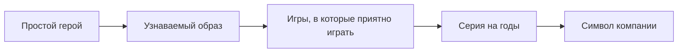

# Знаменитый [водопроводчик](../heroes_and_villains/famous_plumber.md) — [история](../../../../1.2_natural_sciences/physics_in_everyday_life/Q11469.md) [Марио](../how_it_all_started/crisis_and_resurrection.md)

> 💡 **Коротко:** Марио стал символом [Nintendo](../how_it_all_started/crisis_and_resurrection.md), потому что он **очень узнаваемый**, игры с ним **понятные и честные**, а [жанр](../../../../../8.1_entertainment/articles/movie.md) платформеров вырос именно вокруг таких игр.

---

# [Знаменитый водопроводчик — история Марио](./mario.md)

## Введение
Если попросить назвать героя видеоигр, которого узнают почти все, многие сразу скажут: **Марио**. Он появился давно, но до сих пор остаётся “лицом” Nintendo — как будто фирменный знак. Интересно, что Марио не был задуман как “самый главный герой всех времён”. Он стал таким постепенно: через удачные игры, понятный [образ](../game_culture/cosplay.md) и то самое чувство, когда ты проходишь [уровень](../../../../../8.1_entertainment/articles/gamification.md) и думаешь: “Да! Я смог!” 🎮

В этой статье разберём:
- кто такой Марио и почему он именно водопроводчик;
- как он стал знаменитым;
- почему Марио — символ Nintendo;
- почему платформеры часто сравнивают именно с играми про Марио;
- как менялся Марио со временем.

## Кто такой Марио
**Марио** — герой игр Nintendo, которого обычно изображают как невысокого мужчину в красной кепке, с усами и в рабочей одежде. В классических историях он:

- живёт в мире **Грибного королевства**;
- дружит с [Луиджи](../heroes_and_villains/famous_plumber.md);
- спасает принцессу Пич;
- борется с Боузером (главным злодеем серии).

Почему “водопроводчик”? Потому что это простой и понятный образ: герой не “избранный маг”, не “суперсолдат”, а обычный парень, который попадает в приключение. Такой [персонаж](../game_culture/cosplay.md) легко вызывает симпатию: “Это мог бы быть я”.

## Как он появился и почему стал знаменитым
Важная вещь: популярность героя почти всегда зависит от того, **насколько [игра](../../../../4.1_rules_of_study/how_to_learn_effectively/articles/gamification.md) рядом с ним получилась классной**.

С Марио произошло примерно так:
- сначала появился герой, который был удобен для игры ([движение](../../../../1.2_natural_sciences/physics_in_everyday_life/Q11023.md), прыжки, простое управление);
- потом вокруг него сделали мир с понятными правилами: беги, прыгай, собирай, избегай [опасности](../../../../1.2_natural_sciences/physics_in_everyday_life/Q845744.md);
- затем серия начала [повторять](../../../../4.1_rules_of_study/how_to_memorize/articles/povtorenie.md) “победную формулу”, но добавлять новые [идеи](../../../../7.2 Media, leisure and hobbies /useful_and_interesting_leisure/articles/free_leisure_activities.md), чтобы игроку не было скучно.

У платформера есть особая магия: ты сразу видишь, где [ошибка](../../../../5.1_technology_and_digital_literacy/how_internet_works/articles/http_https/http_https.md) (“прыжок не туда”), и сразу понимаешь, чему учиться. Это делает игру честной: если потренироваться, получится. ✨

## Почему Марио называют символом Nintendo
У бренда обычно есть “лицо” — персонаж, который помогает людям быстро понять: “А, это та самая компания”.

Марио стал символом Nintendo по нескольким причинам:
- **Узнаваемость**: силуэт, [цвета](../../../../1.2_natural_sciences/physics_in_everyday_life/Q11652.md), усы, кепка — его можно узнать за секунду.
- **Понятность**: Марио не “слишком сложный”. Он дружелюбный и не пугает новичков.
- **Стабильное [качество](../../../../6.1_Independent_living_and_daily_living_skills/reasonable_spending/articles/quality.md)**: когда люди видят “Mario” в названии, они часто ожидают, что игра будет сделана аккуратно.
- **Семейность**: игры про Марио часто подходят разным возрастам — можно играть одному, с друзьями, с семьёй.

Можно представить это как цепочку:

## Почему Марио — «дедушка» платформеров
**[Платформер](../heroes_and_villains/famous_plumber.md)** — это игра, где главное [действие](../../../../2.1_society/cause_and_effect_relationships/articles/personal_choice.md) связано с перемещением по уровням и прыжками: ты перепрыгиваешь ямы, врагов, ловушки, поднимаешься по платформам, ищешь [путь](../../../../1.2_natural_sciences/physics_in_everyday_life/Q11476.md).

Почему “дедушка”? Потому что игры серии Mario:
- задали понятные [правила](../../../../2.1_society/cause_and_effect_relationships/articles/why_rules_work.md) жанра (прыжок — главное действие);
- показали, как делать уровни так, чтобы они **учили игрока** (сначала просто, потом сложнее);
- сделали “чувство управления” очень приятным: когда ты прыгаешь, ты как будто точно контролируешь героя.

Потом многие платформеры начали использовать похожие идеи:
- уровни “как уроки”;
- секреты и бонусы за внимательность;
- постепенное усложнение.

## Как менялся Марио со временем
Чтобы герой оставался интересным, он должен меняться вместе с играми.

Марио менялся так:
- **2D → 3D**: сначала игры были “плоскими” (влево-вправо), потом появились объёмные миры, где можно бегать в любом направлении.
- **Новые [способности](../../../../4.1_rules_of_study/how_to_learn_effectively/articles/growth_mindset.md)**: костюмы, усиления, новые [виды](../../../../3.1_healthy_lifestyle/pervaya_pomoshch/ushibi_porezy_ozhogi/08_porezy_sadiny_vidy.md) прыжков.
- **Разные [жанры](../../../../7.2 Media, leisure and hobbies /what_you_can_read_and_watch_to_develop_your_taste/articles/z3.md) вокруг героя**: не только платформеры, но и [гонки](../genres_and_worlds/racing_fighting_sports.md), спортивные игры, вечеринки с мини-играми.

| Эпоха | Что нового | Пример игры |
|:--|:--|:--|
| 1980-е | [Появление](../../../../1.2_natural_sciences/physics_in_everyday_life/Q5339.md) персонажа, простые 2D-уровни | Donkey Kong, [Super Mario](../heroes_and_villains/famous_plumber.md) Bros. |
| [1990-е](../../../../7.1_art/modern_technological_art/articles/2.2_heath_bunting.md) | Переход в 3D, свободное [перемещение](../../../../1.2_natural_sciences/physics_in_everyday_life/Q11476.md) | Super Mario 64 |
| 2000-е | Кооператив, новые костюмы и механики | Super Mario Galaxy |
| 2010-е+ | [Открытый мир](../genres_and_worlds/endless_worlds.md), кроссоверы, [кино](../../../../7.2 Media, leisure and hobbies /what_you_can_read_and_watch_to_develop_your_taste/articles/z1.md) | Super Mario Odyssey |

И при этом Марио остаётся узнаваемым. Это важный [баланс](../../../../1.2_natural_sciences/physics_in_everyday_life/Q634.md): менять “начинку” игры, но не терять “душу” персонажа.

## [Заключение](../../../../1.2_natural_sciences/physics_in_everyday_life/Q2225.md)
Марио стал символом Nintendo не потому, что он “самый сильный герой”. А потому что:
- образ прост и узнаваем;
- правила игр понятные и честные;
- серия долго держит качество и умеет обновляться.

И в итоге Марио — это не просто водопроводчик. Это пример того, как герой может стать частью культуры и “входной дверью” в мир видеоигр 🚀.

## См. также

[Главные злодеи, которых мы любим — Почему нам нравится проходить игры ради встречи с харизматичным врагом](./Main_villains_we_love.md)

[Создаем своего героя — Как редакторы персонажей позволяют нам быть собой или тем, кем мы мечтаем стать](./Create_your_own_hero.md)

---

*[Автор](../../../../4.2_thinking_and_working_information/how_to_search_information/articles/copypaste.md): Дзюба Майя • Сгенерировано с помощью GPT-5.3 • Слов: 621 • 2026-03-17*
