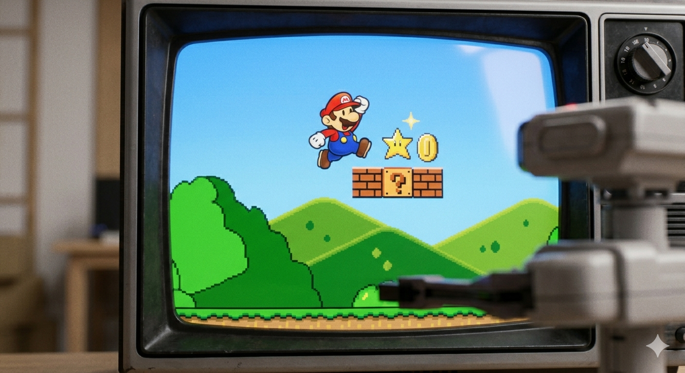
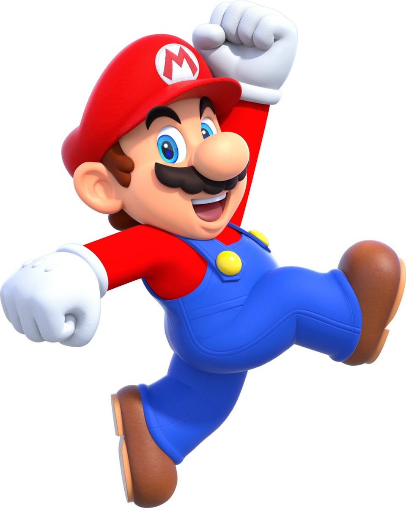
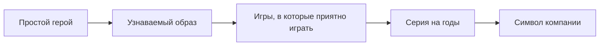

# Знаменитый водопроводчик — история Марио

> 💡 **Коротко:** Марио стал символом Nintendo, потому что он **очень узнаваемый**, игры с ним **понятные и честные**, а жанр платформеров вырос именно вокруг таких игр.

---

# [Знаменитый водопроводчик — история Марио](./mario.md)

## Введение
Если попросить назвать героя видеоигр, которого узнают почти все, многие сразу скажут: **Марио**. Он появился давно, но до сих пор остаётся “лицом” Nintendo — как будто фирменный знак. Интересно, что Марио не был задуман как “самый главный герой всех времён”. Он стал таким постепенно: через удачные игры, понятный образ и то самое чувство, когда ты проходишь уровень и думаешь: “Да! Я смог!” 🎮

В этой статье разберём:
- кто такой Марио и почему он именно водопроводчик;
- как он стал знаменитым;
- почему Марио — символ Nintendo;
- почему платформеры часто сравнивают именно с играми про Марио;
- как менялся Марио со временем.

## Кто такой Марио
**Марио** — герой игр Nintendo, которого обычно изображают как невысокого мужчину в красной кепке, с усами и в рабочей одежде. В классических историях он:

- живёт в мире **Грибного королевства**;
- дружит с Луиджи;
- спасает принцессу Пич;
- борется с Боузером (главным злодеем серии).

Почему “водопроводчик”? Потому что это простой и понятный образ: герой не “избранный маг”, не “суперсолдат”, а обычный парень, который попадает в приключение. Такой персонаж легко вызывает симпатию: “Это мог бы быть я”.

## Как он появился и почему стал знаменитым
Важная вещь: популярность героя почти всегда зависит от того, **насколько игра рядом с ним получилась классной**.

С Марио произошло примерно так:
- сначала появился герой, который был удобен для игры (движение, прыжки, простое управление);
- потом вокруг него сделали мир с понятными правилами: беги, прыгай, собирай, избегай опасности;
- затем серия начала повторять “победную формулу”, но добавлять новые идеи, чтобы игроку не было скучно.

У платформера есть особая магия: ты сразу видишь, где ошибка (“прыжок не туда”), и сразу понимаешь, чему учиться. Это делает игру честной: если потренироваться, получится. ✨

## Почему Марио называют символом Nintendo
У бренда обычно есть “лицо” — персонаж, который помогает людям быстро понять: “А, это та самая компания”.

Марио стал символом Nintendo по нескольким причинам:
- **Узнаваемость**: силуэт, цвета, усы, кепка — его можно узнать за секунду.
- **Понятность**: Марио не “слишком сложный”. Он дружелюбный и не пугает новичков.
- **Стабильное качество**: когда люди видят “Mario” в названии, они часто ожидают, что игра будет сделана аккуратно.
- **Семейность**: игры про Марио часто подходят разным возрастам — можно играть одному, с друзьями, с семьёй.

Можно представить это как цепочку:

## Почему Марио — «дедушка» платформеров
**Платформер** — это игра, где главное действие связано с перемещением по уровням и прыжками: ты перепрыгиваешь ямы, врагов, ловушки, поднимаешься по платформам, ищешь путь.

Почему “дедушка”? Потому что игры серии Mario:
- задали понятные правила жанра (прыжок — главное действие);
- показали, как делать уровни так, чтобы они **учили игрока** (сначала просто, потом сложнее);
- сделали “чувство управления” очень приятным: когда ты прыгаешь, ты как будто точно контролируешь героя.

Потом многие платформеры начали использовать похожие идеи:
- уровни “как уроки”;
- секреты и бонусы за внимательность;
- постепенное усложнение.

## Как менялся Марио со временем
Чтобы герой оставался интересным, он должен меняться вместе с играми.

Марио менялся так:
- **2D → 3D**: сначала игры были “плоскими” (влево-вправо), потом появились объёмные миры, где можно бегать в любом направлении.
- **Новые способности**: костюмы, усиления, новые виды прыжков.
- **Разные жанры вокруг героя**: не только платформеры, но и гонки, спортивные игры, вечеринки с мини-играми.

| Эпоха | Что нового | Пример игры |
|:--|:--|:--|
| 1980-е | Появление персонажа, простые 2D-уровни | Donkey Kong, Super Mario Bros. |
| 1990-е | Переход в 3D, свободное перемещение | Super Mario 64 |
| 2000-е | Кооператив, новые костюмы и механики | Super Mario Galaxy |
| 2010-е+ | Открытый мир, кроссоверы, кино | Super Mario Odyssey |

И при этом Марио остаётся узнаваемым. Это важный баланс: менять “начинку” игры, но не терять “душу” персонажа.

## Заключение
Марио стал символом Nintendo не потому, что он “самый сильный герой”. А потому что:
- образ прост и узнаваем;
- правила игр понятные и честные;
- серия долго держит качество и умеет обновляться.

И в итоге Марио — это не просто водопроводчик. Это пример того, как герой может стать частью культуры и “входной дверью” в мир видеоигр 🚀.

## См. также

[Главные злодеи, которых мы любим — Почему нам нравится проходить игры ради встречи с харизматичным врагом](./Main_villains_we_love.md)

[Создаем своего героя — Как редакторы персонажей позволяют нам быть собой или тем, кем мы мечтаем стать](./Create_your_own_hero.md)

---

*Автор: Дзюба Майя • Сгенерировано с помощью GPT-5.3 • Слов: 621 • 2026-03-17*
