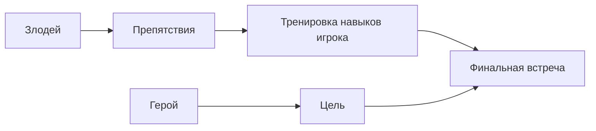

# Главные злодеи, которых мы любим

> 💡 **Коротко:** Хороший [злодей](../heroes_and_villains/main_villains.md) делает игру интереснее: он задаёт **[цель](../../../../1.2_natural_sciences/why_science_help_understand_world/research_work.md)**, создаёт **[напряжение](../../../../1.2_natural_sciences/physics_in_everyday_life/Q11023.md)**, проверяет твоё [мастерство](../game_culture/cosplay.md) и [запоминается](../../../../4.1_rules_of_study/how_to_memorize/articles/zapominanie.md) как [персонаж](../game_culture/cosplay.md).

---

# [Главные злодеи, которых мы любим](./villains_we_love.md)

## Введение
Странная вещь: иногда мы любим не только героев, но и злодеев. Хотя злодей мешает, пугает и ставит ловушки, именно из‑за него [игра](../../../../4.1_rules_of_study/how_to_learn_effectively/articles/gamification.md) становится захватывающей. Ты проходишь [уровень](../../../../../8.1_entertainment/articles/gamification.md) не просто “ради галочки”, а потому что хочешь узнать: **а смогу ли я победить этого противника?** 😈

В этой статье разберём, зачем в игре нужен злодей, почему нам нравятся харизматичные враги, какие бывают типы злодеев и почему финальная встреча может стать самым сильным моментом всей истории.

## Зачем в игре нужен злодей
Злодей ([антагонист](../heroes_and_villains/main_villains.md)) — это персонаж или [сила](../../../../1.2_natural_sciences/physics_in_everyday_life/Q11023.md), которая **мешает герою** и создаёт [конфликт](../../../../2.1_society/cause_and_effect_relationships/articles/conflict_roots.md). Без конфликта [история](../../../../1.2_natural_sciences/physics_in_everyday_life/Q11469.md) часто “провисает”: вроде бы красиво, но непонятно, зачем идти вперёд.

Вот что делает злодей:
- **Даёт цель**: победить, остановить, спасти, вернуть, раскрыть.
- **Создаёт напряжение**: появляются [риски](../../../../7.2 Media, leisure and hobbies /useful_and_interesting_leisure/articles/safety_during_recreation.md) и [ставки](../../../../3.1_healthy lifestyle/vrednye_privychki/articles/ludomania.md) (“если проиграю — будет плохо”).
- **Учить играть лучше**: чтобы пройти дальше, нужно освоить прыжки, уклонения, тактику.
- **Делает мир живым**: если у врага есть [план](../genres_and_worlds/strategy.md), кажется, что мир не стоит на месте.

Можно представить историю так:

## Почему нам нравятся харизматичные враги
“[Харизма](../heroes_and_villains/main_villains.md)” — это когда персонажа интересно слушать и за ним интересно наблюдать. Даже если он плохой.

Почему так происходит:
- **Он умный или смелый**: хочется понять, как он думает.
- **У него есть [стиль](../../../../7.1_art/modern_technological_art/articles/5.5_yandex_neural.md)**: голос, фразы, манера, внешний вид — всё запоминается.
- **Он иногда прав… по‑своему**: у него может быть [логика](../../../../2.1_society/cause_and_effect_relationships/articles/causality_base.md), пусть и жестокая.
- **Он связан с героем**: их [спор](../../../../4.2_thinking_and_working_information/critical_thinking/articles/logical_errors_and_sophisms.md) — не случайный, а личный.

Важно: харизматичный злодей не обязательно “добрый”. Он просто сделан так, что ты в него веришь.

## Какие бывают злодеи (простые типы)
Чтобы проще ориентироваться, можно выделить несколько “понятных типов”:

1. **Тиран**  
   Хочет власти и контроля. Его легко ненавидеть, но интересно побеждать.
2. **Гений‑манипулятор**  
   Побеждает словами, планами и ловушками. У такого злодея часто “всё было рассчитано”.
3. **Трагический злодей**  
   У него есть [причина](../../../../2.1_society/cause_and_effect_relationships/articles/causality_base.md): [страх](../../../../1.2_natural_sciences/neurobiology_for_teens/articles/14_amygdala_fear.md), [боль](../../../../1.2_natural_sciences/neurobiology_for_teens/articles/16_love_chemistry.md), [потеря](../../../../1.2_natural_sciences/neurobiology_for_teens/articles/20_sadness.md). Иногда его даже жалко.
4. **Монстр/[угроза](../../../../5.1_technology_and_digital_literacy/information and media literacy/информационная_безопасность_для_детей.md)**  
   Это может быть существо, болезнь, катастрофа. У него нет “речей”, но он создаёт [опасность](../../../../3.1_healthy_lifestyle/pervaya_pomoshch/ushibi_porezy_ozhogi/06_ushib_kogda_vrach.md).
5. **Шутник‑[хаос](../../../../1.2_natural_sciences/physics_in_everyday_life/Q45003.md)**  
   Делает непредсказуемые вещи. Игрок не понимает, что будет дальше — и это пугает.

| [Тип](../../../../5.2_cybersecurity/cpp_fundamentals/13_struct.md) злодея | Главная черта | Почему запоминается |
|:--|:--|:--|
| Тиран | Власть и контроль | Его приятно побеждать |
| Гений-манипулятор | Планы и ловушки | Ты не знаешь, чего ждать |
| Трагический | Боль и потеря | Его иногда жалко |
| Монстр/угроза | Чистая опасность | Страх и [адреналин](../../../../1.2_natural_sciences/neurobiology_for_teens/articles/07_stress.md) |
| Шутник-хаос | Непредсказуемость | Невозможно просчитать |

Один злодей может быть смесью типов: например, трагический тиран или гений‑шутник.

## Что делает финальную встречу со злодеем запоминающейся
Финальная встреча — это момент, ради которого ты часто проходил всю игру. Чтобы он запомнился, важно:

- **Подготовка**: игра “учила” тебя нужным навыкам раньше.
- **Честная сложность**: [победа](../genres_and_worlds/racing_fighting_sports.md) должна зависеть от умений, а не от случайности.
- **[Сцена](../../../../../8.1_entertainment/articles/script.md) и [музыка](../../../../1.2_natural_sciences/neurobiology_for_teens/articles/18_music_chills.md)**: [атмосфера](../../../../1.2_natural_sciences/physics_in_everyday_life/Q1290.md) помогает почувствовать важность момента.
- **Личная [ставка](../../../../../8.1_entertainment/articles/gambling-and-harm.md)**: герой защищает не абстрактное “добро”, а что-то конкретное.
- **[Поворот](../../../../1.2_natural_sciences/physics_in_everyday_life/Q34442.md)**: иногда злодей показывает неожиданную сторону (слабость, страх, сомнение).

Когда всё это сходится, появляется ощущение: “Я не просто нажимал [кнопки](../../../../7.1_art/musical_instruments/articles/accordion.md) — я прошёл [путь](../../../../1.2_natural_sciences/physics_in_everyday_life/Q11476.md)”.

## Почему «пустой злодей» портит историю
“Пустой” (картонный) злодей — это когда он злой “просто потому что злой”, и больше про него ничего не понятно.

Что обычно не так:
- **нет понятной [цели](../../../../3.1_healthy_lifestyle/pervaya_pomoshch/ushibi_porezy_ozhogi/02_celi_pervoy_pomoshchi.md)** (он делает зло ради зла);
- **нет характера** (одни и те же фразы, никакой личности);
- **нет связи с героем** (просто “[враг](../heroes_and_villains/main_villains.md) на финале”);
- **нет роста напряжения** (он появляется только в конце, и нам всё равно).

В такой истории игрок может думать: “Я прошёл игру, но не понял, зачем”. А хороший злодей делает наоборот: ты понимаешь, что финальная встреча была важна, и запоминаешь её надолго ✨.

## [Заключение](../../../../1.2_natural_sciences/physics_in_everyday_life/Q2225.md)
Мы “любим” некоторых злодеев не за то, что они плохие, а за то, что они:
- делают историю сильнее;
- проверяют [навыки](../../../../7.2 Media, leisure and hobbies /useful_and_interesting_leisure/articles/computer_games_with_benefit.md) игрока;
- запоминаются характером и стилем.

И иногда именно злодей превращает игру из “просто уровней” в настоящее приключение 🚀.

## См. также

[Знаменитый водопроводчик — История Марио: как простой персонаж стал символом Nintendo и дедушкой всех платформеров](./Famous_plumber.md)

[Создаем своего героя — Как редакторы персонажей позволяют нам быть собой или тем, кем мы мечтаем стать](./Create_your_own_hero.md)

---

*[Автор](../../../../4.2_thinking_and_working_information/how_to_search_information/articles/copypaste.md): Дзюба Майя • Сгенерировано с помощью GPT-5.3 • Слов: 602 • 2026-03-17*
