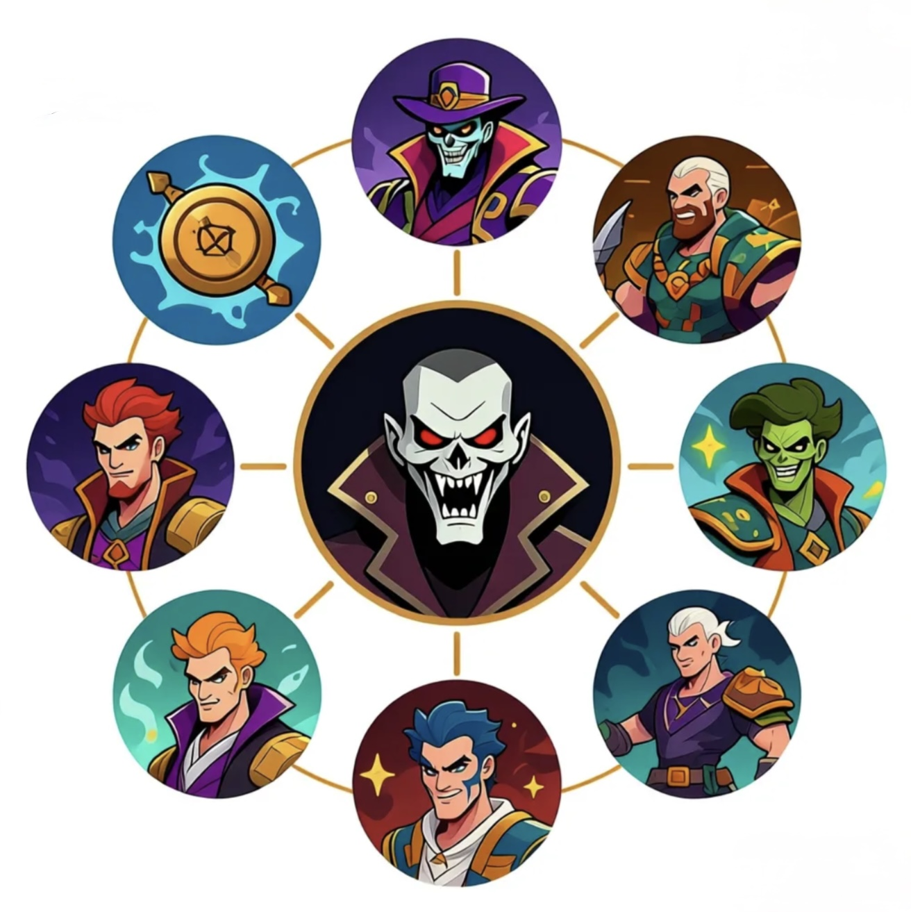
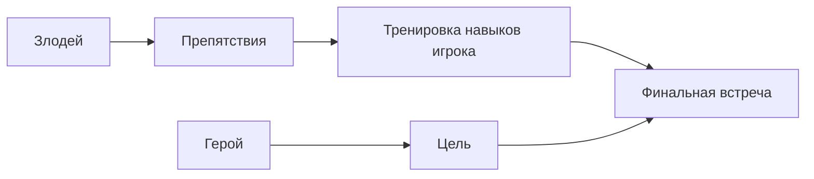

# Главные злодеи, которых мы любим

> 💡 **Коротко:** Хороший злодей делает игру интереснее: он задаёт **цель**, создаёт **напряжение**, проверяет твоё мастерство и запоминается как персонаж.

---

# [Главные злодеи, которых мы любим](./villains_we_love.md)

## Введение
Странная вещь: иногда мы любим не только героев, но и злодеев. Хотя злодей мешает, пугает и ставит ловушки, именно из‑за него игра становится захватывающей. Ты проходишь уровень не просто “ради галочки”, а потому что хочешь узнать: **а смогу ли я победить этого противника?** 😈

В этой статье разберём, зачем в игре нужен злодей, почему нам нравятся харизматичные враги, какие бывают типы злодеев и почему финальная встреча может стать самым сильным моментом всей истории.

## Зачем в игре нужен злодей
Злодей (антагонист) — это персонаж или сила, которая **мешает герою** и создаёт конфликт. Без конфликта история часто “провисает”: вроде бы красиво, но непонятно, зачем идти вперёд.

Вот что делает злодей:
- **Даёт цель**: победить, остановить, спасти, вернуть, раскрыть.
- **Создаёт напряжение**: появляются риски и ставки (“если проиграю — будет плохо”).
- **Учить играть лучше**: чтобы пройти дальше, нужно освоить прыжки, уклонения, тактику.
- **Делает мир живым**: если у врага есть план, кажется, что мир не стоит на месте.

Можно представить историю так:

## Почему нам нравятся харизматичные враги
“Харизма” — это когда персонажа интересно слушать и за ним интересно наблюдать. Даже если он плохой.

Почему так происходит:
- **Он умный или смелый**: хочется понять, как он думает.
- **У него есть стиль**: голос, фразы, манера, внешний вид — всё запоминается.
- **Он иногда прав… по‑своему**: у него может быть логика, пусть и жестокая.
- **Он связан с героем**: их спор — не случайный, а личный.

Важно: харизматичный злодей не обязательно “добрый”. Он просто сделан так, что ты в него веришь.

## Какие бывают злодеи (простые типы)
Чтобы проще ориентироваться, можно выделить несколько “понятных типов”:

1. **Тиран**  
   Хочет власти и контроля. Его легко ненавидеть, но интересно побеждать.
2. **Гений‑манипулятор**  
   Побеждает словами, планами и ловушками. У такого злодея часто “всё было рассчитано”.
3. **Трагический злодей**  
   У него есть причина: страх, боль, потеря. Иногда его даже жалко.
4. **Монстр/угроза**  
   Это может быть существо, болезнь, катастрофа. У него нет “речей”, но он создаёт опасность.
5. **Шутник‑хаос**  
   Делает непредсказуемые вещи. Игрок не понимает, что будет дальше — и это пугает.

| Тип злодея | Главная черта | Почему запоминается |
|:--|:--|:--|
| Тиран | Власть и контроль | Его приятно побеждать |
| Гений-манипулятор | Планы и ловушки | Ты не знаешь, чего ждать |
| Трагический | Боль и потеря | Его иногда жалко |
| Монстр/угроза | Чистая опасность | Страх и адреналин |
| Шутник-хаос | Непредсказуемость | Невозможно просчитать |

Один злодей может быть смесью типов: например, трагический тиран или гений‑шутник.

## Что делает финальную встречу со злодеем запоминающейся
Финальная встреча — это момент, ради которого ты часто проходил всю игру. Чтобы он запомнился, важно:

- **Подготовка**: игра “учила” тебя нужным навыкам раньше.
- **Честная сложность**: победа должна зависеть от умений, а не от случайности.
- **Сцена и музыка**: атмосфера помогает почувствовать важность момента.
- **Личная ставка**: герой защищает не абстрактное “добро”, а что-то конкретное.
- **Поворот**: иногда злодей показывает неожиданную сторону (слабость, страх, сомнение).

Когда всё это сходится, появляется ощущение: “Я не просто нажимал кнопки — я прошёл путь”.

## Почему «пустой злодей» портит историю
“Пустой” (картонный) злодей — это когда он злой “просто потому что злой”, и больше про него ничего не понятно.

Что обычно не так:
- **нет понятной цели** (он делает зло ради зла);
- **нет характера** (одни и те же фразы, никакой личности);
- **нет связи с героем** (просто “враг на финале”);
- **нет роста напряжения** (он появляется только в конце, и нам всё равно).

В такой истории игрок может думать: “Я прошёл игру, но не понял, зачем”. А хороший злодей делает наоборот: ты понимаешь, что финальная встреча была важна, и запоминаешь её надолго ✨.

## Заключение
Мы “любим” некоторых злодеев не за то, что они плохие, а за то, что они:
- делают историю сильнее;
- проверяют навыки игрока;
- запоминаются характером и стилем.

И иногда именно злодей превращает игру из “просто уровней” в настоящее приключение 🚀.

## См. также

[Знаменитый водопроводчик — История Марио: как простой персонаж стал символом Nintendo и дедушкой всех платформеров](./Famous_plumber.md)

[Создаем своего героя — Как редакторы персонажей позволяют нам быть собой или тем, кем мы мечтаем стать](./Create_your_own_hero.md)

---

*Автор: Дзюба Майя • Сгенерировано с помощью GPT-5.3 • Слов: 602 • 2026-03-17*
