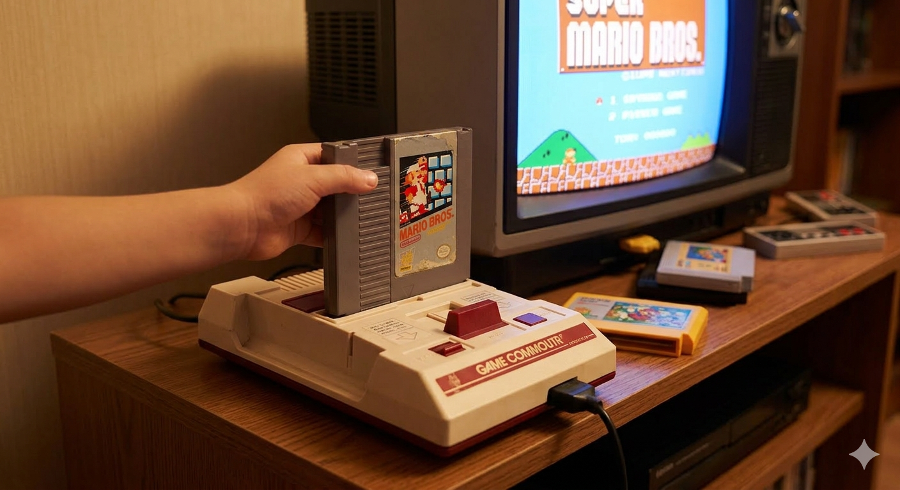
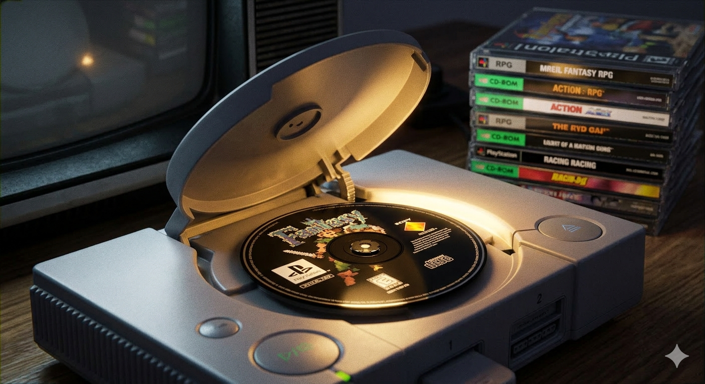
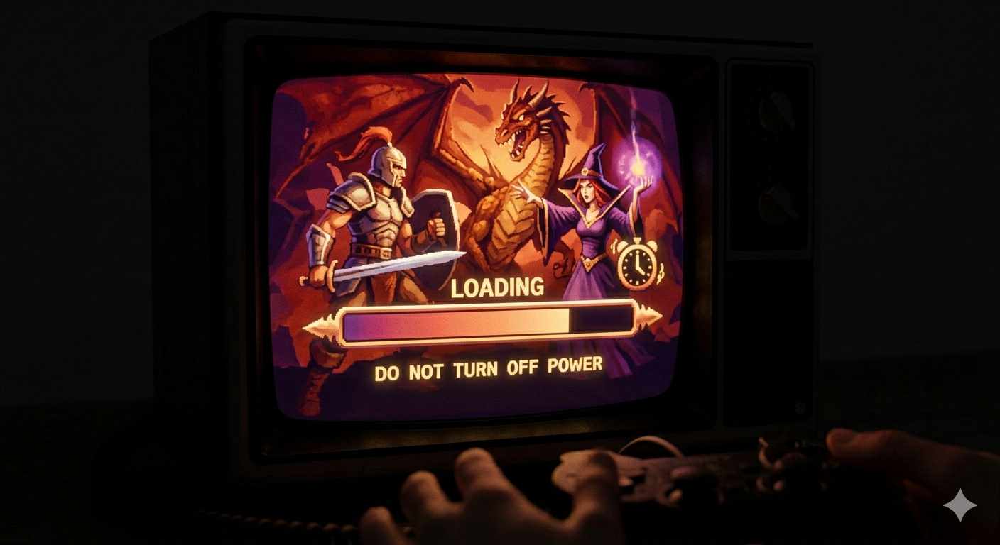
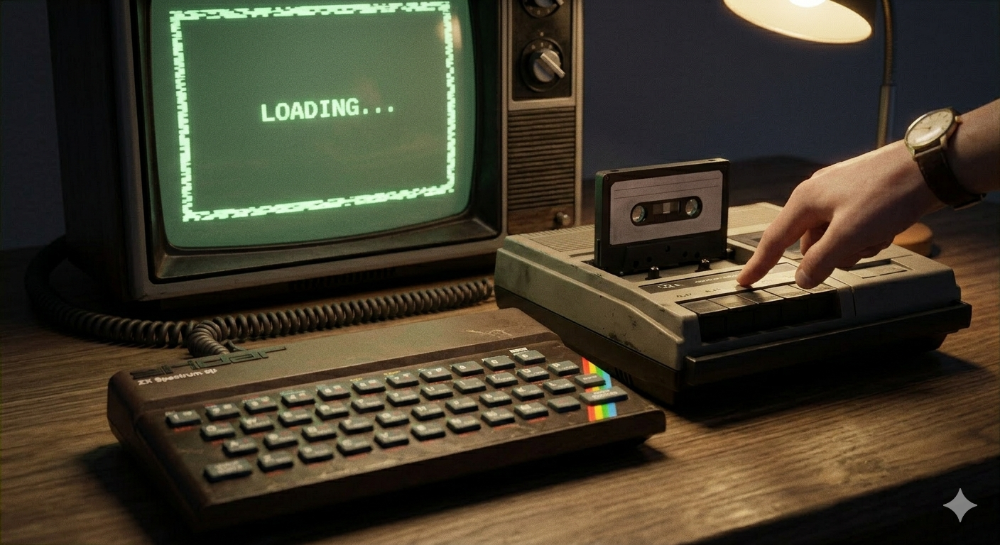
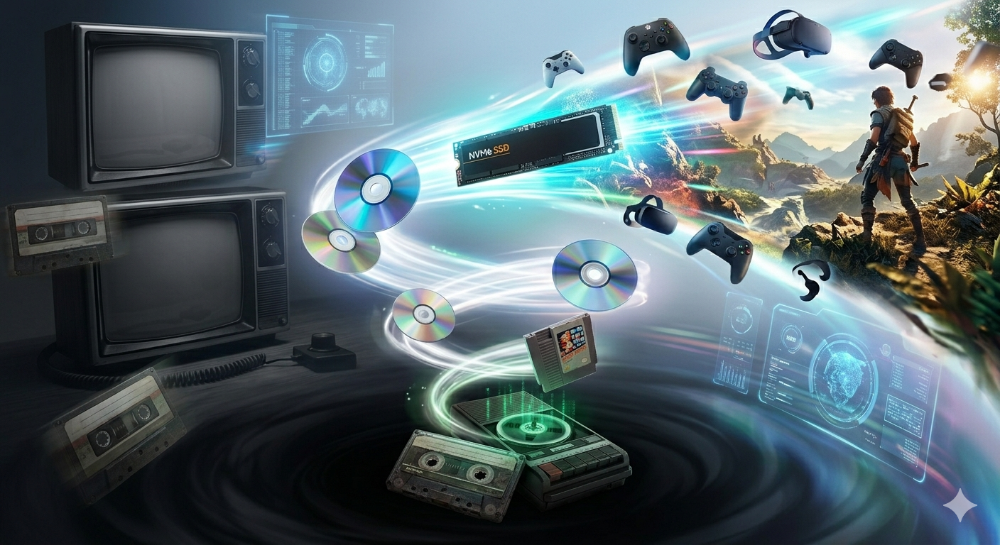

# Картридж против диска — Битва форматов и как раньше игры загружались по полминуты (а иногда и с кассет)

Сегодня мы живём в мире мгновенного доступа. Нажал кнопку — игра запустилась. Сохранился — продолжил через секунду. Но спросите своих родителей или старших братьев, что такое «экран загрузки», и они расскажут вам легенды. Легенды о том, как можно было успеть сделать бутерброд, пока игра грузилась, и о войне, которая шла не на экранах, а внутри самих приставок.

Это была битва технологий: **картридж** против **диска**. И от исхода этой битвы зависело, какими будут игры следующие двадцать лет.

### Эпоха картриджей: скорость и надёжность 🏎️
В 80-х и начале 90-х королём был картридж. Это была пластиковая коробочка с микросхемой внутри.
*   **Как это работало:** Вы вставляли картридж в приставку (например, **Dendy**, **Sega Mega Drive** или **Nintendo 64**), включали питание — и игра начиналась мгновенно.
*   **Плюсы:** Никаких загрузок. Мир игры уже был «записан» в чипе. Картриджи были надёжными: их можно было ронять, трясти, и они всё равно работали.
*   **Минусы:** Они были дорогими в производстве. Внутри мало места. Если разработчик хотел добавить больше музыки или видео, картридж становился золотым.

Именно из-за цены картриджей игры стоили дорого. А ещё существовала народная примета: если игра не запускается, нужно **подуть в разъём картриджа**. Это не всегда помогало, но стало ритуалом целого поколения 😄.

### Революция компакт-дисков: вместимость и риск 💿
В середине 90-х на сцену вышла компания **Sony** с консолью **PlayStation**. Они сделали ставку на обычные компакт-диски (CD-ROM).
*   **Как это работало:** Лазер считывал данные с вращающегося диска.
*   **Плюсы:** Диски были дешёвыми. На один диск влезало в сотни раз больше данных, чем в картридж. Это позволило добавлять в игры полноценную музыку, голосовую озвучку и видеовставки (катсцены).
*   **Минусы:** Скорость чтения была низкой. Игра не могла запуститься мгновенно. Её нужно было **загрузить** в память консоли.

Так появились они — **экраны загрузки**.

### Культура ожидания: искусство загрузочного экрана ⏳
Для современного игрока загрузка даже в 10 секунд — это уже долго. А раньше?
*   **Долгие минуты:** Некоторые игры грузились по 2–5 минут.
*   **Мини-игры:** Чтобы игрок не скучал, разработчики прятали в экран загрузки простые игры (например, в **Tekken** или **Tony Hawk**).
*   **Звуки:** Каждый узнает этот звук — жужжание диска, скрежет механизма. Это был звук приближения приключения.

Но самым экстремальным опытом были даже не диски, а **кассеты**.

### Заря истории: игры на аудиокассетах 📼
До эры картриджей и дисков, в начале 80-х, компьютеры вроде **ZX Spectrum** или **Commodore 64** использовали обычные магнитофонные кассеты.
*   **Процесс:** Вы вставляли аудиокассету в магнитофон, соединяли его проводом с компьютером и нажимали «Play».
*   **Звук:** Из динамиков доносился ужасный скрежет, похожий на шум помех. Это были данные, закодированные в звук.
*   **Риск:** Если кто-то чихнул, если кассета зажевалась, если магнитофон чуть-чуть сбился — **все данные терялись**. Нужно было начинать загрузку сначала.

Представьте: вы ждёте 10 минут, слышите заветное «Loading complete», начинаете играть... и через минуту игра вылетает. Вы снова вставляете кассету и ждёте ещё 10 минут. Это воспитывало в игроках невероятное терпение.

### Почему диски победили? 🏆
К концу 90-х картриджи почти исчезли. Почему?
1.  **Объём:** Игры становились сложнее. Нужно было место для текстур, музыки и видео. Картридж не мог этого дать.
2.  **Цена:** Производить диски было дешевле. Игры стали доступнее для школьников.
3.  **Кино в играх:** Благодаря дискам игры стали похожи на фильмы. Вспомните **Final Fantasy VII** или **Resident Evil**. Без объёма дисков они бы не получились такими эпичными.

Конечно, были и исключения. Nintendo долго держалась за картриджи (Nintendo 64), потому что ценила скорость. Но рынок сказал своё слово.

### От кассет до SSD: как далеко мы зашли
Сегодня мы снова ценим скорость. Современные консоли используют **SSD-накопители**, которые загружают игры за секунды. Мы вернулись к истокам — к мгновенному старту, как во времена картриджей, но с объёмом дисков и качеством кино.

Но стоит помнить те времена. Когда нужно было бережно относиться к носителю. Когда нельзя было просто «переключить» игру, а нужно было физически поменять коробку. Когда ожидание делало момент начала игры особенным.

### Итог
Битва форматов изменила то, как мы потребляем контент.
*   **Картриджи** научили нас надёжности и скорости.
*   **Диски** подарили нам объём и киношность.
*   **Кассеты** показали, насколько сложным может быть путь к данным.

Следующий раз, когда увидите значок загрузки на экране, не спешите раздражаться. Это дань истории. Маленькое напоминание о том, что раньше игры не просто запускались — их нужно было заслужить временем ⏳🎮

## См. также

[Теннис на телевизоре — Как простая точка, летающая по экрану, положила начало целой индустрии (игра Pong)](./Tennis_on_TV.md)

[Кризис и воскрешение — Почему в 1983 году люди перестали покупать игры и как Марио спас индустрию](./Crisis_and_Resurrection.md)

---
*Автор: Елизаров Дмитрий *
*При создании использовались нейросети: ChatGPT, Gemini*
