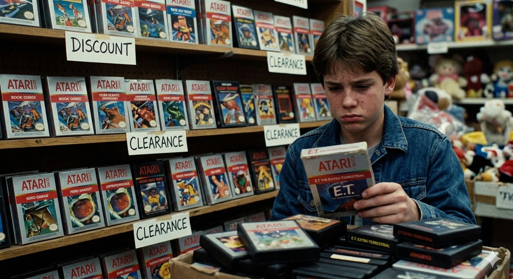
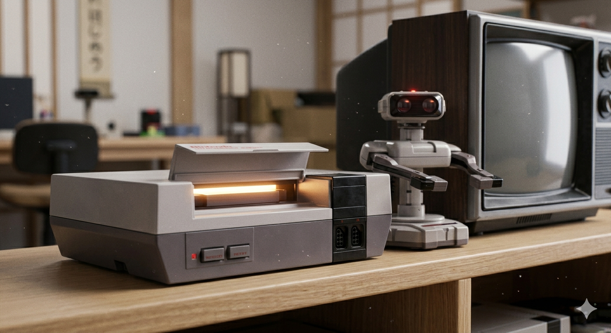
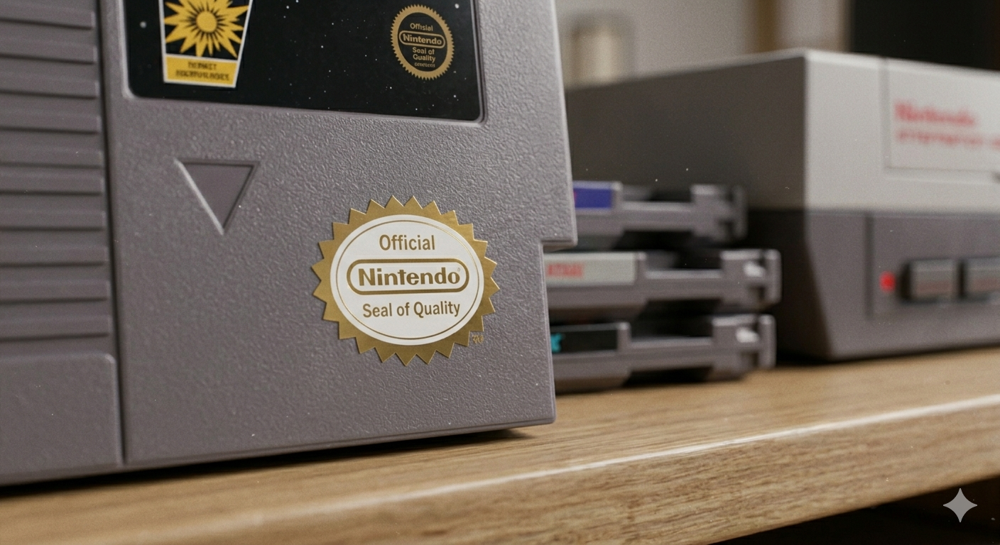

# Кризис и воскрешение — Почему в 1983 году люди перестали покупать игры и как Марио спас индустрию

Представьте, что вы приходите в магазин за новой игрой, а на полках пусто. Или ещё хуже: полки завалены коробками, но внутри них — мусор, который не работает или скучен через пять минут. Именно это произошло в начале 80-х. Индустрия, которая только начала набирать обороты после успеха **Pong**, вдруг рухнула в пропасть.

Казалось, что видеоигры — это просто модное увлечение, которое уже прошло. Но одна компания и один усатый водопроводчик смогли доказать обратное.

### Великий крах 1983 года 📉
К началу 80-х рынок был перенасыщен. Консоли выпускали все, кто мог паять микросхемы.
*   **Слишком много выбора:** Покупатели не понимали, чем одна приставка отличается от другой.
*   **Отсутствие контроля:** Любой мог выпустить игру. Качество было ужасным.
*   **Легенда об E.T.:** Самая известная история того времени. Компания Atari потратила миллионы на лицензию фильма «Инопланетянин», сделала игру за несколько недель, и она оказалась настолько плохой, что тысячи картриджей буквально **закопали в пустыне**.

Доверие игроков было подорвано. Магазины перестали заказывать игры, инвесторы уходили, а слово «видеоигра» стало звучать как «пустая трата денег». Индустрия замерла в ожидании конца.

### Ниндзя из Киото: вход Nintendo 🇯🇵
Пока американские компании паниковали, в Японии компания **Nintendo** готовила свой ответ. Они видели, что произошло в США, и поняли главное: **люди покупают не железо, они покупают доверие.**

Когда Nintendo решила выпустить свою консоль **NES (Nintendo Entertainment System)** в Америке, они пошли на хитрость.
1.  **Не называть это консолью.** Слово «video game» было испорчено. Поэтому приставку назвали «Развлекательной системой».
2.  **Дизайн как у видеомагнитофона.** Чтобы родители думали, что это серьёзная техника для дома, а не игрушка.
3.  **Робот R.O.B.** В комплекте шёл игрушечный робот, который реагировал на действия на экране. Это позиционировало консоль как высокотехнологичную игрушку, а не «очередную приставку».

### Супер Марио: человек, который прыгал лучше всех 🍄
Но вся упаковка мира не сработала бы без главного — **хорошей игры**.
В 1985 году вышла **Super Mario Bros.** Её создатель, **Сигэру Миямото**, подошёл к делу не как инженер, а как исследователь детских площадок.

Почему Марио стал спасителем?
*   **Идеальное управление:** Персонаж слушался игрока мгновенно. Не было задержек, которые бесили в старых играх.
*   **Понятный мир:** Яркие цвета, понятные враги, скрытые секреты.
*   **Эмоция радости:** Игра не наказывала игрока просто так. Она поощряла любопытство.

Марио показал людям: «Смотрите, видеоигры могут быть искусством. Они могут быть точными, красивыми и честными».

### Печать качества — гарантия для игрока ✅
Nintendo поняла, что крах случился из-за плохих игр. Поэтому они ввели систему **лицензирования**.
На коробках с играми появилась надпись: **Official Nintendo Seal of Quality** (Официальная печать качества Nintendo).

Это означало, что:
*   Игра проверена компанией.
*   Она не сломает консоль.
*   Она действительно интересна.

Для покупателей это стало знаком безопасности. Они снова начали открывать кошельки. Магазины снова начали заполняться полками.

### Урок для будущего
Кризис 1983 года научил индустрию важному правилу, которое актуально и сегодня: **нельзя обманывать ожидания игрока.**
Если вы выпускаете продукт, вы отвечаете за его качество.

Благодаря этому уроку:
*   Появились современные рейтинги игр.
*   Разработчики стали больше вкладывать в тестирование.
*   Имя создателя (как Миямото) стало брендом само по себе.

### Итог
История спасения игровой индустрии — это история о том, как **качество побеждает количество**.
Один красный кепочник, одна приставка и одно правильное решение вернули миру веру в магию видеоигр. Без этого «воскрешения» не было бы ни PlayStation, ни Xbox, ни тех игр, в которые вы играете сейчас на телефоне или ПК.

Иногда, чтобы сделать шаг вперёд, нужно сначала убраться после прошлого шага. Nintendo сделала эту уборку блестяще

## См. также

[Теннис на телевизоре — Как простая точка, летающая по экрану, положила начало целой индустрии (игра Pong)](./Tennis_on_TV.md)

[Картридж против диска — Битва форматов и как раньше игры загружались по полминуты (а иногда и с кассет)](./Cartridge_versus_Disc.md)

---
*Автор: Елизаров Дмитрий *
*При создании использовались нейросети: ChatGPT, Gemini*
