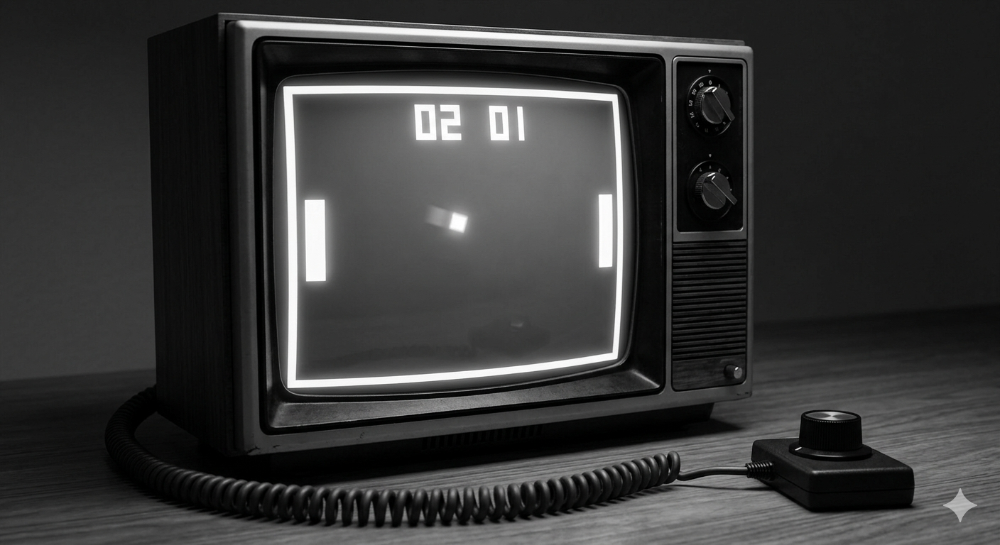
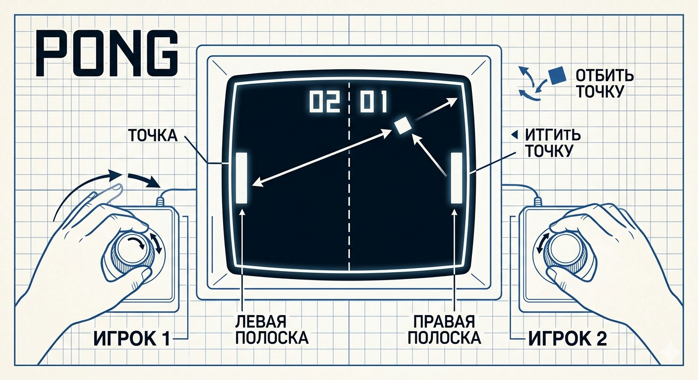
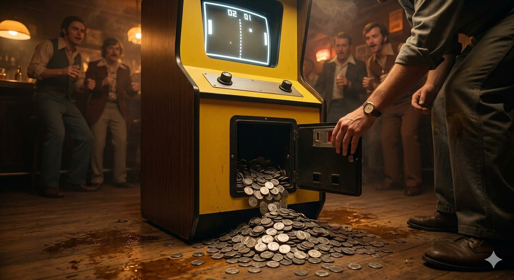
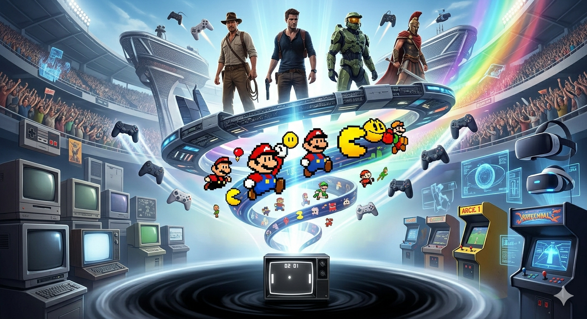

# Теннис на телевизоре — Как простая точка положила начало целой индустрии 🕹️

Сегодня мы привыкли к играм, где графика неотличима от реальности, где голоса актёров записывают в голливудских студиях, а миры занимают сотни гигабайт. Но сложно поверить, что вся эта гигантская индустрия началась с чего-то гораздо проще. Настолько просто, что это казалось шуткой.

Представьте: чёрный экран, две белые полоски по краям и одна светящаяся точка посередине. Никаких спецэффектов. Никакого сюжета. Только звук «пик-понг» при ударе. Именно так выглядела игра, которая изменила мир навсегда.

### Что такое Pong?
В 1972 году компания **Atari** выпустила аркадный автомат с игрой **Pong**. Это был виртуальный настольный теннис.
*   **Игрок 1:** управляет левой полоской.
*   **Игрок 2:** управляет правой полоской.
*   **Цель:** отбить точку так, чтобы соперник не смог её вернуть.

Казалось бы, где здесь история? Где здесь магия? Но магия была именно в **простоте**. Не нужно было читать инструкции. Не нужно было учить кнопки. Вы видели теннис — вы понимали правила. Это было интуитивно понятно каждому, кто заходил в бар или магазин.

### Легенда о сломанном автомате
Существует известная история, которая отлично показывает успех проекта. Первый прототип игры установили в баре «Энди Кэпп» в Калифорнии. Через несколько дней владельцу позвонил инженер и сказал, что нужно починить автомат — он сломался.

Приехав на место, инженер обнаружил, что ничего не сломано. Просто **монетоприёмник был переполнен до отказа**. Люди настолько залипали в эту «точку», что не жалели денег. Именно в этот момент стало ясно: видеоигры — это не научная забава, а полноценный бизнес и развлечение для миллионов.

### Почему это сработало?
Если вспомнить принципы сторителлинга, то даже у такой простой игры была своя «драматургия»:
1.  **Понятный конфликт:** Ты против соперника.
2.  **Мгновенная обратная связь:** Ударил мяч — услышал звук. Проиграл — увидел, как мяч улетел за край.
3.  **Азарт:** Хочется отбить ещё раз. Хочется победить.

В отличие от современных игр, где сценарист прописывает ветки диалогов и мотивацию героев, здесь сценарием была сама механика. Игрок сам создавал свою историю матча. Каждый раунд был уникальным.

### От точки к вселенной
Успех Pong дал старт тому, что мы сегодня называем **геймдевом**.
*   Появились первые домашние консоли.
*   Компании начали инвестировать в разработку.
*   Люди поняли, что телевизор может быть не только для просмотра передач, но и для взаимодействия.

Без этой простой точки не было бы ни сложных сюжетов в стиле *The Last of Us*, ни открытых миров вроде *The Witcher*, ни киберспортивных турниров на стадионах.

### Итог
История игровой индустрии — это доказательство того, что для великой идеи не нужны сложные инструменты. Нужна лишь искра.
**Pong** стал той искрой. Он научил мир одному важному правилу: главное не то, насколько красива картинка, а то, насколько увлекательно процесс.

Когда в следующий раз запустите современную игру с графикой уровня кино, вспомните ту самую точку. Ведь всё великое начинается с простого шага… или простого удара по виртуальному мячу 😉

## См. также

[Кризис и воскрешение — Почему в 1983 году люди перестали покупать игры и как Марио спас индустрию](./Crisis_and_Resurrection.md)

[Картридж против диска — Битва форматов и как раньше игры загружались по полминуты (а иногда и с кассет)](./Cartridge_versus_Disc.md)

---
*Автор: Елизаров Дмитрий *
*При создании использовались нейросети: ChatGPT, Gemini*
