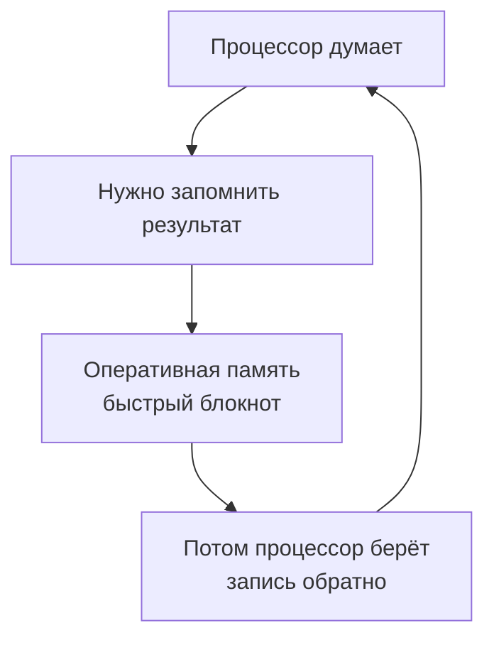

# Хитрый [процессор](../technologies_inside/smart_processor.md) и быстрая [память](../../../../3.1. healthy lifestyle/Sleep, nutrition, and adolescent energy/articles/sleep_and_memory_grades.md)

Почему компьютер не путается, когда считает миллионы действий в секунду

---

Представь, что тебе нужно решить 100 примеров по математике. Одновременно ответить на [сообщения](../../../../5.1_technology_and_digital_literacy/operating system/articles/IPC.md) в чате, включить музыку и следить, чтобы не пригорела [яичница](../../../../6.1_Independent_living_and_daily_living_skills/Simple_and_safe_cooking/articles/10_must_know_recipes.md) на плите. Сложно? А вот компьютер делает такое каждую секунду — и никогда ничего не забывает и не путает. Как у него это получается?

Давай заглянем внутрь системного блока или ноутбука. Там есть два самых главных жителя: **Процессор** и **Память**. Они работают в паре, как два лучших друга.

 
---

### 🧠 Процессор — супер-мозг с тысячью рук

**Процессор** (или CPU — Central Processing Unit) — это главный мыслительный центр компьютера. Если сравнивать с человеком, то процессор — это и твой [мозг](../../../../3.1. healthy lifestyle/Sleep, nutrition, and adolescent energy/articles/breakfast_for_the_brain.md), и твои руки одновременно. Только представь:

- Твой мозг может думать над одной задачей за раз.
- А у современного процессора внутри — **от 4 до 16 и больше «мозгов»**! Они называются **ядра**.

> 🎮 **Представь отряд супергероев:** Каждое [ядро](../../../../1.1_structure_of_the_world/matter/articles/03_atom_structure.md) — это отдельный герой. Один считает математику, второй отвечает за музыку, третий рисует картинку на экране, четвёртый скачивает [файл](../../../../5.1_technology_and_digital_literacy/operating system/articles/file_system.md) из интернета. И все работают одновременно!

 

Но самое удивительное даже не это. Каждое ядро работает с невероятной скоростью. [Скорость](../../../../1.2_natural_sciences/physics_in_everyday_life/Q11402.md) измеряется в **гигагерцах ([ГГц](../../../../5.1_technology_and_digital_literacy/how_internet_works/articles/wifi/radio.md))**.

| Скорость | Что это значит |
|----------|----------------|
| 1 ГГц | 1 миллиард операций в секунду |
| 3 ГГц | 3 миллиарда операций в секунду |

То есть процессор с частотой 3 ГГц делает **три миллиарда крошечных действий каждую секунду**! [Человек](../../../../1.2_natural_sciences/physics_in_everyday_life/Q45003.md) моргает раз в 5 секунд, а процессор за это [время](../../../../1.2_natural_sciences/physics_in_everyday_life/Q20702.md) успевает выполнить 15 миллиардов операций.

---

### 📚 Память — супер-быстрый блокнот

Но просто быстро считать мало. Нужно же где-то [запоминать](../../../../4.1_rules_of_study/how_to_memorize/articles/zapominanie.md), что уже сделано, а что ещё предстоит. Для этого у компьютера есть **[оперативная память](../../../../4.1_rules_of_study/how_to_memorize/articles/kratkovremennaya_pamyat.md)** (или RAM — Random Access Memory).

Представь, что ты решаешь примеры и держишь в голове промежуточные ответы. Если пример сложный, ты записываешь их на листочек, который лежит рядом. Вот этот листочек и есть оперативная память.

Почему она такая особенная?

1. Очень быстрая — процессор может взять из неё [данные](../../../../2.1_society/cause_and_effect_relationships/articles/ai_causality.md) за наносекунды (это миллиардные доли секунды!).
2. Всё временное — когда ты выключаешь компьютер, блокнот «очищается». Поэтому несохранённый рисунок пропадает, если отключить [свет](../../../../1.2_natural_sciences/physics_in_everyday_life/Q1.md).
3. Ячейки-сейфики — память состоит из миллиардов крошечных ячеек. У каждой — свой [адрес](../../../../5.1_technology_and_digital_literacy/how_internet_works/articles/ip_mac/ip_and_mac.md). Процессор знает эти адреса и мгновенно находит нужную информацию.

---

🗂️ А как же всё хранить навсегда?

Для долгого хранения есть другой вид [памяти](../../../../4.1_rules_of_study/how_to_memorize/articles/pamyat.md) — постоянная (SSD или жёсткий [диск](../../../../5.1_technology_and_digital_literacy/operating system/articles/file_system.md)). Это как книжная полка или большой шкаф с папками.

[Тип](../../../../5.2_cybersecurity/cpp_fundamentals/13_struct.md) памяти Это как... Скорость Когда исчезает
Оперативная (RAM) Блокнот на столе 🚀 Мгновенно При выключении
Постоянная (SSD/HDD) Книжный шкаф 🐢 Медленнее Хранится всегда

Процессор работает так:

1. Берёт задачу из «книжного шкафа» (игры или программы).
2. Перекладывает в «быстрый блокнот» (оперативную память).
3. Быстро-быстро там всё считает.
4. Готовый [результат](../../../../1.2_natural_sciences/why_science_help_understand_world/experimental_science.md) показывает на экране или сохраняет обратно в шкаф.

---

⏰ Как они всё успевают и не путаются?

У компьютера есть строгий [планировщик](../../../../5.1_technology_and_digital_literacy/operating system/articles/process.md) задач — специальная [программа](../../../../5.1_technology_and_digital_literacy/operating system/articles/process.md) в процессоре. Она работает как строгий, но справедливый учитель в классе.

👩‍🏫 Представь [урок](../../../../5.1_technology_and_digital_literacy/information and media literacy/шаблон_урока_по_медиаграмотности.md): 30 учеников (программ) хотят ответить. Учитель (планировщик) даёт каждому по 1 миллисекунде. Пока один отвечает, остальные ждут. Но переключение происходит так быстро, что кажется, будто отвечают все одновременно!

Как это выглядит на самом деле:

Процессор переключается между задачами миллионы раз в секунду. Для нас это выглядит как одновременная [работа](../../../../1.2_natural_sciences/physics_in_everyday_life/Q11382.md): [игра](../../../../4.1_rules_of_study/how_to_learn_effectively/articles/gamification.md) не тормозит, [музыка](../../../../1.2_natural_sciences/neurobiology_for_teens/articles/18_music_chills.md) играет, сайты грузятся.

---

🎯 Главные секреты

Что это Сколько операций Для чего нужно
Ядро процессора 1 супер-мозг Считать одну задачу
4-ядерный процессор 4 супер-мозга Считать 8-16 задач одновременно
[Частота](../../../../1.2_natural_sciences/physics_in_everyday_life/Q11388.md) 3 ГГц 3 млрд операций/сек Скорость мышления
Оперативная память 16 ГБ Миллиарды ячеек Быстрый блокнот для текущих дел

---

🔮 Интересный [факт](../../../../1.2_natural_sciences/why_science_help_understand_world/science.md)

Если бы человек мог считать так же быстро, как процессор (3 миллиарда операций в секунду), то:

· Он бы решил пример, который обычный школьник решает 5 минут, за 0,0000001 секунды
· За одну секунду он бы посчитал все примеры из всех учебников математики в мире
· Ему бы не хватило бумаги [записывать](../../../../4.1_rules_of_study/how_to_memorize/articles/konspektirovanie.md) ответы — понадобился бы стопка листов высотой с небоскрёб каждую секунду!

---

Вот такой он — хитрый процессор. Миллиарды операций, десятки программ одновременно, и ни одной [ошибки](../../../../3.1_healthy_lifestyle/pervaya_pomoshch/ushibi_porezy_ozhogi/07_ushib_chego_nelzya.md). А помогает ему верная подруга — быстрая оперативная память, которая всегда под рукой с нужными цифрами.

## См. также
[Магия экрана: от лампочки до пикселя — Как луч пробегает по экрану тысячи раз в секунду, чтобы мы видели картинку](./Screen_Magic_From_Bulb_to_Pixel.md)

[Кнопки, джойстики и провода — История управления: от деревянного руля до геймпада с вибрацией](./Management_history.md)

---
## 📝 Авторы

**Жданович Елизавета, 307**  
*С использованием [нейросети](../../../../2.1_society/cause_and_effect_relationships/articles/ai_causality.md) DeepSeek*
