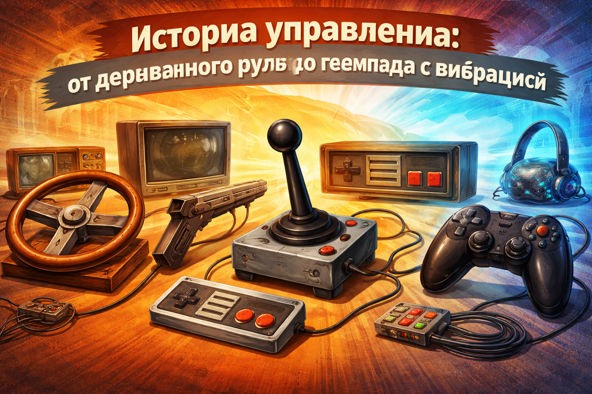
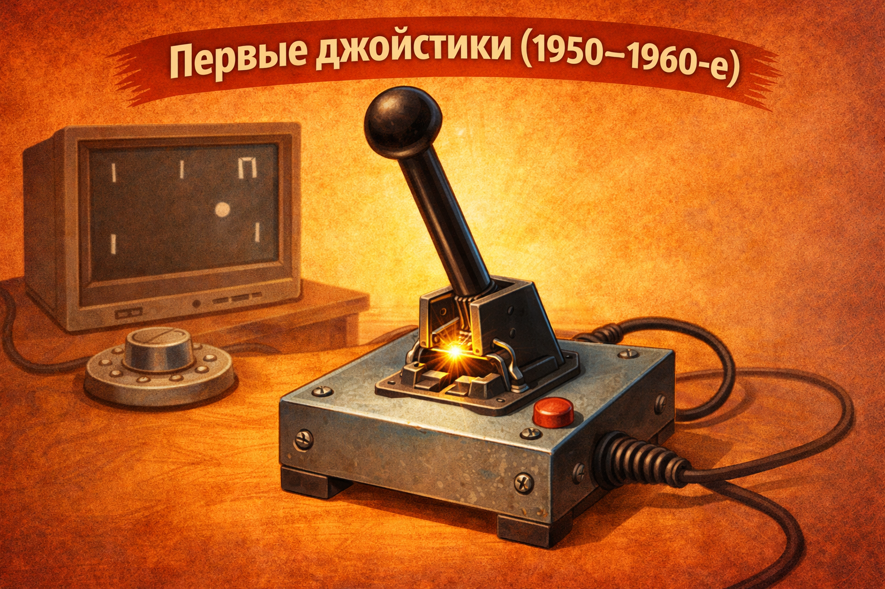
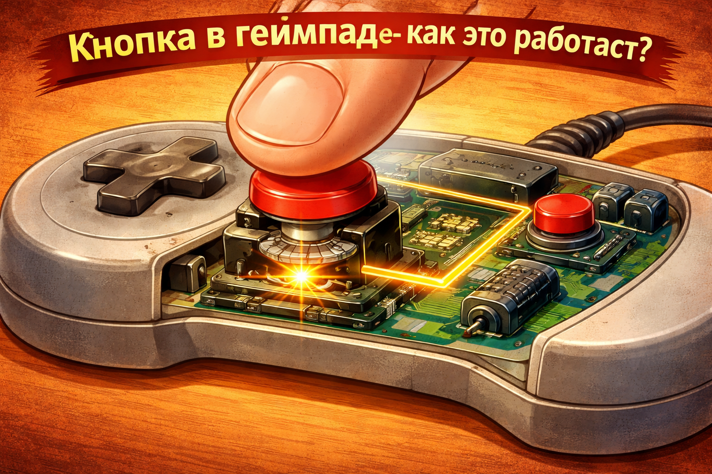
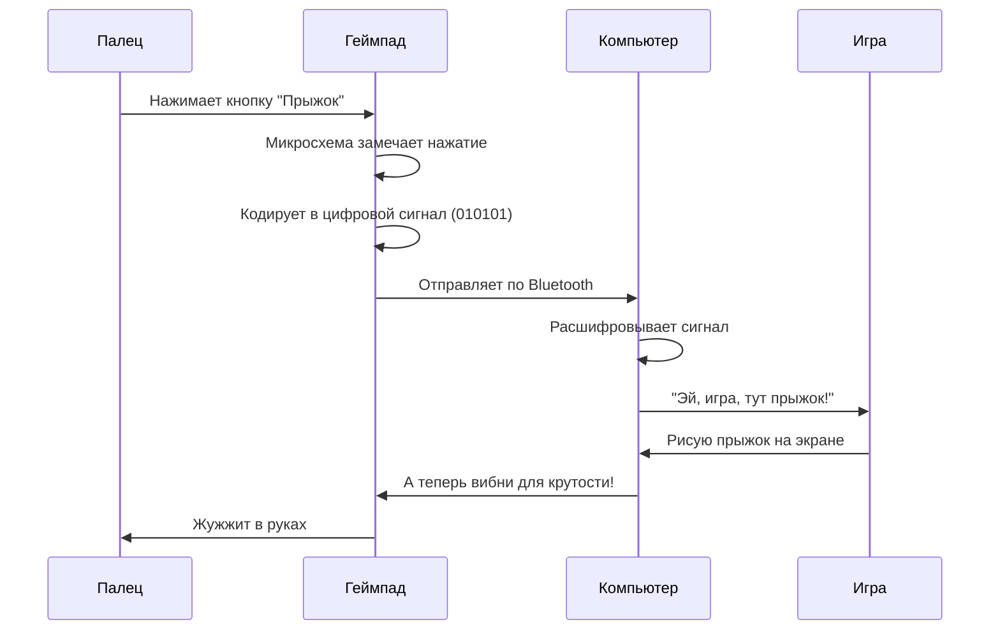
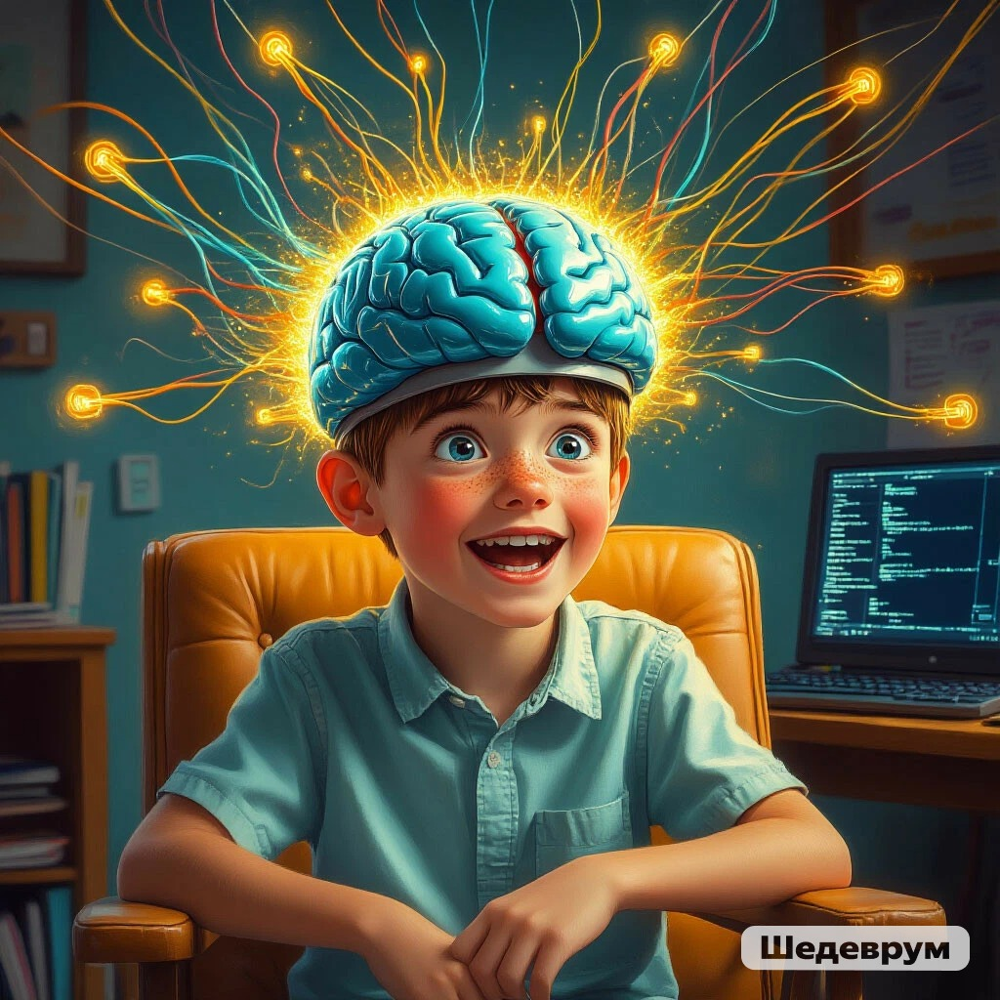

## [Кнопки](../../../../7.1_art/musical_instruments/articles/accordion.md), джойстики и [провода](../../../../1.2_natural_sciences/physics_in_everyday_life/Q124291.md)

[История](../../../../1.2_natural_sciences/physics_in_everyday_life/Q11469.md) управления: от деревянного руля до геймпада с вибрацией

---

Представь, что ты хочешь сказать компьютеру: «Иди налево! Прыгай! Стреляй!» Как он тебя поймёт? Ведь у него нет ушей, как у человека.

Для этого люди придумали специальных переводчиков — **[устройства](../../../../5.1_technology_and_digital_literacy/operating system/articles/HAL.md) ввода**. Самое главное из них — [геймпад](../technologies_inside/management_history.md) или [джойстик](../technologies_inside/management_history.md). Но такими, как сейчас, они были не всегда. Давай отправимся в путешествие во времени и посмотрим, как люди учили компьютеры понимать свои команды.

 

---

### 🕹️ Эпоха 1: Ручки и крутилки (1950–1960-е)

Самые первые игры были совсем простыми. Например, [теннис](../how_it_all_started/tennis_on_tv.md) — две палочки и квадратик-мячик. Для управления не нужны были десятки кнопок.

> 🎛 **Первые джойстики** напоминали ручку переключения скоростей в самолёте. Просто палка, которую можно наклонять в разные стороны. Внутри — обычные металлические пластинки. Наклоняешь влево — пластинки замыкаются, [ток](../../../../1.2_natural_sciences/physics_in_everyday_life/Q177897.md) бежит по проводу, компьютер понимает: «Ага, игрок хочет налево!»



Но были и совсем необычные штуки:

| [Устройство](../../../../1.2_natural_sciences/physics_in_everyday_life/Q178032.md) | Как работало |
|------------|--------------|
| **[Руль](../technologies_inside/management_history.md)** | Просто [деревянный](../../../../7.1_art/musical_instruments/articles/didgeridoo.md) круг, приделанный к столу. Идеально для гоночных игр! |
| **Световой пистолет** | Стреляешь в [экран](../../../../3.1. healthy lifestyle/Sleep, nutrition, and adolescent energy/articles/gadgets_blue_light_sleep.md) — специальный датчик замечает, куда попал луч |
| **Потенциометр** | Крутилка, как у старого [радио](../how_it_all_started/tennis_on_tv.md). Чем сильнее крутишь — тем быстрее едет машинка |

Внутри этих устройств не было никаких микросхем. Только провода, металлические контакты и [резисторы](../../../../1.2_natural_sciences/physics_in_everyday_life/Q25358.md) (такие штуки, которые меняют силу тока).

---

### 🔌 Эпоха 2: Провода и разъёмы (1970–1980-е)

Когда игры стали сложнее, одной палки стало мало. Появились первые **геймпады с кнопками**!

Посмотри на культовую приставку **[NES](../how_it_all_started/crisis_and_resurrection.md) ([Nintendo](../how_it_all_started/crisis_and_resurrection.md) Entertainment System)**. Её геймпад выглядел как прямоугольный кирпичик:

```

┌─────────────────────┐
│   ⬆️                │
│ ⬅️ ⬇️ ➡️   🔴  🔴   │
│          SELECT START│
└─────────────────────┘

```

Всего 4 кнопки направления и 2 кнопки [действия](../../../../3.1_healthy_lifestyle/pervaya_pomoshch/ushibi_porezy_ozhogi/03_obschie_pravila_algorithm.md) (А и В) и две служебные (Select и Start). Этого хватало, чтобы пройти любую игру того времени!

**Как это работало внутри?**

Представь обычный [выключатель](../../../../1.2_natural_sciences/physics_in_everyday_life/Q177897.md) света. Нажал — [свет](../../../../1.2_natural_sciences/physics_in_everyday_life/Q1.md) зажёгся ([контакт](../../../../1.2_natural_sciences/neurobiology_for_teens/articles/17_hugs_oxytocin.md) замкнулся). Отпустил — погас (контакт разомкнулся). Кнопка в геймпаде — это тот же выключатель, только крошечный.




Всё гениально и просто! Но был минус — провода. Провод от геймпада тянулся к приставке. Если ты слишком увлекался игрой, можно было дёрнуть провод и уронить приставку на пол. А если в доме была кошка — она обязательно перегрызала эти провода.

---

📡 Эпоха 3: Беспроводное [будущее](../../../../1.2_natural_sciences/physics_in_everyday_life/Q11469.md) ([1990-е](../../../../7.1_art/modern_technological_art/articles/2.2_heath_bunting.md))

Инженеры придумали, как избавиться от проводов. Они отправили команды... по воздуху!

Первые беспроводные геймпады работали как пульты от телевизора — с помощью инфракрасного луча. Нажимаешь кнопку — геймпад мигает невидимым глазом красным огоньком, [приставка](../how_it_all_started/tennis_on_tv.md) ловит этот [сигнал](../../../../5.1_technology_and_digital_literacy/how_internet_works/articles/wifi/router.md).

🚫 Но был смешной недостаток: если между тобой и приставкой кто-то проходил — луч прерывался, и [персонаж](../game_culture/cosplay.md) замирал в самый ответственный момент!

Позже придумали радиосигнал (как у радиостанций). Теперь можно было сидеть в любой комнате, и сигнал проходил сквозь стены. А чтобы геймпад не путался с другими устройствами, каждому дали свой «голос» — свой канал связи.

---

🎮 Эпоха 4: Умные геймпады с обратной связью (2000-е)

Современные геймпады — это уже не просто набор кнопок. Это настоящие маленькие компьютеры! Внутри каждого живёт свой [процессор](../technologies_inside/smart_processor.md) и [память](../../../../3.1. healthy lifestyle/Sleep, nutrition, and adolescent energy/articles/sleep_and_memory_grades.md).

Заглянем внутрь современного геймпада:

```
┌─────────────────────────────────────┐
│  ⬆️⬇️⬅️➡️  🔴🔵🟢🟡  🔛 🔛  🎮     │
│                                     │
│  [~~~~~~~~~~ ВИБРОМОТОРЫ ~~~~~~~~~] │
│  [    АККУМУЛЯТОР    ГИРОСКОП     ] │
└─────────────────────────────────────┘
```

Что внутри Для чего нужно
Микропроцессор Следит за всеми кнопками сразу
Вибромоторы Два грузика, которые крутятся и заставляют геймпад дрожать
Акселерометр Чувствует, как ты наклоняешь геймпад
Гироскоп Понимает, в какую сторону ты повернул устройство
Аккумулятор Чтобы не было проводов
Bluetooth-модуль Отправляет сигналы в приставку по воздуху

---

📱 Эпоха 5: Сенсоры и касания (2010-е — сейчас)

А потом появились сенсорные экраны. Кнопки исчезли совсем! Теперь вместо нажатия — [прикосновение](../../../../1.2_natural_sciences/neurobiology_for_teens/articles/17_hugs_oxytocin.md).

Как экран понимает, что ты к нему прикоснулся?

✨ Секрет в электричестве. Экран покрыт невидимой сеткой из проводников. Твой палец проводит [электричество](../../../../1.2_natural_sciences/physics_in_everyday_life/Q11408.md) (потому что внутри нас [вода](../../../../3.1. healthy lifestyle/Sleep, nutrition, and adolescent energy/articles/drinking_regime.md) и соли). Когда палец касается стекла, он замыкает крошечные токи в этом месте. Процессор замечает: «Вот здесь палец! Наверное, игрок хочет нажать на эту кнопку».

Современные геймпады тоже научились чувствовать силу нажатия. Нажал слабо — персонаж идёт медленно. Нажал сильно — бежит. Внутри специальные датчики давления, которые понимают, с какой силой ты давишь на кнопку.

---

📡 Как кнопки разговаривают с компьютером

Теперь самое интересное. Когда ты нажимаешь кнопку на современном геймпаде, происходит целое приключение:



Вся эта цепочка занимает меньше одной сотой секунды! Поэтому нам кажется, что персонаж прыгает сразу, как только мы нажали кнопку.

---

🎯 [Эволюция](../../../../1.2_natural_sciences/neurobiology_for_teens/articles/10_sweet_tooth.md) управления за 5 минут

Годы [Тип](../../../../5.2_cybersecurity/cpp_fundamentals/13_struct.md) управления Фишка
1950-60 Ручки и крутилки Как в самолёте
1970-80 Кнопки и джойстики Просто и надёжно
1990 Инфракрасные пульты Без проводов, но нужна прямая видимость
2000 Радио + вибро Сквозь стены и с отдачей
2010+ Сенсоры + [гироскопы](../../../../1.2_natural_sciences/physics_in_everyday_life/Q161635.md) Чувствуют наклон и касание

---

🔮 А что дальше?

Учёные уже тестируют управление силой мысли! Датчики на голове считывают мозговые [волны](../../../../1.2_natural_sciences/physics_in_everyday_life/Q136980.md). Хочешь прыгнуть — просто подумай об этом. Пока технология только учится, но кто знает — может, через 10 лет мы будем управлять играми без всяких геймпадов?



А пока наслаждайся кнопками, джойстиками и приятной вибрацией в руках — за этим стоит 70 лет инженерной мысли и тысячи изобретателей по всему миру!


## См. также
[Магия экрана: от лампочки до пикселя — Как луч пробегает по экрану тысячи раз в секунду, чтобы мы видели картинку](./Screen_Magic_From_Bulb_to_Pixel.md)

[Хитрый процессор и быстрая память — Почему компьютер не путается, когда считает миллионы действий в секунду](./A_smart_processor_and_fast_memory.md)


---
## 📝 Авторы

**Жданович Елизавета, 307**  
*С использованием [нейросети](../../../../2.1_society/cause_and_effect_relationships/articles/ai_causality.md) DeepSeek*

