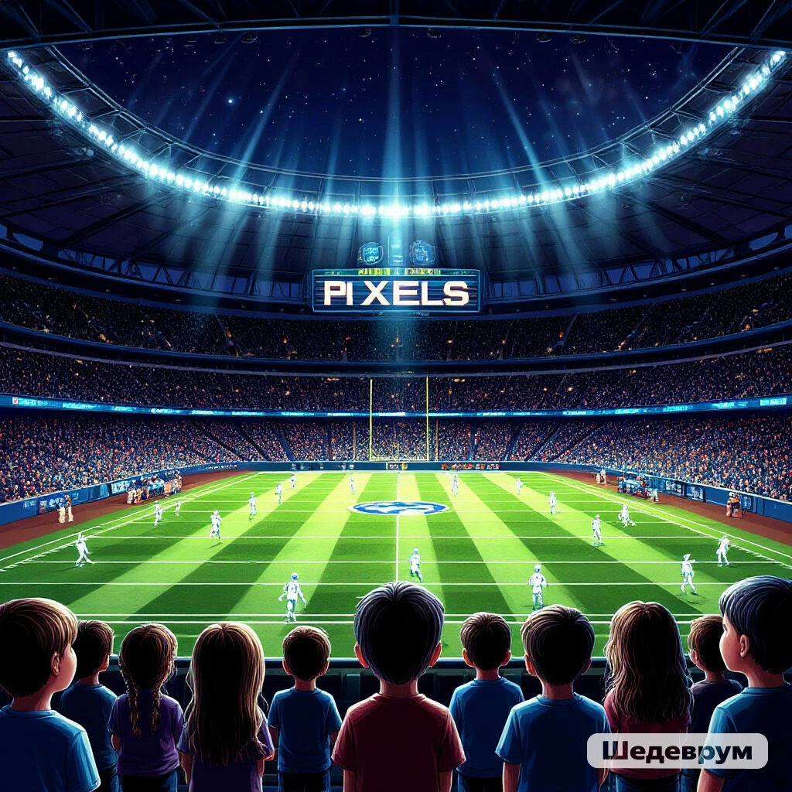
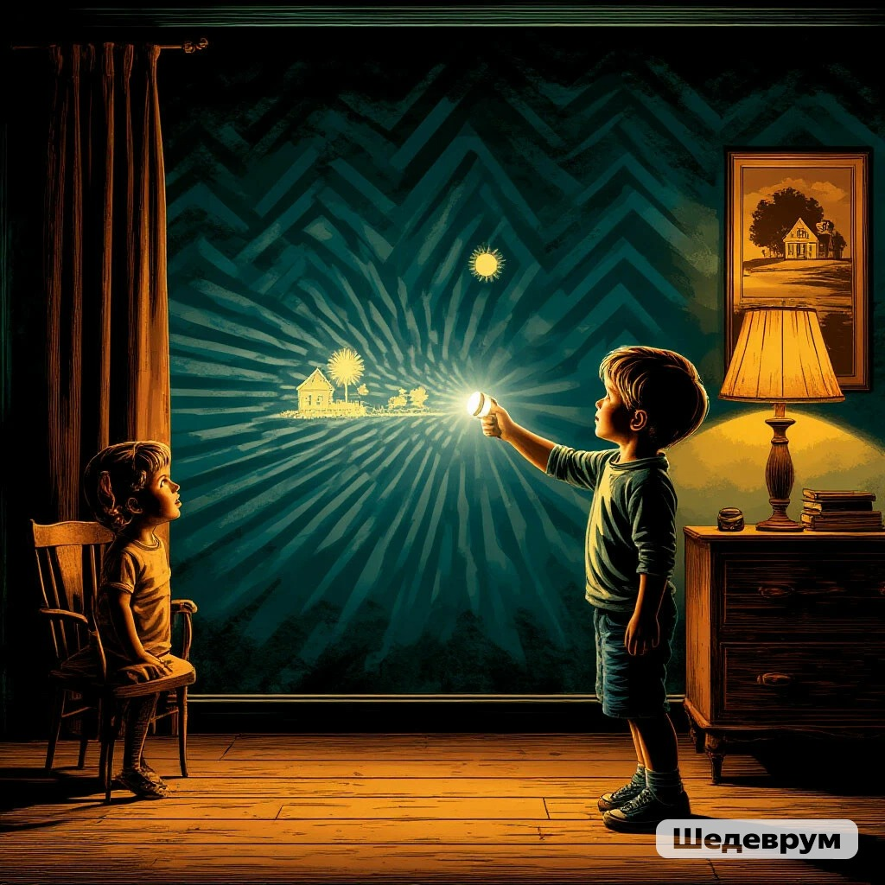
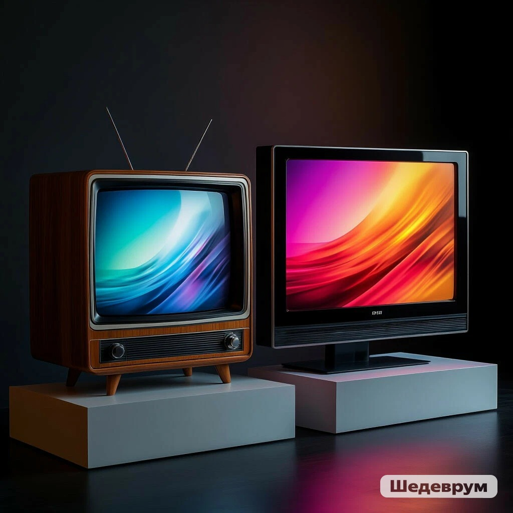

# Магия экрана: от лампочки до пикселя

Привет! Давай заглянем внутрь самого обычного экрана — того, на котором ты сейчас читаешь этот [текст](../../../../4.1_rules_of_study/how_to_learn_effectively/articles/reading_skills.md), смотришь мультики или играешь в игры. Кажется, что это простое [стекло](../../../../1.2_natural_sciences/physics_in_everyday_life/Q11469.md), но на самом деле это настоящее окно в волшебный мир, полный хитрых механизмов.

Представь, что [экран](../../../../3.1. healthy lifestyle/Sleep, nutrition, and adolescent energy/articles/gadgets_blue_light_sleep.md) — это огромный [стадион](../game_culture/esports.md) ночью. Но вместо футболистов на нём играют лучики света, а вместо зрителей на трибунах — мы с тобой. Чтобы понять, как они это делают, нам нужно отправиться в [прошлое](../../../../2.1_society/cause_and_effect_relationships/articles/lessons_of_history.md), к самому первому телевизору.

 

Как всё начиналось: одна большая «бегающая» [лампочка](../technologies_inside/screen_magic.md)

Когда-то очень давно, у твоих бабушек и дедушек, экраны были огромными и толстыми, как шкаф. Внутри такого телевизора жила всего одна... нет, не лампочка, а специальная электронная пушка. Она стреляла не пулями, а тоненьким лучиком электронов (таких крошечных частичек).

Представь себе тёмную комнату. У тебя есть только один узкий луч фонарика. Но тебе нужно показать другу огромную цветную картину. Как это сделать? Единственный способ — очень-очень быстро водить фонариком по стене слева направо и сверху вниз, как будто ты рисуешь в воздухе. Если водить лучом достаточно быстро, твой друг увидит не бегающую точку, а целую светящуюся картину!

 

Именно так и работал старый телевизор. Его единственный «лучик» бегал по стеклу с сумасшедшей скоростью:

1. Он пробегал первую строчку слева направо.
2. Мгновенно возвращался обратно и начинал вторую строчку.
3. И так, строчка за строчкой, он «прорисовывал» весь экран.
4. Добежав до нижнего правого угла, лучик пулей летел обратно в верхний левый угол и всё начиналось заново!

Это происходило так быстро, что наши [глаза](../useful_tips/eyes_and_back.md) не успевали заметить трюк. За одну секунду луч успевал пробежать весь экран и нарисовать новую картинку 50 раз! Поэтому мы видели не бегающую точку, а плавное [движение](../../../../1.2_natural_sciences/physics_in_everyday_life/Q11023.md).

Волшебство сегодня: миллионы маленьких художников

Старые телевизоры были настоящими спортсменами — один луч работал за всех. Но современные экраны (тонкие, как лист бумаги) устроены по-другому и гораздо хитрее. В них нет ни одной бегающей точки. Вместо этого на стадионе собралась целая армия маленьких художников.

Приглядись к экрану своего телефона или компьютера (можно даже через лупу, если получится). Видишь, он состоит из крошечных точек? Эти точки называются [ПИКСЕЛИ](../../../../5.1_technology_and_digital_literacy/operating system/articles/window_manager.md).

Представь, что экран — это мозаика, собранная из миллионов мельчайших квадратиков-пикселей. Каждый [пиксель](../technologies_inside/screen_magic.md) — это не просто точка. Внутри каждого живут три маленьких волшебных фонарика:

· 🔴 Один фонарик светит Красным цветом.
· 🟢 Второй — Зелёным.
· 🔵 Третий — Синим.

Почему именно эти три [цвета](../../../../1.2_natural_sciences/physics_in_everyday_life/Q11652.md)? Это главные цвета света. Смешивая их, как краски в палитре художника, можно получить любой другой [цвет](../../../../1.2_natural_sciences/physics_in_everyday_life/Q1075.md): жёлтый, фиолетовый, оранжевый и даже белый. Это называется цветовая [модель RGB](../../../../1.2_natural_sciences/physics_in_everyday_life/Q1075.md).

Как рождается картинка?

Когда ты включаешь мультик, специальный компьютер внутри экрана (называется [процессор](../technologies_inside/smart_processor.md)) начинает командовать этой армией пикселей.

· Если на картинке нужно показать небо, процессор говорит миллионам пикселей в верхней части экрана: «Синие фонарики, светите в полную силу! А красные и зелёные — спите!» Мы видим синее небо.
· Если нужно показать солнышко, [команда](../../../../4.1_rules_of_study/how_to_learn_effectively/articles/peer_learning.md) такая: «Красные и зелёные, светите ярко-ярко! А синие — выключайтесь!» Красный и зелёный [свет](../../../../1.2_natural_sciences/physics_in_everyday_life/Q1.md) вместе дают жёлтый цвет, и мы видим [солнце](../../../../1.2_natural_sciences/physics_in_everyday_life/Q11388.md).

И так каждый пиксель получает свою команду 60, 90, а то и 120 раз в секунду! Пока один [кадр](../../../../../8.1_entertainment/articles/director.md) мультика сменяется другим, каждый из миллионов пикселей меняет цвет. Их [работа](../../../../1.2_natural_sciences/physics_in_everyday_life/Q11382.md) настолько слаженная и быстрая, что для нас это превращается в плавное, [живое](../../../../1.2_natural_sciences/why_science_help_understand_world/nature.md) [изображение](../../../../5.1_technology_and_digital_literacy/information and media literacy/оценка_качества_изображений_и_видео.md).

Так в чём же главное отличие?

· В старом телевизоре был один луч-художник, который бегал как угорелый, чтобы успеть нарисовать всё сразу.
· В новом экране — миллионы маленьких художников (пикселей), которые просто стоят на месте, но каждый миг меняют цвет по команде «главного режиссёра».

 

---

Вот так, от одной бегающей лампочки мы пришли к целому городу из крошечных цветных огоньков. И теперь, когда ты смотришь на экран, ты знаешь, что это не просто стекло, а [результат](../../../../1.2_natural_sciences/why_science_help_understand_world/experimental_science.md) невероятной [работы](../../../../8.2_future/choosing_a_career_path/articles/interview.md) миллионов пикселей, которые творят для тебя настоящую магию света! ✨

## См. также

[Хитрый процессор и быстрая память — Почему компьютер не путается, когда считает миллионы действий в секунду](./A_smart_processor_and_fast_memory.md)

[Кнопки, джойстики и провода — История управления: от деревянного руля до геймпада с вибрацией](./Management_history.md)

---
## 📝 Авторы

**Жданович Елизавета, 307**  
*С использованием [нейросети](../../../../2.1_society/cause_and_effect_relationships/articles/ai_causality.md) DeepSeek*
