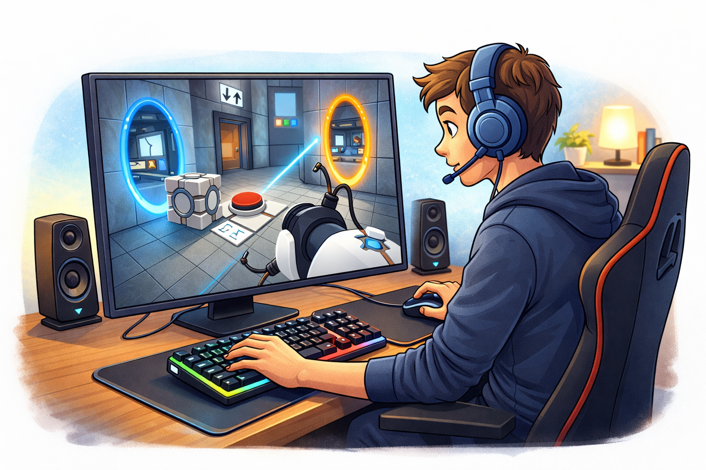
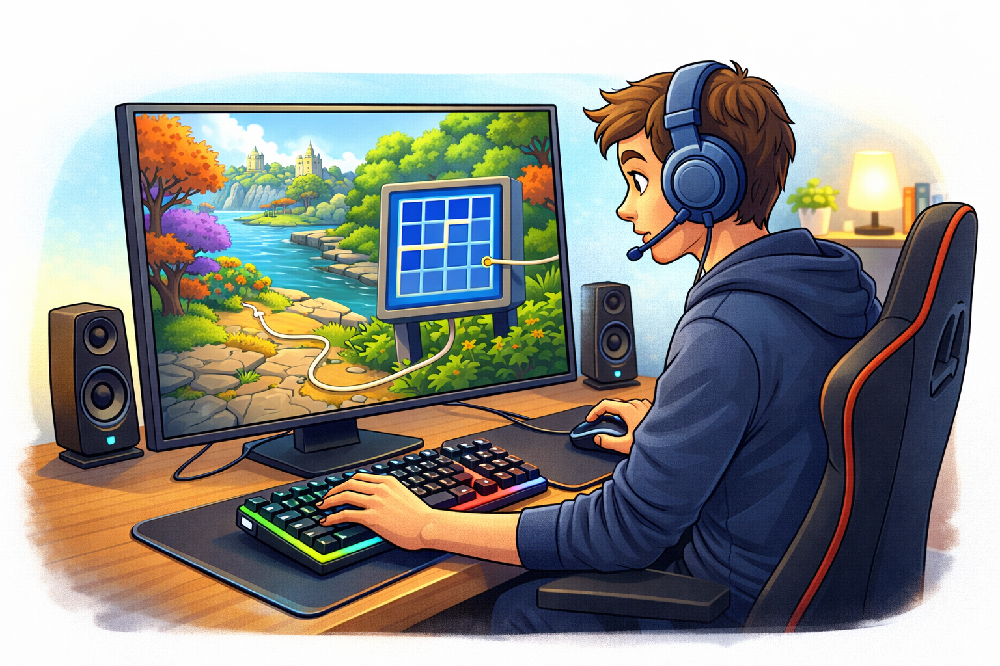
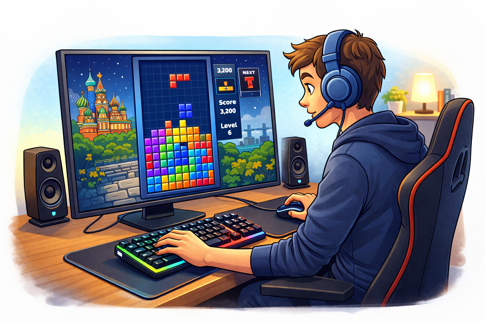
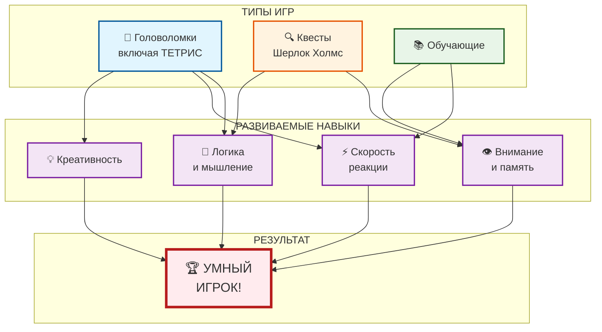

# 🧠 Игры для развития ума: прокачай свой мозг!

## Введение

Многие думают, что игры — это просто развлечение и пустая трата времени. Но есть хорошие новости: **существуют игры, которые действительно делают нас умнее!** Головоломки, квесты и обучающие игры развивают память, логику, скорость реакции и даже творческое мышление. А русские разработчики создали немало шедевров, которые помогут прокачать мозг.

---

## 🎯 Почему игры развивают мозг

Во время игры наш мозг активно работает: ищет решения, запоминает детали, строит стратегии.

**Что развивают умные игры:**

| Навык | Как развивается |
|-------|-----------------|
| **Логика** | Поиск закономерностей, решение головоломок |
| **Память** | Запоминание сюжета, деталей, кодов |
| **Внимание** | Поиск скрытых предметов, анализ ситуаций |
| **Скорость реакции** | Быстрое принятие решений |
| **Креативность** | Нестандартные решения задач |
| **Английский язык** | Диалоги и тексты в играх |

---

## 🎮 Топ игр для развития ума

### 🧩 Головоломки (Puzzle)

| Игра | Разработчик | Чем полезна | Сложность |
|------|-------------|-------------|-----------|
| **Portal / Portal 2** | Valve (США) | Пространственное мышление, логика | 🟡 Средняя |
| **The Witness** | Thekla (США) | Наблюдательность, дедукция | 🔴 Высокая |
| **Baba Is You** | Hempuli (Финляндия) | Креативность, нестандарное мышление | 🔴 Высокая |
| **Monument Valley** | Ustwo (Великобритания) | Оптические иллюзии, логика | 🟢 Лёгкая |
| **Tetris** | Алексей Пажитнов (**Россия**) | Реакция, пространственное мышление | 🟢 Лёгкая |

### 🔍 Квесты (Quest)

| Игра | Разработчик | Чем полезна | Сложность |
|------|-------------|-------------|-----------|
| **The Legend of Zelda** | Nintendo (Япония) | Решение комплексных задач, память | 🟡 Средняя |
| **Professor Layton** | Level-5 (Япония) | Логика, дедукция | 🟡 Средняя |
| **Sherlock Holmes** | Frogwares (**Россия**) | Дедукция, внимание к деталям | 🔴 Высокая |
| **Return of the Obra Dinn** | 3909 (США) | Дедукция, внимательность | 🔴 Высокая |
| **Бесконечное лето** | Soviet Games (**Россия**) | Выбор решений, психология | 🟡 Средняя |

### 📚 Обучающие игры

| Игра | Разработчик | Чем полезна | Сложность |
|------|-------------|-------------|-----------|
| **Kerbal Space Program** | Squad (США/Мексика) | Физика, инженерия | 🔴 Высокая |
| **Civilization** | Firaxis (США) | Стратегия, история | 🟡 Средняя |
| **SimCity / Cities: Skylines** | Maxis / Colossal Order (США/Финляндия) | Градостроительство, логистика | 🟡 Средняя |
| **Human Resource Machine** | Tomorrow Corporation (США) | Программирование, логика | 🟡 Средняя |
| **Duolingo** | Duolingo (США) | Иностранные языки | 🟢 Лёгкая |

---

## 🇷🇺 Лучшие русские игры для ума

### Топ-5 отечественных разработок:

| Игра | Жанр | Чем полезна |
|------|------|-------------|
| **Тетрис** | Головоломка | Реакция, пространственное мышление |
| **Серия игр про Шерлока Холмса** | Квест | Дедукция, внимание к деталям |
| **Бесконечное лето** | Визуальная новелла | Психология, анализ выборов |
| **Мор (Утопия)** | Постапокалиптический квест | Выживание, логика |
| **Cepheus Protocol** | Стратегия | Тактическое мышление, планирование |

---

## 📸 Примеры умных игр

### 🌀 Portal

*Portal — развивает пространственное мышление и логику. Игра заставляет находить неочевидные решения с помощью физики порталов.*

### 🌅 The Witness

*The Witness — тренирует наблюдательность и дедукцию. Здесь нет подсказок — только анализ и внимание к деталям.*

### 🇷🇺 Тетрис

*Тетрис — легендарная русская игра, созданная Алексеем Пажитновым в 1984 году. Развивает реакцию, пространственное мышление и даже увеличивает толщину коры головного мозга!*

---

## 📝 Что развивают эти игры:

| Игра | Разработчик | Что развивает |
|------|-------------|---------------|
| **Portal** | Valve (США) | Пространственное мышление, логику |
| **The Witness** | Thekla (США) | Наблюдательность, дедукцию |
| **Тетрис** | **Алексей Пажитнов (Россия)** | **Реакцию, пространственное мышление** |

---

## 🌟 Почему эти игры работают

### Portal
> *"Теперь ты мыслишь пространственно!"*

Игра заставляет вас думать нестандартно. Физика порталов тренирует мозг находить неочевидные решения.

### The Witness
> *"Остановись и посмотри вокруг"*

Здесь нет подсказок. Только наблюдение и анализ. Каждая головоломка учит вас новому "языку" правил.

### Тетрис (наша гордость!)
> *"Простота, которая гениальна"*

Созданный Алексеем Пажитновым в 1984 году, Тетрис до сих пор считается одной из лучших игр для развития пространственного мышления и реакции. Учёные доказали, что регулярная игра в Тетрис увеличивает толщину коры головного мозга!

---

## 🧠 Как игры влияют на мозг (наука)

**Исследования показывают:**

- 🧩 Головоломки увеличивают **нейропластичность** мозга
- ⚡ Стратегии улучшают **скорость принятия решений**
- 🎯 Квесты развивают **рабочую память**
- 📚 Обучающие игры создают новые **нейронные связи**

> *"Игры — это единственный вид деятельности, который одновременно задействует практически все зоны мозга"* — нейробиолог Дафна Бавелье

---

## 📊 Схема развития мозга через игры

## См. также

[Глаза и спина: правила выживания — Как правильно сидеть, чтобы после игры не болела шея, и почему важно моргать](./eyes_and_back.md)

[Токсичные игроки и как с ними быть — Что делать, если в игре тебя оскорбляют, и почему не стоит отвечать тем же](./toxic_players.md)

---
## 📝 Авторы

**Алина Карачарова, 306**  
*С использованием нейросети ChatGPT*
