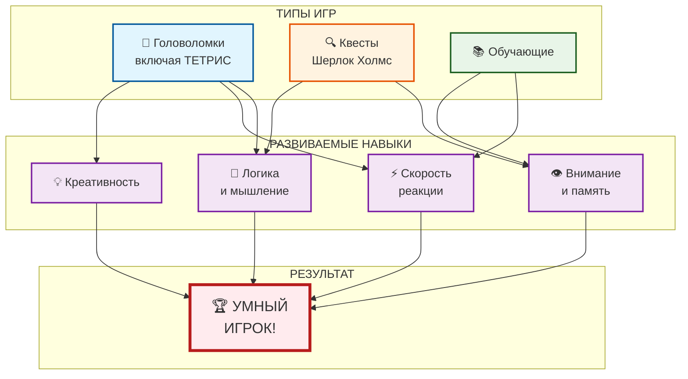

# 🧠 Игры для развития ума: прокачай свой [мозг](../../../../3.1. healthy lifestyle/Sleep, nutrition, and adolescent energy/articles/breakfast_for_the_brain.md)!

## Введение

Многие думают, что игры — это просто развлечение и пустая трата времени. Но есть хорошие новости: **существуют игры, которые действительно делают нас умнее!** [Головоломки](../useful_tips/educational_games.md), [квесты](../useful_tips/educational_games.md) и [обучающие игры](../useful_tips/educational_games.md) развивают [память](../../../../3.1. healthy lifestyle/Sleep, nutrition, and adolescent energy/articles/sleep_and_memory_grades.md), логику, [скорость реакции](../../../../1.1_structure_of_the_world/matter/articles/12_chemical_properties.md) и даже творческое [мышление](../../../../1.2_natural_sciences/neurobiology_for_teens/articles/01_brain_complexity.md). А русские разработчики создали немало шедевров, которые помогут прокачать мозг.

---

## 🎯 Почему игры развивают мозг

Во [время](../../../../1.2_natural_sciences/physics_in_everyday_life/Q20702.md) игры наш мозг активно работает: ищет решения, запоминает детали, строит [стратегии](../../../../../8.1_self_understanding/articles/overcoming.md).

**Что развивают умные игры:**

| [Навык](../../../../5.1_technology_and_digital_literacy/information and media literacy/карта_компетенций_по_возрастам.md) | Как развивается |
|-------|-----------------|
| **[Логика](../../../../2.1_society/cause_and_effect_relationships/articles/causality_base.md)** | [Поиск](../../../../3.2 healthy lifestyle/how to act in a dangerous situation/articles/lost-in-city.md) закономерностей, [решение](../../../../2.1_society/cause_and_effect_relationships/articles/personal_choice.md) головоломок |
| **Память** | [Запоминание](../../../../1.2_natural_sciences/neurobiology_for_teens/articles/21_how_memory_works.md) сюжета, деталей, кодов |
| **[Внимание](../../../../1.2_natural_sciences/neurobiology_for_teens/articles/16_love_chemistry.md)** | Поиск скрытых предметов, [анализ](../../../../1.2_natural_sciences/why_science_help_understand_world/research.md) ситуаций |
| **Скорость реакции** | Быстрое [принятие решений](../../../../1.2_natural_sciences/neurobiology_for_teens/articles/05_teen_brain.md) |
| **Креативность** | Нестандартные решения задач |
| **Английский [язык](../../../../5.2_cybersecurity/cpp_fundamentals/1_introduction.md)** | [Диалоги](../dream_team/screenwriter.md) и тексты в играх |

---

## 🎮 Топ игр для развития ума

### 🧩 Головоломки (Puzzle)

| [Игра](../../../../4.1_rules_of_study/how_to_learn_effectively/articles/gamification.md) | Разработчик | Чем полезна | Сложность |
|------|-------------|-------------|-----------|
| **Portal / Portal 2** | Valve (США) | Пространственное мышление, логика | 🟡 Средняя |
| **The Witness** | Thekla (США) | Наблюдательность, [дедукция](../../../../4.2_thinking_and_working_information/critical_thinking/articles/methods_of_logical_inference.md) | 🔴 Высокая |
| **Baba Is You** | Hempuli (Финляндия) | Креативность, нестандарное мышление | 🔴 Высокая |
| **Monument Valley** | Ustwo (Великобритания) | [Оптические иллюзии](../../../../1.2_natural_sciences/neurobiology_for_teens/articles/26_optical_illusions.md), логика | 🟢 Лёгкая |
| **Tetris** | Алексей Пажитнов (**Россия**) | [Реакция](../../../../1.2_natural_sciences/why_science_help_understand_world/chemistry.md), пространственное мышление | 🟢 Лёгкая |

### 🔍 Квесты (Quest)

| Игра | Разработчик | Чем полезна | Сложность |
|------|-------------|-------------|-----------|
| **The Legend of Zelda** | [Nintendo](../how_it_all_started/crisis_and_resurrection.md) (Япония) | Решение комплексных задач, память | 🟡 Средняя |
| **Professor Layton** | Level-5 (Япония) | Логика, дедукция | 🟡 Средняя |
| **Sherlock Holmes** | Frogwares (**Россия**) | Дедукция, внимание к деталям | 🔴 Высокая |
| **[Return](../../../../5.2_cybersecurity/cpp_fundamentals/8_functions.md) of the Obra Dinn** | 3909 (США) | Дедукция, внимательность | 🔴 Высокая |
| **Бесконечное лето** | Soviet Games (**Россия**) | [Выбор](../../../../2.1_society/cause_and_effect_relationships/articles/personal_choice.md) решений, [психология](../../../../2.1_society/cause_and_effect_relationships/articles/empathy_causality.md) | 🟡 Средняя |

### 📚 Обучающие игры

| Игра | Разработчик | Чем полезна | Сложность |
|------|-------------|-------------|-----------|
| **Kerbal Space Program** | Squad (США/Мексика) | [Физика](../../../../1.2_natural_sciences/physics_in_everyday_life/Q11023.md), [инженерия](../../../../1.2_natural_sciences/physics_in_everyday_life/Q161635.md) | 🔴 Высокая |
| **[Civilization](../genres_and_worlds/strategy.md)** | Firaxis (США) | [Стратегия](../../../../2.1_society/cause_and_effect_relationships/articles/future_planning.md), [история](../../../../1.2_natural_sciences/physics_in_everyday_life/Q11469.md) | 🟡 Средняя |
| **SimCity / Cities: Skylines** | Maxis / Colossal Order (США/Финляндия) | Градостроительство, [логистика](../../../../2.2_history/world_economy_on_fingers/articles/suetskiy_kanal.md) | 🟡 Средняя |
| **Human Resource Machine** | Tomorrow Corporation (США) | [Программирование](../../../../5.2_cybersecurity/cpp_fundamentals/1_introduction.md), логика | 🟡 Средняя |
| **Duolingo** | Duolingo (США) | Иностранные языки | 🟢 Лёгкая |

---

## 🇷🇺 Лучшие русские игры для ума

### Топ-5 отечественных разработок:

| Игра | [Жанр](../../../../../8.1_entertainment/articles/movie.md) | Чем полезна |
|------|------|-------------|
| **Тетрис** | Головоломка | Реакция, пространственное мышление |
| **Серия игр про Шерлока Холмса** | [Квест](../dream_team/screenwriter.md) | Дедукция, внимание к деталям |
| **Бесконечное лето** | Визуальная новелла | Психология, анализ выборов |
| **Мор (Утопия)** | Постапокалиптический квест | Выживание, логика |
| **Cepheus Protocol** | Стратегия | Тактическое мышление, [планирование](../../../../3.1. healthy lifestyle/Sleep, nutrition, and adolescent energy/articles/ideal_schedule_energy_management.md) |

---

## 📸 Примеры умных игр

### 🌀 Portal

*Portal — развивает пространственное мышление и логику. Игра заставляет находить неочевидные решения с помощью [физики](../../../../1.2_natural_sciences/physics_in_everyday_life/Q172280.md) порталов.*

### 🌅 The Witness

*The Witness — тренирует наблюдательность и дедукцию. Здесь нет подсказок — только анализ и внимание к деталям.*

### 🇷🇺 Тетрис

*Тетрис — легендарная русская игра, созданная Алексеем Пажитновым в 1984 году. Развивает реакцию, пространственное мышление и даже увеличивает толщину коры головного мозга!*

---

## 📝 Что развивают эти игры:

| Игра | Разработчик | Что развивает |
|------|-------------|---------------|
| **Portal** | Valve (США) | Пространственное мышление, логику |
| **The Witness** | Thekla (США) | Наблюдательность, дедукцию |
| **Тетрис** | **Алексей Пажитнов (Россия)** | **Реакцию, пространственное мышление** |

---

## 🌟 Почему эти игры работают

### Portal
> *"Теперь ты мыслишь пространственно!"*

Игра заставляет вас думать нестандартно. Физика порталов тренирует мозг находить неочевидные решения.

### The Witness
> *"Остановись и посмотри вокруг"*

Здесь нет подсказок. Только [наблюдение](../../../../1.2_natural_sciences/neurobiology_for_teens/articles/15_empathy.md) и анализ. Каждая головоломка учит вас новому "языку" правил.

### Тетрис (наша гордость!)
> *"Простота, которая гениальна"*

Созданный Алексеем Пажитновым в 1984 году, Тетрис до сих пор считается одной из лучших игр для развития пространственного мышления и реакции. Учёные доказали, что регулярная игра в Тетрис увеличивает толщину коры головного мозга!

---

## 🧠 Как игры влияют на мозг ([наука](../../../../1.2_natural_sciences/physics_in_everyday_life/Q238323.md))

**Исследования показывают:**

- 🧩 Головоломки увеличивают **[нейропластичность](../../../../1.2_natural_sciences/neurobiology_for_teens/articles/22_neuroplasticity.md)** мозга
- ⚡ Стратегии улучшают **[скорость](../../../../1.2_natural_sciences/physics_in_everyday_life/Q11402.md) принятия решений**
- 🎯 Квесты развивают **рабочую память**
- 📚 Обучающие игры создают новые **[нейронные связи](../../../../1.2_natural_sciences/neurobiology_for_teens/articles/21_how_memory_works.md)**

> *"Игры — это единственный вид деятельности, который одновременно задействует практически все зоны мозга"* — нейробиолог Дафна Бавелье

---

## 📊 Схема развития мозга через игры

## См. также

[Глаза и спина: правила выживания — Как правильно сидеть, чтобы после игры не болела шея, и почему важно моргать](./eyes_and_back.md)

[Токсичные игроки и как с ними быть — Что делать, если в игре тебя оскорбляют, и почему не стоит отвечать тем же](./toxic_players.md)

---
## 📝 Авторы

**Алина Карачарова, 306**  
*С использованием [нейросети](../../../../2.1_society/cause_and_effect_relationships/articles/ai_causality.md) [ChatGPT](../../../../7.1_art/modern_technological_art/articles/6.1_prompt_art.md)*
