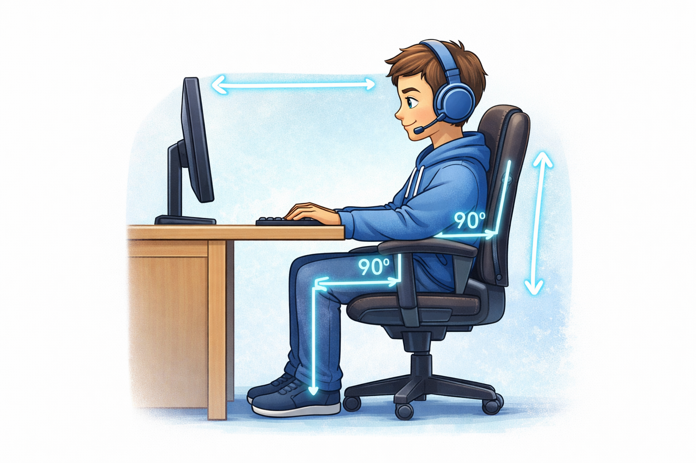
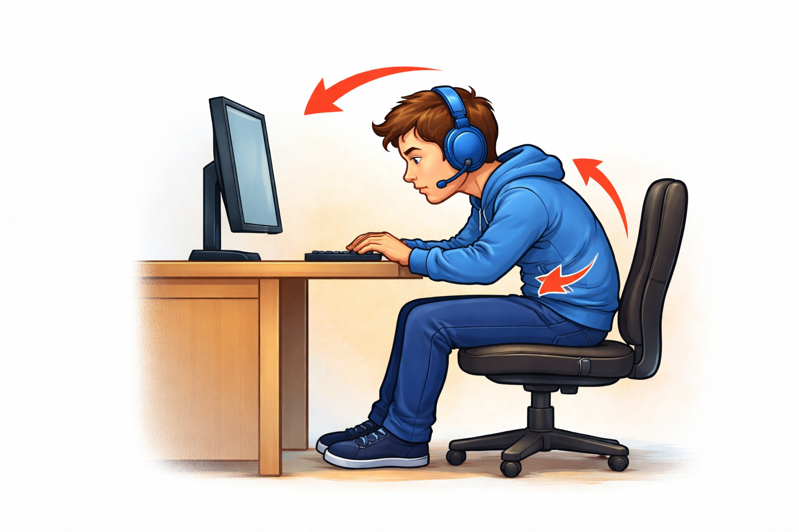
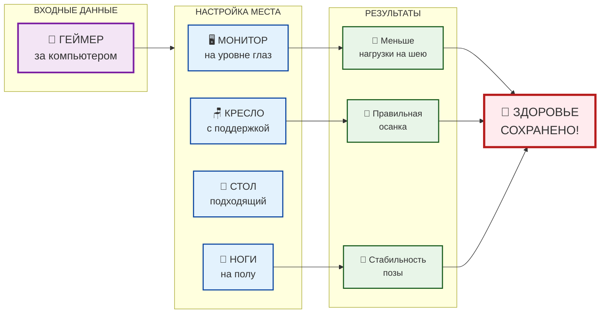

# 👁️🦴 [Глаза](../useful_tips/eyes_and_back.md) и [спина](../useful_tips/eyes_and_back.md): [правила](../../../../2.1_society/cause_and_effect_relationships/articles/why_rules_work.md) выживания для геймера

## Введение

Современные игры требуют длительного нахождения за компьютером. Это может привести к усталости [глаз](../../../../1.2_natural_sciences/physics_in_everyday_life/Q467980.md), боли в спине, напряжению в шее и ухудшению общего самочувствия. Но есть хорошие новости: **этих проблем можно избежать**, если знать простые правила и следовать им.

---

## 🧠 Почему у игроков возникают проблемы

Во [время](../../../../1.2_natural_sciences/physics_in_everyday_life/Q20702.md) игры [человек](../../../../1.2_natural_sciences/physics_in_everyday_life/Q45003.md) долго сохраняет почти неподвижную позу и сильно концентрируется на экране.

**Основные факторы риска:**

- 🧠 Перенапрягаются мышцы шеи и спины
- 📉 Ухудшается [осанка](../../../../3.1_healthy lifestyle/vrednye_privychki/articles/malopodvizhnost.md)
- 👁️ Глаза пересыхают
- ⬇️ Снижается [частота](../../../../1.2_natural_sciences/physics_in_everyday_life/Q11388.md) моргания (в 3-4 раза!)
- 💺 Неправильное положение за столом
- 🌃 Плохое [освещение](../../../../1.2_natural_sciences/physics_in_everyday_life/Q628858.md)

---

## 🪑 Правильная посадка: основа основ

### Золотые правила эргономики

| Часть тела | Правильное положение |
|------------|----------------------|
| **Спина** | Прямая, прижата к спинке кресла |
| **[Шея](../useful_tips/eyes_and_back.md)** | Не наклонена вперёд, взгляд прямо |
| **Плечи** | Расслаблены, не подняты |
| **Локти** | Под углом 90°, лежат на столе |
| **Запястья** | Прямые, не согнуты |
| **Ноги** | Стопы полностью на полу |
| **Бёдра** | Параллельно полу |

---

## 📸 Примеры правильной и неправильной посадки

### ✅ Правильная посадка

*Прямая спина, монитор на уровне глаз, ноги на полу, локти под 90°*

### ❌ Неправильная посадка

*Сгорбленная спина, голова наклонена вперёд, запястья согнуты*

### 📝 Что не так на неправильных [фото](../../../../5.1_technology_and_digital_literacy/information and media literacy/проверка_фото_на_манипуляции.md):

| [Ошибка](../../../../5.1_technology_and_digital_literacy/how_internet_works/articles/http_https/http_https.md) | Последствия |
|--------|-------------|
| Голова наклонена вперёд | Нагрузка на шею, головные боли |
| Сгорбленная спина | Искривление позвоночника, [боль](../../../../1.2_natural_sciences/neurobiology_for_teens/articles/16_love_chemistry.md) в пояснице |
| Запястья согнуты | Туннельный синдром, боль в кистях |
| Ноги не касаются пола | Нарушение кровообращения |
| Монитор слишком низко | [Напряжение](../../../../1.2_natural_sciences/physics_in_everyday_life/Q11023.md) глаз, боль в шее |

---

## 🖥️ Настройка рабочего места

### Монитор
- На расстоянии **вытянутой руки** (50-70 см)
- Верхний край на **уровне глаз** или чуть ниже
- **Яркость** не выше окружающего освещения
- Включите **ночной [режим](../../../../4.1_rules_of_study/how_to_learn_effectively/articles/breaks_and_rest.md)/синий [фильтр](../../../../3.1_healthy lifestyle/vrednye_privychki/articles/Social_media.md)** вечером

### Кресло
- Имеет **поддержку поясницы**
- **Подлокотники** на уровне стола
- Регулируется по высоте

### Освещение
- Не должно быть **бликов** на экране
- Используйте **дополнительный [свет](../../../../1.2_natural_sciences/physics_in_everyday_life/Q1.md)** (не только монитор)
- Поставьте **ночник за монитором** для мягкого фонового света

---

## 👁️ Гимнастика для глаз

### [Правило](../../../../1.2_natural_sciences/why_science_help_understand_world/patterns.md) 20-20-20
> **Каждые 20 минут смотрите [20 секунд](../../../../6.1_Independent_living_and_daily_living_skills/Simple_and_safe_cooking/articles/hand_hygiene.md) на [объект](../../../../1.2_natural_sciences/physics_in_everyday_life/Q634.md) в 6 метрах от вас**

### Простые упражнения (делайте каждый час):
1. **Часто моргайте** — 15-20 раз подряд
2. **Вращайте глазами** — по кругу в обе стороны
3. **[Фокусировка](../../../../4.1_rules_of_study/how_to_memorize/articles/koncentraciya.md)** — смотрите на близкий предмет, затем на дальний
4. **Пальминг** — закройте глаза ладонями на 30-60 секунд
5. **Рисуйте глазами** цифры или буквы в воздухе

---

## 🏋️ Разминка для спины и шеи

### Каждый час — 2 минуты упражнений:

| Упражнение | Как делать | Повторы |
|------------|------------|---------|
| **Повороты головы** | Медленно поверните голову вправо, затем влево | 5-8 раз |
| **Наклоны головы** | Коснитесь ухом правого плеча, потом левого | 5 раз |
| **Пожимание плечами** | Поднимите плечи вверх, задержите, опустите | 10 раз |
| **"Кошечка"** | Сидя на стуле, прогните спину, затем округлите | 6-8 раз |
| **Потягивания** | Руки вверх, тянемся к потолку | 3 раза |
| **Сведение лопаток** | Отведите плечи назад, сведите лопатки | 10 раз |

---

## ⏰ Режим труда и отдыха

### Эффективные [методы](../../../../4.1_rules_of_study/how_to_learn_effectively/articles/note_taking.md):

**🎮 25/5 [метод](../../../../5.1_technology_and_digital_literacy/how_internet_works/articles/http_https/http_https.md)**
> 25 минут игры → 5 минут отдыха (встать, пройтись, размяться)

**🚶 Каждый час**
> Вставайте из-за стола, ходите по комнате 2-3 минуты

**💧 Пейте воду**
> Обезвоживание усиливает [усталость](../../../../3.1. healthy lifestyle/Sleep, nutrition, and adolescent energy/articles/sugar_rollercoaster.md) глаз. Держите бутылку воды на столе

**🌬️ Проветривайте**
> Свежий [воздух](../../../../1.2_natural_sciences/physics_in_everyday_life/Q487005.md) помогает глазам и мозгу работать лучше

---

## 💡 Полезные [привычки](../../../../1.2_natural_sciences/neurobiology_for_teens/articles/11_reward_system.md)

- Используйте **увлажняющие [капли](../../../../1.2_natural_sciences/physics_in_everyday_life/Q170749.md)** для глаз (искусственная слеза)
- Поставьте **напоминания** на телефоне о разминке
- Не играйте **за 2 часа до сна** — [синий свет](../../../../3.1. healthy lifestyle/Sleep, nutrition, and adolescent energy/articles/gadgets_blue_light_sleep.md) мешает засыпанию
- Делайте **скриншоты** вместо долгого вглядывания в [экран](../../../../3.1. healthy lifestyle/Sleep, nutrition, and adolescent energy/articles/gadgets_blue_light_sleep.md)
- Используйте **тёмную тему** в играх и приложениях вечером

---

## 🚨 Тревожные сигналы

**Когда нужно срочно сделать [перерыв](../useful_tips/eyes_and_back.md) или обратиться к врачу:**

- 🔴 Резь и жжение в глазах
- 🔴 Двоение в глазах
- 🔴 Головные боли после игры
- 🔴 Онемение в пальцах рук
- 🔴 Острая боль в спине или шее

---

## 📊 Схема эргономики ([код](../../../../5.2_cybersecurity/cpp_fundamentals/1_introduction.md) для GitHub)

## См. также

[Токсичные игроки и как с ними быть — Что делать, если в игре тебя оскорбляют, и почему не стоит отвечать тем же](./toxic_players.md)

[Игры для развития ума — Обзор головоломок, квестов и обучающих игр, которые делают нас умнее](./Games_for_mind_development.md)

---
## 📝 Авторы

**Алина Карачарова, 306**  
*С использованием [нейросети](../../../../2.1_society/cause_and_effect_relationships/articles/ai_causality.md) [ChatGPT](../../../../7.1_art/modern_technological_art/articles/6.1_prompt_art.md)*
