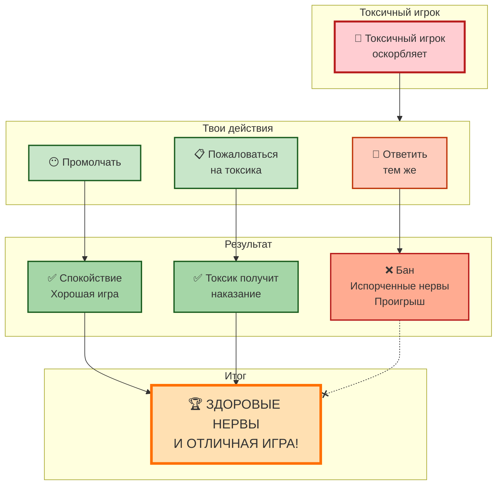

# 💬 Токсичные [игроки](../useful_tips/toxic_players.md): как сохранить [нервы](../../../../1.2_natural_sciences/neurobiology_for_teens/articles/03_nervous_system_map.md) и достоинство

## Введение

Каждый, кто играл в многопользовательские игры, сталкивался с токсичностью. [Оскорбления](../useful_tips/toxic_players.md), [троллинг](../useful_tips/toxic_players.md), бесконечный флейм — всё это может испортить даже самую лучшую игру. Но есть хорошие новости: **с этим можно справиться**, не опускаясь до уровня токсичных игроков.

---

## 🧠 Почему игроки становятся токсичными

[Токсичность](../useful_tips/toxic_players.md) в играх — это не всегда про "плохого человека". Часто за этим стоят конкретные причины.

**Основные причины токсичного поведения:**

| [Причина](../../../../2.1_society/cause_and_effect_relationships/articles/causality_base.md) | Почему так происходит |
|---------|----------------------|
| **[Анонимность](../../../../4.2_thinking_and_working_information/how_to_search_information/articles/vpn_dns_proxy_anonymity_and_security.md)** | В интернете можно говорить то, что никогда не скажешь в лицо |
| **[Стресс](../../../../3.1. healthy lifestyle/Sleep, nutrition, and adolescent energy/articles/chronic_sleep_deprivation.md)** | Проигрыш, неудачная серия, личные проблемы |
| **Чувство безнаказанности** | Кажется, что последствий не будет |
| **[Желание](../../../../6.1_Independent_living_and_daily_living_skills/reasonable_spending/articles/want.md) самоутвердиться** | За счёт унижения других |
| **Подражание** | "Все так делают" — [эффект толпы](../../../../1.2_natural_sciences/neurobiology_for_teens/articles/25_cognitive_biases.md) |

---

## 🚫 Почему не стоит отвечать токсичностью на токсичность

### 5 причин не ввязываться в перепалку:

1. **Это бессмысленно** — вы не переубедите токсичного игрока
2. **Это отнимает энергию** — вместо игры вы тратите нервы на переписку
3. **Это ухудшает вашу игру** — пока вы пишете гневные [сообщения](../../../../5.1_technology_and_digital_literacy/operating system/articles/IPC.md), проигрываете
4. **Это может привести к бану** — многие игры банят за ответные оскорбления
5. **Это делает вас таким же** — опускаясь до их уровня, вы становитесь частью проблемы

---

### 🎭 Три реакции на токсичность

*слева — правильная [реакция](../../../../1.2_natural_sciences/why_science_help_understand_world/chemistry.md) (игнор), в центре — неправильная (перепалка), справа — психологическая [защита](../../../../5.1_technology_and_digital_literacy/how_internet_works/articles/dns/cdn.md) (мысленный щит)*

---

## 📋 Что изображено на [фото](../../../../5.1_technology_and_digital_literacy/information and media literacy/проверка_фото_на_манипуляции.md):

| | Эпизод | Описание |
|---|--------|----------|
| **✅ Слева** | Правильная реакция | Игрок получает оскорбление, нажимает "Заглушить" и спокойно играет дальше |
| **❌ В центре** | Неправильная реакция | Два игрока обмениваются оскорблениями, [чат](../useful_tips/toxic_players.md) заполнен красными флагами, [персонажи](../dream_team/screenwriter.md) проигрывают |
| **🧘 Справа** | Психологическая защита | Игрок в защитном пузыре, оскорбления отскакивают, на лице улыбка |

---

## 🛡️ Что делать, если вас оскорбляют

### [Пошаговая](../genres_and_worlds/strategy.md) инструкция выживания:

| [Шаг](../../../../1.2_natural_sciences/physics_in_everyday_life/Q36253.md) | [Действие](../../../../2.1_society/cause_and_effect_relationships/articles/personal_choice.md) | Эффект |
|-----|----------|--------|
| **1** | **Не отвечайте сразу** | Сделайте паузу, глубоко вдохните |
| **2** | **Игнорируйте** | Тролли питаются реакцией — не кормите их |
| **3** | **Заглушите (Mute)** | В большинстве игр есть кнопка "Заглушить" |
| **4** | **Пожалуйтесь (Report)** | Отправьте жалобу на оскорбления |
| **5** | **Отвлекитесь** | Сфокусируйтесь на игре, а не на чате |
| **6** | **Смените [сервер](../../../../5.1_technology_and_digital_literacy/how_internet_works/articles/http_https/http_https.md)/комнату** | Если совсем невмоготу — уйдите |

---

## 🧘 Психологические приёмы защиты

### Как не принимать токсичность близко к сердцу:

1. **Помните:** это говорит не [человек](../../../../1.2_natural_sciences/physics_in_everyday_life/Q45003.md), а его токсичная маска
2. **Представьте:** за монитором сидит капризный ребёнок (часто так и есть)
3. **Подумайте:** через час вы забудете этого человека, а нервы останутся
4. **Визуализируйте:** представьте, что вы в защитном пузыре, и оскорбления отскакивают

---

## ⚔️ Когда всё же стоит ответить?

**В редких случаях можно:**

- Спокойно и аргументированно указать на ошибку (если человек просто расстроен, но не токсичен)
- Пошутить — но только если уверены, что это не перерастёт в перепалку

**Но помните:** чаще всего лучше просто промолчать.

---

## 💡 Полезные [привычки](../../../../1.2_natural_sciences/neurobiology_for_teens/articles/11_reward_system.md) для защиты от токсичности

- Играйте с **друзьями** — в компании токсичность переносится легче
- Делайте **[перерывы](../../../../4.1_rules_of_study/how_to_learn_effectively/articles/breaks_and_rest.md)**, если чувствуете, что начинаете заводиться
- Включайте **музыку** вместо голосового чата
- Используйте **позитивные наклейки/смайлы** — они разряжают обстановку

---

## 🚨 Когда токсичность переходит в буллинг

**Нужно действовать жёстко, если:**

- 🔴 Оскорбления переходят на [личность](../../../../1.2_natural_sciences/neurobiology_for_teens/articles/06_phineas_gage.md) ([семья](../../../../5.1_technology_and_digital_literacy/information and media literacy/семейные_правила_потребления_контента.md), национальность)
- 🔴 Вас преследуют в разных матчах/комнатах
- 🔴 Угрожают физической расправой или доксом
- 🔴 [Травля](../../../../3.2 healthy lifestyle/how to act in a dangerous situation/articles/cyberbullying.md) продолжается систематически

### Что делать в таких случаях:
1. **Скриншоты** всех сообщений
2. **[Жалоба](../../../../3.2 healthy lifestyle/how to act in a dangerous situation/articles/cyberbullying.md)** в поддержку игры (приложите скрины)
3. **[Блокировка](../../../../3.2 healthy lifestyle/how to act in a dangerous situation/articles/cyberbullying.md)** игрока
4. В крайних случаях — обращение в **полицию**

---

## 📊 Схема правильного поведения

## См. также

[Глаза и спина: правила выживания — Как правильно сидеть, чтобы после игры не болела шея, и почему важно моргать](./eyes_and_back.md)

[Игры для развития ума — Обзор головоломок, квестов и обучающих игр, которые делают нас умнее](./Games_for_mind_development.md)

---
## 📝 Авторы

**Алина Карачарова, 306**  
*С использованием [нейросети](../../../../2.1_society/cause_and_effect_relationships/articles/ai_causality.md) [ChatGPT](../../../../7.1_art/modern_technological_art/articles/6.1_prompt_art.md)*
