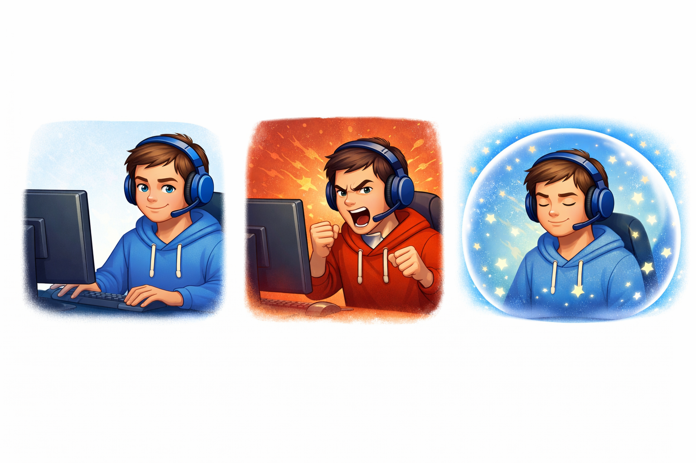
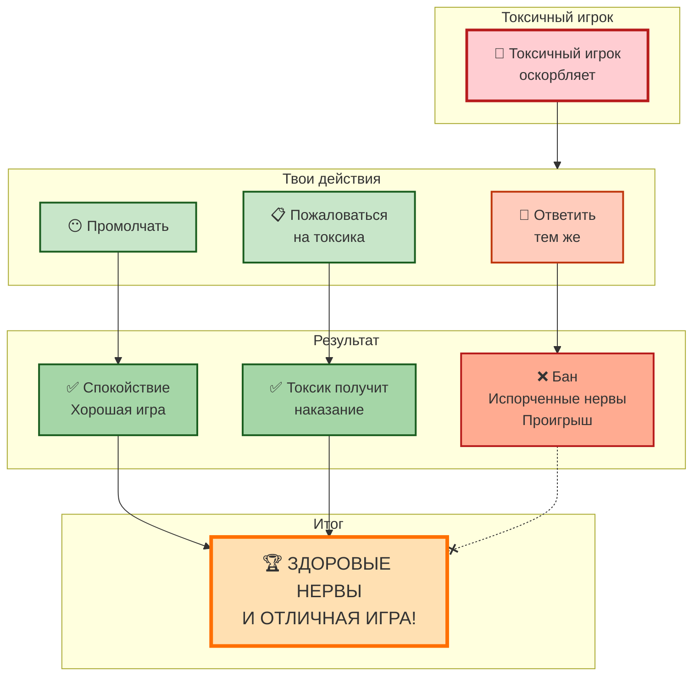

# 💬 Токсичные игроки: как сохранить нервы и достоинство

## Введение

Каждый, кто играл в многопользовательские игры, сталкивался с токсичностью. Оскорбления, троллинг, бесконечный флейм — всё это может испортить даже самую лучшую игру. Но есть хорошие новости: **с этим можно справиться**, не опускаясь до уровня токсичных игроков.

---

## 🧠 Почему игроки становятся токсичными

Токсичность в играх — это не всегда про "плохого человека". Часто за этим стоят конкретные причины.

**Основные причины токсичного поведения:**

| Причина | Почему так происходит |
|---------|----------------------|
| **Анонимность** | В интернете можно говорить то, что никогда не скажешь в лицо |
| **Стресс** | Проигрыш, неудачная серия, личные проблемы |
| **Чувство безнаказанности** | Кажется, что последствий не будет |
| **Желание самоутвердиться** | За счёт унижения других |
| **Подражание** | "Все так делают" — эффект толпы |

---

## 🚫 Почему не стоит отвечать токсичностью на токсичность

### 5 причин не ввязываться в перепалку:

1. **Это бессмысленно** — вы не переубедите токсичного игрока
2. **Это отнимает энергию** — вместо игры вы тратите нервы на переписку
3. **Это ухудшает вашу игру** — пока вы пишете гневные сообщения, проигрываете
4. **Это может привести к бану** — многие игры банят за ответные оскорбления
5. **Это делает вас таким же** — опускаясь до их уровня, вы становитесь частью проблемы

---

### 🎭 Три реакции на токсичность

*слева — правильная реакция (игнор), в центре — неправильная (перепалка), справа — психологическая защита (мысленный щит)*

---

## 📋 Что изображено на фото:

| | Эпизод | Описание |
|---|--------|----------|
| **✅ Слева** | Правильная реакция | Игрок получает оскорбление, нажимает "Заглушить" и спокойно играет дальше |
| **❌ В центре** | Неправильная реакция | Два игрока обмениваются оскорблениями, чат заполнен красными флагами, персонажи проигрывают |
| **🧘 Справа** | Психологическая защита | Игрок в защитном пузыре, оскорбления отскакивают, на лице улыбка |

---

## 🛡️ Что делать, если вас оскорбляют

### Пошаговая инструкция выживания:

| Шаг | Действие | Эффект |
|-----|----------|--------|
| **1** | **Не отвечайте сразу** | Сделайте паузу, глубоко вдохните |
| **2** | **Игнорируйте** | Тролли питаются реакцией — не кормите их |
| **3** | **Заглушите (Mute)** | В большинстве игр есть кнопка "Заглушить" |
| **4** | **Пожалуйтесь (Report)** | Отправьте жалобу на оскорбления |
| **5** | **Отвлекитесь** | Сфокусируйтесь на игре, а не на чате |
| **6** | **Смените сервер/комнату** | Если совсем невмоготу — уйдите |

---

## 🧘 Психологические приёмы защиты

### Как не принимать токсичность близко к сердцу:

1. **Помните:** это говорит не человек, а его токсичная маска
2. **Представьте:** за монитором сидит капризный ребёнок (часто так и есть)
3. **Подумайте:** через час вы забудете этого человека, а нервы останутся
4. **Визуализируйте:** представьте, что вы в защитном пузыре, и оскорбления отскакивают

---

## ⚔️ Когда всё же стоит ответить?

**В редких случаях можно:**

- Спокойно и аргументированно указать на ошибку (если человек просто расстроен, но не токсичен)
- Пошутить — но только если уверены, что это не перерастёт в перепалку

**Но помните:** чаще всего лучше просто промолчать.

---

## 💡 Полезные привычки для защиты от токсичности

- Играйте с **друзьями** — в компании токсичность переносится легче
- Делайте **перерывы**, если чувствуете, что начинаете заводиться
- Включайте **музыку** вместо голосового чата
- Используйте **позитивные наклейки/смайлы** — они разряжают обстановку

---

## 🚨 Когда токсичность переходит в буллинг

**Нужно действовать жёстко, если:**

- 🔴 Оскорбления переходят на личность (семья, национальность)
- 🔴 Вас преследуют в разных матчах/комнатах
- 🔴 Угрожают физической расправой или доксом
- 🔴 Травля продолжается систематически

### Что делать в таких случаях:
1. **Скриншоты** всех сообщений
2. **Жалоба** в поддержку игры (приложите скрины)
3. **Блокировка** игрока
4. В крайних случаях — обращение в **полицию**

---

## 📊 Схема правильного поведения

## См. также

[Глаза и спина: правила выживания — Как правильно сидеть, чтобы после игры не болела шея, и почему важно моргать](./eyes_and_back.md)

[Игры для развития ума — Обзор головоломок, квестов и обучающих игр, которые делают нас умнее](./Games_for_mind_development.md)

---
## 📝 Авторы

**Алина Карачарова, 306**  
*С использованием нейросети ChatGPT*
