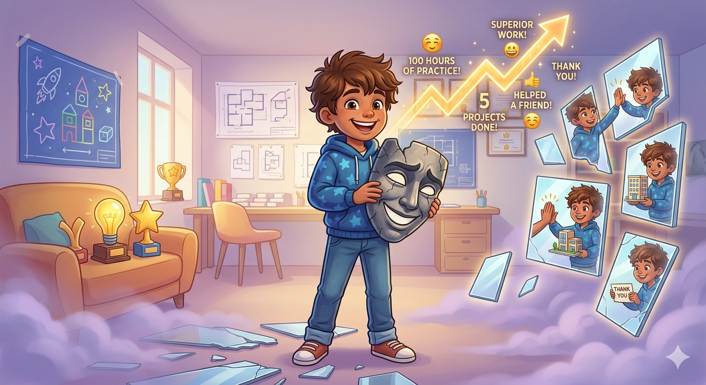

# Синдром самозванца против реальности: как увидеть в себе эксперта

Бывало ли у тебя так: ты сделал что-то крутое, например, нарисовал суперский рисунок или победил в игре, но вместо радости подумал: «Мне просто повезло!»? Или тебе кажется, что все вокруг думают, что ты отлично разбираешься в майнкрафте, а ты боишься, что вот-вот все поймут: на самом деле ты просто нажимаешь на кнопки и ничего не смыслишь?

Поздравляю, ты попал в элитный клуб «самозванцев»! В нём состоят даже самые умные учёные и боссы огромных компаний. Это когда ты умеешь что-то делать, но боишься, что все вокруг — настоящие мастера, а ты — просто притворяешься.

Проблема в том, что **синдром самозванца — это не отсутствие умений, а неумение поверить, что они у тебя есть.** Давай разберемся, как победить этого вредного внутреннего критика с помощью фактов и честного взгляда на реальность.

---

## 1. Парадокс компетентности

Чем больше мы узнаём, тем больше понимаем, сколько всего ещё не знаем. Из-за этого настоящие мастера часто думают: _«Ой, ну это же очевидно, это все и так знают!»_.

> **Реальность:** То, что для тебя кажется «элементарным», для 90% людей — темный лес. Твоя легкость в решении задач — это не признак их простоты, а признак твоего мастерства.

## 2. Собери доказательства (Метод «Анти-самозванец»)

Эмоции часто врут, а факты — нет. Чтобы увидеть в себе мастера, нужно перевести внутренний разговор из чувств в доказательства.

- **Посчитай опыт:** Сколько часов ты потратил на тренировки? Сколько проектов ты закрыл? Сколько проблем ты решил за последний год?
- **Сделай «шкатулку благодарности»:** Собери отзывы, письма со словами спасибо и похвалу от друзей и учителей. В моменты сомнений перечитывай их.
- **Сравни себя с собой прошлым:** Не смотри на «звезд» киберспорта с 20-летним стажем. Сравни свои знания сегодня с тем, что вы знали год назад. Эта разница и есть твоё твердое мастерство.

## 3. Ошибка выжившего наоборот

Мы часто думаем, что мастер — это тот, кто никогда не ошибается. На самом деле, **мастер — это тот, кто совершил все возможные ошибки в своей нише и научился их исправлять.**

Если ты сталкиваешься с трудностями — это не значит, что ты плохой специалист. Это значит, что ты находишься в процессе профессионального роста. Настоящий «самозванец» — это тот, кто даже не сомневается в своей гениальности, не имея на то никаких оснований.

## 4. Как начать верить в успех?

1.  **Замени «Мне повезло» на «Я подготовился»:** Удача — это просто встреча возможности и твоей готовности.
2.  **Говори о своем опыте вслух:** Начни делиться знаниями (блоги, менторство, советы друзьям). Когда ты видишь, что твои советы реально помогают другим, отрицать свою пользу становится невозможно.
3.  **Прими право на незнание:** Ты не обязан знать всё. Фраза _«Я сейчас не готов ответить, но я разберусь»_ — это маркер уверенного профессионала, а не дилетанта.

---

### Резюме

Синдром самозванца — это просто шум в голове. Реальность же строится на твоих результатах, довольных клиентах и пройденном пути. Не жди, когда страх исчезнет, чтобы начать действовать. Действуйте, и в процессе вы заметите, что «самозванцу» просто не осталось места за вашим столом.

---

Автор: Бабинцева Диана, @diiwwae;  
_Ресурсы: LLM - Gemini 3 Flash, Image Gen - Imagen 3_
