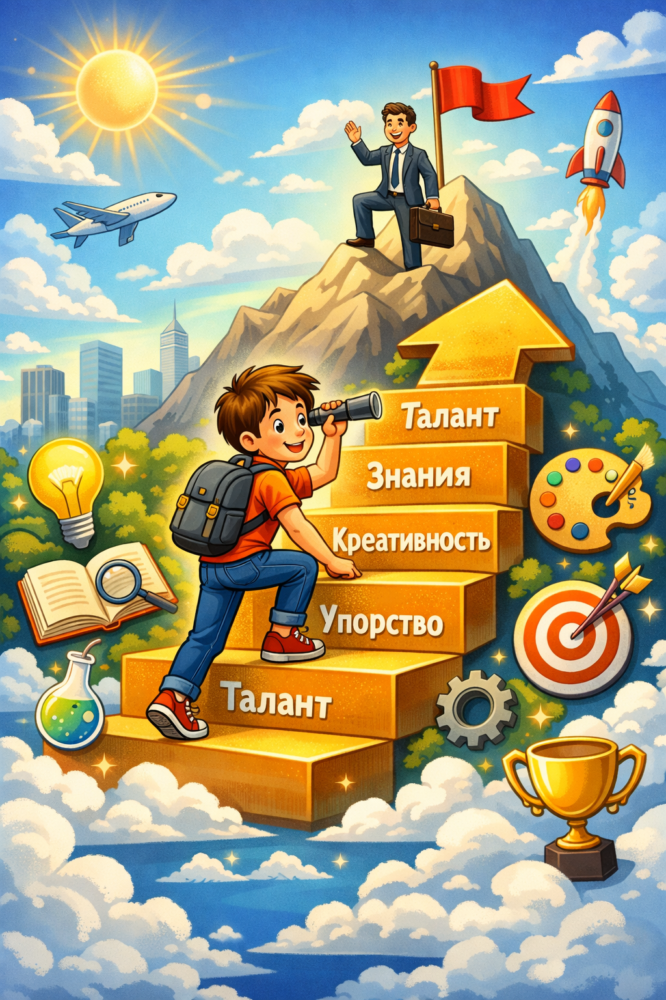

# Карьерный взлет: строим стратегию успеха на базе ваших природных качеств

**Метаданные**

- Раздел: Как найти свои сильные стороны
- Тип: Подстатья
- Формат: Объяснение простыми словами
- Целевая аудитория: 10+
- Дата: 2026-03-19
- Ключевые слова: сильные стороны, природные качества, карьера, стратегия успеха

Когда люди слышат слово "карьера", иногда им кажется, что это что-то очень взрослое и сложное. Но если объяснить просто, карьера - это длинная дорога, по которой человек идет в учебе, работе и любимом деле. А хороший взлет в карьере начинается не с волшебства, а с понимания: **что у меня уже получается хорошо от природы?**

Представь, что у каждого человека есть свой маленький набор суперсил. У одного хорошо получается слушать и поддерживать. У другого - придумывать идеи. У третьего - замечать порядок, ошибки и мелочи. Это и есть природные качества. Если строить успех на таких качествах, дорога становится понятнее и легче.

## Что такое природные качества

Природные качества - это то, что у тебя часто выходит легче, чем у других, или то, что тебе приятно делать снова и снова.

Например:

- тебе нравится объяснять другим;
- ты быстро замечаешь, что не так;
- ты умеешь мирить людей;
- ты любишь доводить дело до конца;
- тебе нравится придумывать новое.

Важно понять одну вещь: природные качества - это не "идеальность". У человека не должно получаться все на свете. Достаточно заметить свои самые яркие сильные стороны.

## Почему успех лучше строить на сильных сторонах

Представь два велосипеда. У одного колеса крепкие и ровные, а у другого одно колесо все время спускает. Конечно, ехать легче на первом. Так же и с карьерой: когда человек опирается на свои сильные стороны, он быстрее учится, меньше устает и чаще радуется своим результатам.

Это не значит, что слабые стороны не важны. Просто главный мотор успеха обычно находится именно в том, что у тебя уже хорошо получается.

## Как найти свои сильные стороны

Вот простой способ.

### 1. Заметь, что дается тебе легче

Спроси себя:

- Что у меня получается без долгих мучений?
- За что меня чаще всего хвалят?
- Какое дело мне интересно даже тогда, когда никто не заставляет?

Если ты любишь рисовать схемы, возможно, у тебя сильна наглядность. Если тебе нравится договариваться с людьми, возможно, твоя сила - общение. Если ты любишь точность, твоя сила может быть в аккуратности и внимании.

### 2. Посмотри, где ты полезен другим

Сильная сторона часто видна там, где ты реально помогаешь.

Например:

- друзья просят тебя объяснить тему - значит, ты умеешь понятно рассказывать;
- тебе доверяют проверить работу - значит, ты внимательный;
- к тебе идут за идеями - значит, ты умеешь придумывать;
- тебя просят организовать общее дело - значит, у тебя есть лидерские качества.

### 3. Спроси у близких людей

Иногда человек не замечает свою силу, потому что она для него кажется "обычной". Поэтому полезно спросить:

"Как ты думаешь, что у меня получается лучше всего?"

Ответы родителей, друзей, учителей или коллег могут приятно удивить.

## Как построить стратегию успеха

Теперь самое важное. Стратегия успеха - это не огромный страшный план на десять лет. Это просто понятная схема:

**мои сильные качества -> подходящие дела -> маленькие шаги -> рост**

Разберем по частям.

### Шаг 1. Соедини качество и дело

Каждая сильная сторона может пригодиться в разных занятиях.

- Любишь объяснять: подойдут обучение, наставничество, продажи, управление командой.
- Любишь порядок: подойдут аналитика, учет, работа с данными, планирование.
- Любишь придумывать: подойдут дизайн, реклама, тексты, разработка идей.
- Любишь собирать и чинить: подойдут инженерия, техника, конструирование.
- Любишь помогать людям: подойдут медицина, психология, сервис, обучение.

То есть сначала мы не выбираем профессию наугад. Сначала смотрим на свои качества, а уже потом ищем, где они особенно нужны.

### Шаг 2. Выбери одну главную силу

Не надо хвататься за все сразу. Лучше выбрать одну сильную сторону, которая сейчас кажется самой яркой.

Например:

- "Я хорошо объясняю".
- "Я умею организовывать".
- "Я замечаю детали".

Одна главная сила - это как фонарик. Он помогает осветить путь.

### Шаг 3. Сделай маленький план

Большие мечты пугают, а маленькие шаги помогают двигаться.

Если твоя сила - объяснять, план может быть таким:

1. Один раз в неделю объяснять кому-то сложную тему простыми словами.
2. Читать или смотреть материалы о том, как говорить ясно и интересно.
3. Тренироваться выступать коротко и понятно.

Если твоя сила - порядок, план может быть другим:

1. Учиться вести списки и планы.
2. Осваивать таблицы, заметки, расписание.
3. Браться за задачи, где нужен контроль деталей.

Стратегия становится сильной не тогда, когда она длинная, а тогда, когда она выполнимая.

### Шаг 4. Собирай доказательства своих успехов

Очень полезно вести "копилку побед". Это может быть тетрадка, заметка в телефоне или файл.

Записывай туда:

- что у тебя получилось;
- кому ты помог;
- чему ты научился;
- за что тебя похвалили.

Такая копилка помогает не забывать, что ты растешь. А еще она показывает, какие сильные стороны у тебя повторяются чаще всего.

### Шаг 5. Проверяй курс

Иногда человек думает: "Мне это подходит", а потом понимает: "Нет, мне скучно". Это нормально. Стратегия - не камень, а карта. Карту можно уточнять.

Если какое-то дело не радует, спроси себя:

- Мне действительно это интересно?
- Здесь используются мои сильные стороны?
- Хочу ли я продолжать?

Если ответ "нет", можно повернуть в другую сторону. Это не проигрыш. Это умный выбор.

## Что мешает карьерному взлету

Есть несколько ловушек.

### Сравнение с другими

Если все время смотреть на чужие успехи, можно забыть о своих. Но у каждого человека свой старт, свой темп и свои сильные стороны.

### Попытка быть как все

Иногда человеку кажется, что нужно выбрать "модную" дорогу. Но если она совсем не подходит его характеру, радости и пользы будет мало.

### Мысль "у меня нет талантов"

Часто это просто неправда. Бывает, что сильные стороны тихие и не очень заметные. Например, надежность, терпение, доброта, умение слушать или аккуратность. Но именно такие качества часто очень ценятся в жизни и работе.

## Простой план на неделю

Вот маленькое упражнение:

1. Выпиши три дела, которые тебе нравятся.
2. Выпиши три качества, которые помогают тебе в этих делах.
3. Спроси у двух людей, в чем они видят твою силу.
4. Выбери одну сильную сторону для развития.
5. Сделай один маленький шаг, чтобы использовать ее на практике.

Так из простой мысли "у меня что-то получается" рождается настоящая стратегия роста.

## Главная мысль

Карьерный взлет не начинается с громких слов, дорогого костюма или идеального плана. Он начинается с честного ответа на вопрос: **"Что у меня получается хорошо от природы?"**

Когда человек знает свои сильные стороны, ему легче выбирать занятия, учиться новому и становиться полезным другим людям. А когда ты полезен, уверен в себе и растешь шаг за шагом, успех приходит не случайно, а вполне закономерно.

Проще говоря: не нужно пытаться стать кем-то другим. Намного умнее понять свои природные качества и строить путь на них. Это и есть одна из самых надежных дорог к успеху.

---

Автор: Чесноков В.  
Контакт: @Che4ve  
GitHub ответственного: сhe4ve

_Нейросети, использованные при создании статьи: GPT-5 (Codex)._
