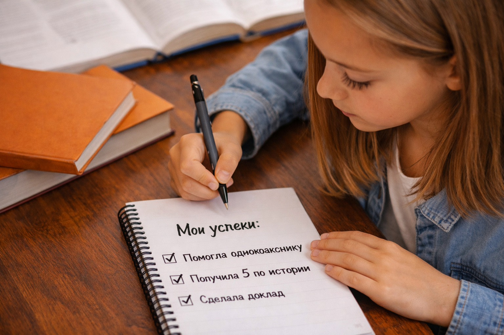

# [7 способов найти свои сильные стороны](../../../8.1_colf-underctandina/HouToFindVourStrenaths/articles/find_strengths_7_ways.md)

## Введение

Не всегда легко сразу понять, в чём ты силён. Иногда кажется, что у других всё получается лучше, а у тебя нет ничего особенного. Но это не так.

[Сильные стороны](../../HowToFindYourStrengths/articles/career-rise-natural-strengths.md) есть у каждого человека. Их можно найти, если [внимательно](../../../4.1_rules_of_study/how_to_memorize/articles/vnimanie.md) понаблюдать за собой и своими действиями.

## Способ 1. Обрати [внимание](../../../1.2_natural_sciences/neurobiology_for_teens/articles/16_love_chemistry.md) на то, что тебе интересно

Очень часто сильные стороны связаны с интересом. Если тебе нравится какое-то дело, ты чаще им занимаешься, а значит, быстрее развиваешься.

Например:

- нравится читать — возможно, у тебя хорошо получается работать с текстами;
- любишь объяснять — возможно, у тебя сильные коммуникативные [навыки](../../../7.2 Media, leisure and hobbies /useful_and_interesting_leisure/articles/computer_games_with_benefit.md);
- нравится придумывать [идеи](../../../7.2 Media, leisure and hobbies /useful_and_interesting_leisure/articles/free_leisure_activities.md) — возможно, у тебя развито творческое [мышление](../../../1.2_natural_sciences/neurobiology_for_teens/articles/01_brain_complexity.md).

> [Интерес](../../../1.2_natural_sciences/neurobiology_for_teens/articles/19_curiosity.md) — это не гарантия, но очень важная подсказка.

## Способ 2. Заметь, где ты быстро учишься

Есть области, где [человек](../../../1.2_natural_sciences/physics_in_everyday_life/Q45003.md) осваивает новое быстрее обычного. Это важный знак.

Например:

- ты быстро понимаешь темы по истории;
- легко осваиваешь программы и [приложения](../../../4.1_rules_of_study/how_to_learn_effectively/articles/digital_tools.md);
- быстро учишься новому в спорте;
- легко запоминаешь слова по иностранному языку.

Если [обучение](../../../3.1. healthy lifestyle/Sleep, nutrition, and adolescent energy/articles/sleep_and_memory_grades.md) в какой-то сфере идёт легче, это может быть связано с твоей сильной стороной.

## Способ 3. Вспомни свои удачные моменты

Подумай о ситуациях, когда ты был(а) доволен(льна) собой.

Например:

- хорошо выступил(а) у доски;
- помог(ла) другу с заданием;
- придумал(а) идею для проекта;
- не сдался(ась) и завершил(а) сложное дело.

| Ситуация успеха         | Что это может показать |
| :---------------------- | :--------------------- |
| Хорошо выступил(а)      | [Уверенность](../../../2.1_society/how_and_where_find_friends/articles/otkaz_ne_konets.md), смелость  |
| Помог(ла) однокласснику | Умение объяснять       |
| Сделал(а) [проект](../../../1.2_natural_sciences/why_science_help_understand_world/research_work.md) в [срок](../../../6.1_Independent_living_and_daily_living_skills/reasonable_spending/articles/financial_goal.md) | Организованность       |
| Довёл(а) дело до конца  | Настойчивость          |

## Способ 4. Замечай, что ты делаешь без напоминаний

Есть дела, за которые ты берёшься сам(а). Это может много о тебе рассказать.

Например, ты сам(а):

- ищешь информацию;
- наводишь [порядок](../../../1.2_natural_sciences/physics_in_everyday_life/Q45003.md);
- рисуешь;
- составляешь планы;
- помогаешь другим;
- организуешь [работу](../../../8.2_future/choosing_a_career_path/articles/interview.md) в группе.

То, что ты делаешь по собственной инициативе, часто связано с твоими сильными сторонами.

## Способ 5. Слушай обратную [связь](../../../1.2_natural_sciences/physics_in_everyday_life/Q12969754.md)

Иногда со стороны виднее. Полезно прислушиваться к тому, что говорят:

- [друзья](../../../4.1_rules_of_study/how_to_learn_effectively/articles/peer_learning.md);
- [родители](../../../../8.1_self_understanding/articles/family_influence.md);
- учителя;
- [одноклассники](../../../4.1_rules_of_study/how_to_learn_effectively/articles/peer_learning.md).

Если тебе часто говорят:

- «Ты хорошо объясняешь»;
- «Ты очень спокойный(ая)»;
- «На тебя можно положиться»;
- «У тебя хорошие идеи»,

это не случайность.

[!TIP]

> Если несколько человек повторяют одно и то же, к этому стоит отнестись серьёзно.

## Способ 6. Пробуй новое

Некоторые сильные стороны невозможно заметить заранее. Они проявляются только в деле.

Попробуй:

1. поучаствовать в школьном проекте;
2. сходить на новый кружок;
3. попробовать себя в олимпиаде;
4. выступить с сообщением;
5. поучаствовать в волонтёрской или командной деятельности.

Чем больше разного опыта, тем лучше видно, что у тебя получается.

## Способ 7. Записывай свои маленькие победы

Это один из самых простых и полезных способов.

Можно завести заметку и каждый день коротко [записывать](../../../4.1_rules_of_study/how_to_memorize/articles/konspektirovanie.md):

- что получилось;
- чем ты доволен(льна);
- в чём ты стал(а) лучше;
- какую сильную сторону ты сегодня проявил(а).

Пример:

`Сегодня я спокойно объяснил(а) однокласснику новую тему по алгебре.`

Такие [записи](../../../4.1_rules_of_study/how_to_learn_effectively/articles/note_taking.md) помогают увидеть свои сильные стороны не по одному случаю, а по нескольким реальным примерам.

## Что может помешать

Иногда человек не замечает свои плюсы из-за ошибок в мышлении.

### [Ошибка](../../../5.1_technology_and_digital_literacy/how_internet_works/articles/http_https/http_https.md) 1. Сравнивать себя со всеми

У всех людей разные [способности](../../../4.1_rules_of_study/how_to_learn_effectively/articles/growth_mindset.md), [характер](../../../1.2_natural_sciences/neurobiology_for_teens/articles/06_phineas_gage.md) и темп развития.

### Ошибка 2. Считать важным только идеальный [результат](../../../1.2_natural_sciences/why_science_help_understand_world/experimental_science.md)

~~Если я не лучший, значит, я не силён~~ — это неверно.

### Ошибка 3. Сводить всё только к оценкам

[Оценки](../../../3.1. healthy lifestyle/Sleep, nutrition, and adolescent energy/articles/sleep_and_memory_grades.md) важны, но они не показывают всю [личность](../../../1.2_natural_sciences/neurobiology_for_teens/articles/06_phineas_gage.md) человека.

[!IMPORTANT]

> Сильные стороны могут проявляться не только в учёбе, но и в общении, характере, творчестве и ответственности.

## Иллюстрация

## Небольшое задание на неделю

Попробуй 7 дней подряд отвечать себе на 3 вопроса:

1. Что у меня сегодня получилось?
2. Что я сделал(а) хорошо?
3. Какая сильная сторона у меня проявилась сегодня?

## [Вывод](../../../1.2_natural_sciences/why_science_help_understand_world/scientific_method.md)

Чтобы найти свои сильные стороны, нужно наблюдать за собой, [вспоминать](../../../4.1_rules_of_study/how_to_memorize/articles/aktivnoe_vspominanie.md) удачные ситуации, слушать обратную связь и не бояться пробовать новое. Чем внимательнее ты относишься к своему опыту, тем лучше понимаешь себя.

---

**[Автор](../../../4.2_thinking_and_working_information/how_to_search_information/articles/copypaste.md):** Нечаев Виктор
**GitHub ответственный:** `@Hazel-th`

_Использованные [нейросети](../../../2.1_society/cause_and_effect_relationships/articles/ai_causality.md): [ChatGPT](../../../7.1_art/modern_technological_art/articles/6.1_prompt_art.md) (OpenAI)._
