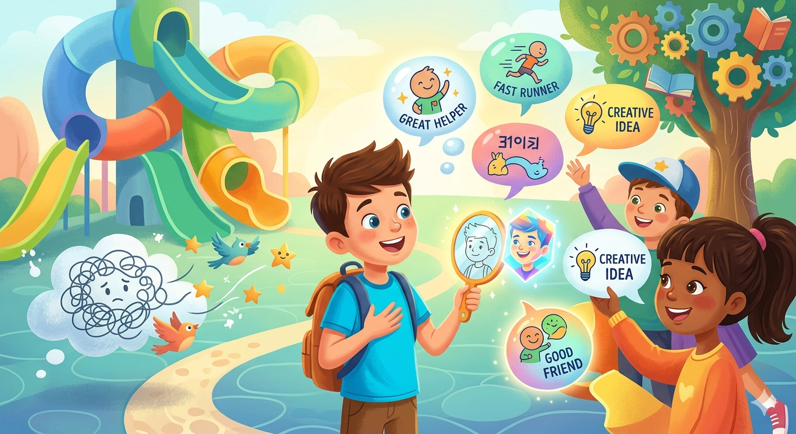

# Объективный взгляд: как [фидбэк](../../HowToFindYourStrengths/articles/objective_view.md) от окружающих меняет ваше представление о себе

Представь, что ты смотришь в [зеркало](../../../1.2_natural_sciences/physics_in_everyday_life/Q35197.md). Ты видишь своё лицо, причёску, одежду. Но можешь ли ты увидеть своё [отражение](../../../1.2_natural_sciences/physics_in_everyday_life/Q11388.md) целиком? Например, увидеть, насколько ты добрый, смелый или весёлый?

Обычно мы сами себе придумываем, какие мы. Например, «я плохо рисую» или «я слишком стеснительный». И верим в это! Но это — не совсем настоящее отражение. Настоящее отражение нам помогают увидеть другие люди.

Это называется «фидбэк». Слово сложное, но на самом деле всё просто: это то, что тебе говорят о тебе другие. Это могут быть комплименты, [советы](../../../7.2 Media, leisure and hobbies /useful_and_interesting_leisure/articles/mistakes_in_choosing_hobby.md) или даже замечания. И самое интересное — этот фидбэк может полностью поменять то, что ты о себе думаешь.

---

## Фидбэк — это не просто «молодец!»

Многие думают, что фидбэк — это когда тебя хвалят или ругают. Например, «ты молодец!» или «ты плохо сделал». Но это — не настоящий фидбэк. Это просто [мнение](../../../4.2_thinking_and_working_information/critical_thinking/articles/fact_and_opinion_differences.md).

Настоящий фидбэк — это когда тебе говорят **что именно** и **как** ты сделал. Например:

- **Плохой фидбэк:** «Твой рисунок — ерунда». (Это просто обидно и ничего не понятно).
- **Хороший фидбэк:** «Твой рисунок весёлый, но если ты нарисуешь [солнце](../../../1.2_natural_sciences/physics_in_everyday_life/Q11388.md) поярче, он станет ещё лучше». (Здесь есть совет, который можно использовать).

Чувствуешь разницу? Настоящий фидбэк даёт тебе новые знания.

## Как фидбэк меняет твою картинку о себе?

Это как [игра](../../../4.1_rules_of_study/how_to_learn_effectively/articles/gamification.md) в пазл. Ты думал, что твоя картинка уже готова, но другой [человек](../../../1.2_natural_sciences/physics_in_everyday_life/Q45003.md) приносит новые кусочки.

1.  **Ты видишь скрытые [суперсилы](../../HowToFindYourStrengths/articles/talent_monetization.md).** Бывает, что ты делаешь что-то очень хорошо, но сам этого не замечаешь. Например, ты всегда помогаешь друзьям мириться. Тебе это кажется обычным делом. А друг скажет тебе: «Ты такой крутой, ты так легко находишь слова!». И ты вдруг поймёшь: «Ух ты! Я умею мирить людей! Я — миротворец!». Твоя картинка о себе стала круче.
2.  **Ты видишь [ошибки](../../../3.1_healthy_lifestyle/pervaya_pomoshch/ushibi_porezy_ozhogi/07_ushib_chego_nelzya.md), которые можно исправить.** Ты можешь думать, что ты отлично рассказываешь истории. Но мама или учительница могут сказать тебе: «Твоя [история](../../../1.2_natural_sciences/physics_in_everyday_life/Q11469.md) очень интересная, но ты её так быстро рассказываешь, что мы не успеваем всё понять». И ты поймёшь: «Ага! Значит, мне нужно учиться рассказывать помедленнее». И твоя картинка о себе станет точнее.

## Главное — уметь слушать (и не обижаться!)

Многие дети (и даже взрослые!) обижаются, когда им дают фидбэк. Они думают, что их ругают.

Но помни: фидбэк — это не ругань, а [помощь](../../../3.1_healthy_lifestyle/pervaya_pomoshch/ushibi_porezy_ozhogi/10_krovotechenie_chto_delat.md). Это как подарок, который тебе дают, чтобы ты стал ещё лучше.

**Что делать, когда тебе дают фидбэк:**

1.  **Слушай [внимательно](../../../4.1_rules_of_study/how_to_memorize/articles/vnimanie.md).** Не перебивай.
2.  **Задавай [вопросы](../../../4.1_rules_of_study/how_to_learn_effectively/articles/curiosity.md).** Если что-то непонятно, спроси: «Как именно мне это сделать лучше?».
3.  **Помни про [фильтр](../../../3.1_healthy lifestyle/vrednye_privychki/articles/Social_media.md).** Не весь фидбэк одинаково полезен. Если кто-то просто хочет тебя обидеть, это плохой фидбэк. Его можно проигнорировать. А если человек говорит тебе что-то, чтобы ты стал лучше, это хороший фидбэк.

Фидбэк от окружающих — это как волшебные [очки](../../../1.2_natural_sciences/physics_in_everyday_life/Q14620.md). Они помогают тебе увидеть себя по-новому, найти скрытые [таланты](../../HowToFindYourStrengths/articles/zone-of-genius-how-to-know.md) и стать самым лучшим в [том](../../../7.1_art/musical_instruments/articles/drums.md), что ты любишь делать. Не бойся слушать других!

---

[Автор](../../../4.2_thinking_and_working_information/how_to_search_information/articles/copypaste.md): Бабинцева Диана, @diiwwae;  
_Ресурсы: [LLM](../../../7.1_art/modern_technological_art/README.md) - Gemini 1.5 Pro, Image Gen - Imagen 3_
