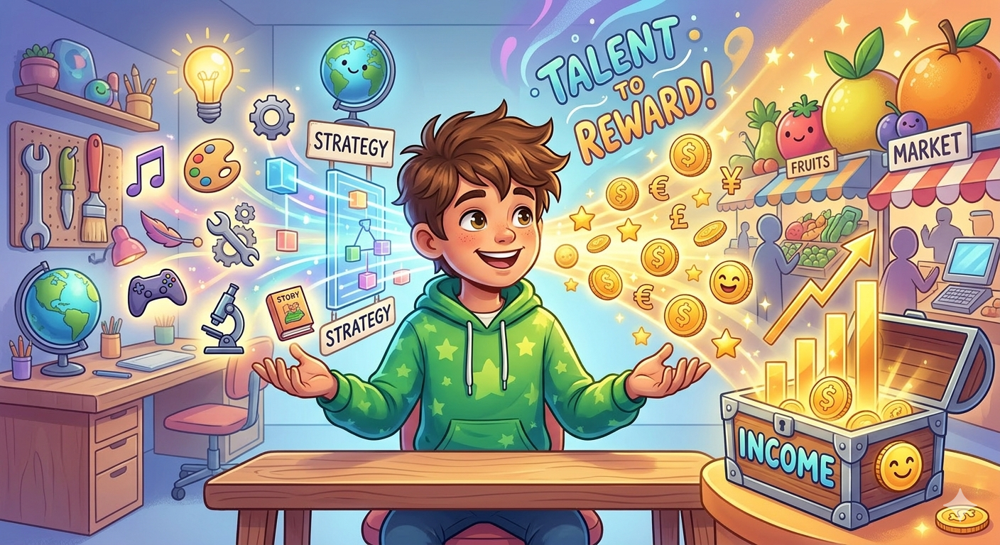

# Монетизируйте [таланты](../../HowToFindYourStrengths/articles/zone-of-genius-how-to-know.md): как превратить свои [сильные стороны](../../HowToFindYourStrengths/articles/career-rise-natural-strengths.md) в [доход](../../../6.1_Independent_living_and_daily_living_skills/reasonable_spending/articles/income.md)

Многие дети (и даже взрослые!) думают, что [работа](../../../1.2_natural_sciences/physics_in_everyday_life/Q11382.md) — это когда ты делаешь что-то скучное, трудное и нелюбимое. А то, что тебе нравится и даётся легко, — это «просто [хобби](../../../2.1_society/how_and_where_find_friends/articles/neochevidnye_mesta_dlya_znakomstva.md)». Это — огромная [ошибка](../../../5.1_technology_and_digital_literacy/how_internet_works/articles/http_https/http_https.md)! Твои настоящие таланты и то, что ты любишь делать, — это твои самые ценные [суперсилы](../../HowToFindYourStrengths/articles/talent_monetization.md). И на них можно зарабатывать!

Проблема не в [том](../../../7.1_art/musical_instruments/articles/drums.md), что у тебя нет талантов, а в том, что ты не видишь, кому они могут быть нужны. Давай разберемся, как сделать так, чтобы то, что ты делаешь лучше всех, приносило тебе [деньги](../../../2.1_society/cause_and_effect_relationships/articles/economic_chains.md).

---

## [Шаг](../../../1.2_natural_sciences/physics_in_everyday_life/Q36253.md) 1. Найди свои «суперсилы»

Прежде чем что-то продавать, нужно понять, что именно. Сильная сторона — это когда ты делаешь что-то **хорошо**, **легко** (для тебя) и **с удовольствием**.

**Упражнение:** Ответь на три вопроса:

1.  За какой помощью ко мне чаще всего обращаются [друзья](../../../4.1_rules_of_study/how_to_learn_effectively/articles/peer_learning.md)?
2.  Какую [работу](../../../8.2_future/choosing_a_career_path/articles/interview.md) я могу делать часами, теряя счет времени?
3.  В каких вопросах я разбираюсь лучше, чем большинство моих друзей?

_Пример: Ты отлично умеешь строить сложные дома в майнкрафте, придумывать весёлые игры для компании или находить общий [язык](../../../5.2_cybersecurity/cpp_fundamentals/1_introduction.md) с любым животным. Это и есть твои суперсилы._

## Шаг 2. Найди тех, кому это нужно

[Талант](../../HowToFindYourStrengths/articles/talent_monetization.md) сам по себе не приносит [денег](../../../8.2_future/choosing_a_career_path/articles/salary.md). Деньги приносит **[решение](../../../2.1_society/cause_and_effect_relationships/articles/personal_choice.md) [чужой](../../../3.2 healthy lifestyle/how to act in a dangerous situation/articles/stranger-safety.md) проблемы** с помощью твоего таланта. Твоя задача — найти людей, которым ты можешь помочь.

- **Твоя суперсила:** Ты умеешь классно монтировать [видео](../../../5.1_technology_and_digital_literacy/information and media literacy/оценка_качества_изображений_и_видео.md).
- **Чья-то [боль](../../../1.2_natural_sciences/neurobiology_for_teens/articles/16_love_chemistry.md):** У друга есть канал на ютубе, но он не знает, как красиво обрезать видео и добавить эффекты.
- **Твой продукт:** Предложить другу [услуги](../../HowToFindYourStrengths/articles/talent_monetization.md) монтажёра за символическую плату или отзыв.

## Шаг 3. Придумай, как это продавать

Люди не покупают «абстрактный талант», они покупают понятный [результат](../../../1.2_natural_sciences/why_science_help_understand_world/experimental_science.md). Это как подарок: он должен быть в красивой упаковке.

Существует несколько основных способов монетизации:

1.  **Услуги ([Фриланс](../../HowToFindYourStrengths/articles/talent_monetization.md)):** Делать работу за других (строить в майнкрафте, рисовать аватарки, помогать с математикой).
2.  **[Обучение](../../../3.1. healthy lifestyle/Sleep, nutrition, and adolescent energy/articles/sleep_and_memory_grades.md):** Учить других тому, что умеешь сам (проводить мастер-классы, вебинары, быть ментором).
3.  **[Контент](../../../5.1_technology_and_digital_literacy/information and media literacy/информационная_диета.md):** Создавать полезный контент (блоги, рассылки, ютуб-каналы).
4.  **Продукт:** Создать что-то физическое или цифровое ([книги](../../../7.2 Media, leisure and hobbies /useful_and_interesting_leisure/articles/reading_and_self_education.md), шаблоны, ремесленные изделия).

## Шаг 4. Сделай первый (даже бесплатный) шаг

Главная ошибка — ждать, пока твой «продукт» станет идеальным. Начни с малого, чтобы получить первый отзыв.

- Предложи услугу за символическую плату или отзыв.
- Напиши бесплатный гайд по твоей теме.
- Проведи бесплатную 15-минутную консультацию.

Это поможет тебе поверить в себя, накопить [портфолио](../../../8.2_future/choosing_a_career_path/articles/resume.md) и понять, за что люди реально готовы платить.

---

### [Резюме](../../../8.2_future/choosing_a_career_path/articles/resume.md)

Превращение таланта в доход — это не магия, а технология. Она требует смелости признать свою ценность, усилий по поиску клиентов и готовности учиться бизнесу. Не позволяй своим суперсилам пылиться на полке. Мир готов платить за то, что ты делаешь лучше всех.

---

[Автор](../../../4.2_thinking_and_working_information/how_to_search_information/articles/copypaste.md): Бабинцева Диана, @diiwwae;  
_Ресурсы: [LLM](../../../7.1_art/modern_technological_art/README.md) - Gemini 1.5 Pro, Image Gen - Imagen 3_
