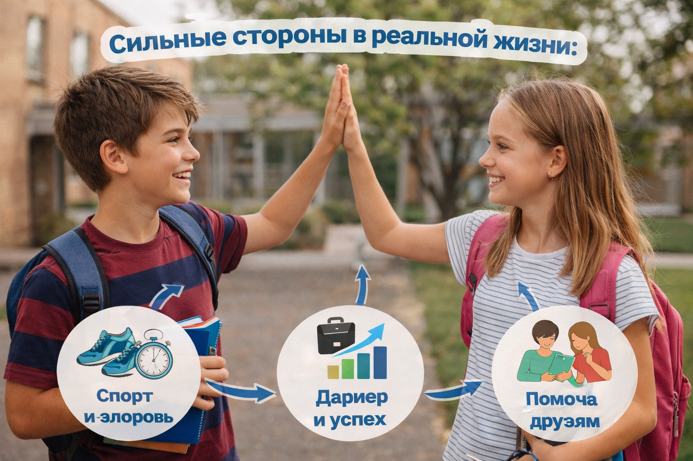

# [Как развивать свои сильные стороны](../../../8.1_colf-underctandina/HouToFindVourStrenaths/articles/use_strengths_in_life.md) и использовать их в жизни

## Введение

Найти свои [сильные стороны](../../HowToFindYourStrengths/articles/career-rise-natural-strengths.md) — это только [первый шаг](../../../1.2_natural_sciences/physics_in_everyday_life/Q26540.md). Важно не просто заметить их, но и научиться использовать в жизни. Тогда они действительно помогут тебе в учёбе, общении и выборе будущих целей.

## Почему важно развивать сильные стороны

Когда [человек](../../../1.2_natural_sciences/physics_in_everyday_life/Q45003.md) развивает то, что у него уже получается, он:

- чувствует больше уверенности;
- быстрее видит [результат](../../../1.2_natural_sciences/why_science_help_understand_world/experimental_science.md);
- лучше понимает себя;
- легче справляется с трудностями;
- может быть полезнее в команде.

> [Развитие](../../../3.1. healthy lifestyle/Sleep, nutrition, and adolescent energy/articles/micronutrients_and_teenagers.md) сильных сторон помогает человеку расти не через постоянную критику себя, а через опору на свои возможности.

## Как развивать сильные стороны

### 1. Практиковаться регулярно

Любая сильная сторона становится заметнее, если её развивать.

Например:

- если ты хорошо пишешь, пиши чаще;
- если умеешь объяснять, помогай другим разбирать темы;
- если ты организованный(ая), бери на себя [планирование](../../../3.1. healthy lifestyle/Sleep, nutrition, and adolescent energy/articles/ideal_schedule_energy_management.md) в проекте;
- если у тебя хорошие [идеи](../../../7.2 Media, leisure and hobbies /useful_and_interesting_leisure/articles/free_leisure_activities.md), пробуй участвовать в творческих заданиях.

**Простое [правило](../../../1.2_natural_sciences/why_science_help_understand_world/patterns.md):** чем больше практики, тем сильнее [навык](../../../5.1_technology_and_digital_literacy/information and media literacy/карта_компетенций_по_возрастам.md).

### 2. Ставить маленькие [цели](../../../3.1_healthy_lifestyle/pervaya_pomoshch/ushibi_porezy_ozhogi/02_celi_pervoy_pomoshchi.md)

Большие цели вдохновляют, но часто пугают. Гораздо полезнее идти небольшими шагами.

Например:

- не «Я должен(на) стать уверенным(ой)»,
- а «На этой неделе я один раз отвечу у доски».

Или:

- не «Я [хочу](../../../6.1_Independent_living_and_daily_living_skills/reasonable_spending/articles/want.md) стать очень организованным(ой)»,
- а «Сегодня я составлю [план](../../../7.2 Media, leisure and hobbies/Computer games/articles/genres_and_worlds/strategy.md) подготовки к контрольной».

### 3. Применять свои сильные стороны в разных ситуациях

Сильная сторона становится особенно полезной, когда ты переносишь её в разные области жизни.

Например:

| Сильная сторона | Где можно применить                          |
| :-------------- | :------------------------------------------- |
| Умение слушать  | В дружбе, в командной [работе](../../../8.2_future/choosing_a_career_path/articles/interview.md)                 |
| [Ответственность](../../../2.1_society/cause_and_effect_relationships/articles/responsibility.md) | В учёбе, в домашних делах                    |
| Настойчивость   | В сложных заданиях и тренировках             |
| Креативность    | В проектах, конкурсах, [хобби](../../../2.1_society/how_and_where_find_friends/articles/neochevidnye_mesta_dlya_znakomstva.md)                 |
| [Спокойствие](../../../7.2 Media, leisure and hobbies/Computer games/articles/useful_tips/toxic_players.md)     | В спорах, выступлениях, стрессовых ситуациях |

## Пример из жизни

Представим ученицу Аню.

- Она не считает себя лучшей в классе.
- Но она всегда доводит дела до конца.
- На неё можно положиться в проекте.
- Она спокойно помогает одноклассникам, если им что-то непонятно.

Какие сильные стороны у неё можно заметить?

1. ответственность;
2. надёжность;
3. терпение;
4. умение объяснять.

Это хороший пример того, что сильные стороны бывают не только «яркими», но и очень важными в обычной жизни.

## Что делать, если что-то не получается

Даже если у тебя есть сильные стороны, это не значит, что всё всегда будет получаться идеально. У всех бывают [ошибки](../../../3.1_healthy_lifestyle/pervaya_pomoshch/ushibi_porezy_ozhogi/07_ushib_chego_nelzya.md), [неудачи](../../../4.1_rules_of_study/how_to_learn_effectively/articles/learning_from_mistakes.md) и [усталость](../../../3.1. healthy lifestyle/Sleep, nutrition, and adolescent energy/articles/sugar_rollercoaster.md).

[!CAUTION]

> Не стоит делать [вывод](../../../1.2_natural_sciences/why_science_help_understand_world/scientific_method.md) о себе по одной плохой оценке, одной ошибке или одному неудачному дню.

Гораздо полезнее спросить себя:

- Что у меня уже получается?
- Что помогло мне раньше?
- Какую свою сильную сторону я могу использовать сейчас?

## Упражнение «Моя [опора](../../../1.2_natural_sciences/physics_in_everyday_life/Q2945123.md)»

Заполни таблицу:

| Моя сильная сторона | Где она уже проявлялась | Как я могу развивать её дальше |
| :------------------ | :---------------------- | :----------------------------- |
| ...                 | ...                     | ...                            |
| ...                 | ...                     | ...                            |
| ...                 | ...                     | ...                            |

Такое упражнение помогает увидеть, что сильные стороны — это не просто слова, а реальные качества, которые уже работают в твоей жизни.

## Как использовать сильные стороны в будущем

[Понимание](../../../2.1_society/cause_and_effect_relationships/articles/empathy_causality.md) своих сильных сторон полезно уже в 8 классе, потому что помогает:

- выбирать интересные занятия;
- понимать, в чём хочется развиваться;
- чувствовать [уверенность в себе](../../../2.1_society/how_and_where_find_friends/articles/fandom.md);
- [замечать](../../../4.1_rules_of_study/how_to_memorize/articles/vnimanie.md), где ты особенно полезен(на);
- лучше готовиться к выбору профиля, кружков и будущих интересов.

[!NOTE]

> Необязательно сразу знать своё [будущее](../../../1.2_natural_sciences/physics_in_everyday_life/Q11469.md).  
> Достаточно начать лучше понимать себя уже сейчас.

## Иллюстрация

## Вывод

Сильные стороны есть у каждого человека. Их можно заметить, развивать и применять в жизни. Когда ты знаешь, в чём твоя опора, тебе легче учиться, общаться и двигаться вперёд.

## Внутренние ссылки

- [Почему важно развивать сильные стороны](#почему-важно-развивать-сильные-стороны)
- [Как развивать сильные стороны](#как-развивать-сильные-стороны)
- [Что делать, если что-то не получается](#что-делать-если-что-то-не-получается)
- [Вывод](#вывод)

---

**[Автор](../../../4.2_thinking_and_working_information/how_to_search_information/articles/copypaste.md):** Нечаев Виктор
**GitHub ответственный:** `@Hazel-th`

_Использованные [нейросети](../../../2.1_society/cause_and_effect_relationships/articles/ai_causality.md): [ChatGPT](../../../7.1_art/modern_technological_art/articles/6.1_prompt_art.md) (OpenAI)._
