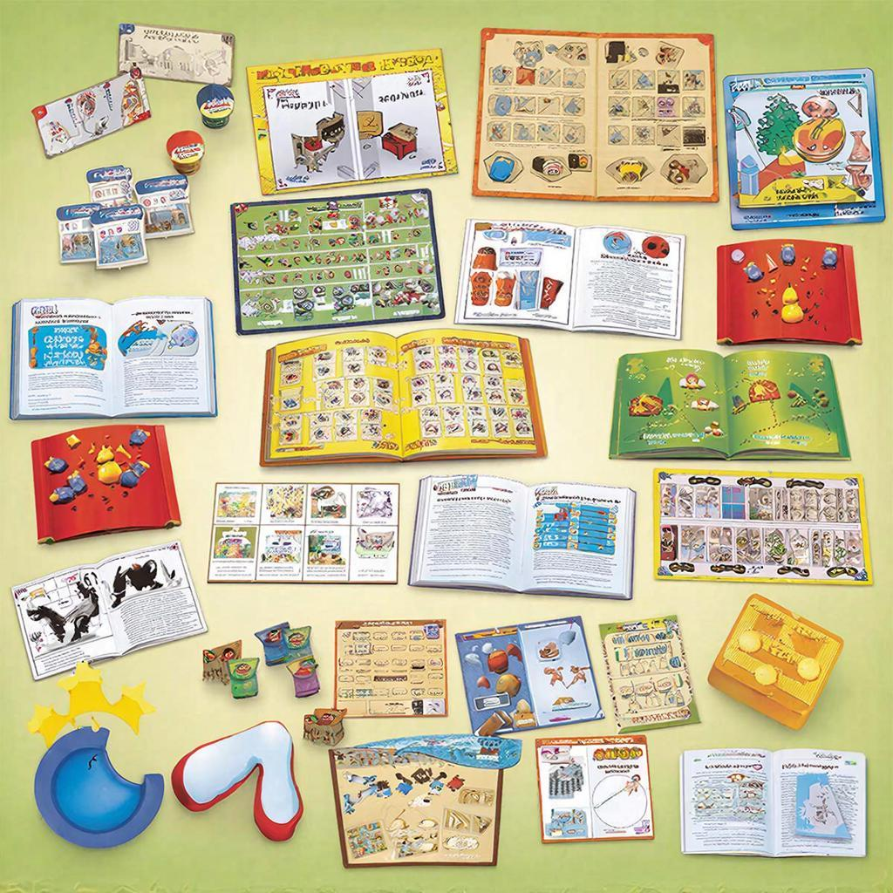

# [Настольные игры](../../7.2_leisure/useful_and_interesting_leisure/articles/board_and_intellectual_games.md)

## Что такое [настольные игры](../../../7.2 Media, leisure and hobbies /useful_and_interesting_leisure/articles/board_and_intellectual_games.md)?

Представь себе большой круглый стол, за которым собрались [друзья](../../../4.1_rules_of_study/how_to_learn_effectively/articles/peer_learning.md) или [семья](../../5.1_technology_and_digital_literacy/information and media literacy/семейные_правила_потребления_контента.md). На столе разложены карточки, фишки, кубики и разноцветные фигурки. Каждый участник пытается выиграть, следуя правилам игры. Это и есть **[настольная игра](../../../../8.1_entertainment/articles/board-games.md)** – увлекательное занятие, которое объединяет людей разных возрастов и интересов.

Зачем они нужны? Во-первых, настольные игры помогают весело провести [время](../../../1.2_natural_sciences/physics_in_everyday_life/Q20702.md) вместе. Во-вторых, они тренируют [мышление](../../5.1_technology_and_digital_literacy/information and media literacy/критическое_мышление_в_онлайн_среде.md), [память](../../3.1. healthy lifestyle/Sleep, nutrition, and adolescent energy/articles/sleep_and_memory_grades.md) и [внимание](../../5.1_technology_and_digital_literacy/information and media literacy/эмоциональные_триггеры_в_контенте.md). Например, если ты играешь в [шахматы](../../../../8.1_entertainment/articles/board-games.md), тебе нужно продумывать ходы наперёд, чтобы победить соперника.

## [История](../../2.1_society/cause_and_effect_relationships/articles/lessons_of_history.md) настольных игр

Давным-давно люди играли в простые игры, используя кости животных или камешки. Со временем появились более сложные [варианты](../../../6.1_Independent_living_and_daily_living_skills/reasonable_spending/articles/comparison.md). Вот несколько ключевых этапов:

### Древние времена
В Египте около 3000 лет до нашей эры была популярна [игра](../../../4.1_rules_of_study/how_to_learn_effectively/articles/gamification.md) под названием "Сенет". Она напоминала современные шашки.

### Средневековье
В Европе стали популярны карточные игры, такие как "Карты Таро", которые использовали не только для развлечений, но и для гадания.

### Новое время
В XIX веке появилась популярная игра "Монополия", которая учит финансовой грамотности и стратегическому мышлению.

## Основные [виды](../../3.1_healthy_lifestyle/pervaya_pomoshch/ushibi_porezy_ozhogi/08_porezy_sadiny_vidy.md) или разновидности

Существует множество видов настольных игр, каждый из которых отличается правилами и тематикой. Вот самые популярные:

### Игры на удачу
Это те игры, где [результат](../../1.2_natural_sciences/why_science_help_understand_world/experimental_science.md) зависит от случайного события. Например, бросок кубика или вытягивание карт. Пример такой игры – "Уно".

### Стратегические игры
Здесь важно думать заранее и планировать свои [действия](../../3.1_healthy_lifestyle/pervaya_pomoshch/ushibi_porezy_ozhogi/03_obschie_pravila_algorithm.md). Хороший пример – шахматы или го.

### Карточные игры
Используются специальные колоды карт, каждая [карта](../../5.1_technology_and_digital_literacy/information and media literacy/карта_компетенций_по_возрастам.md) имеет своё [значение](../../7.2_leisure/useful_and_interesting_leisure/articles/leisure_and_why_need.md). Популярная игра – "Дурак".

### Экономические игры
Эти игры учат управлять финансами и принимать важные решения. Одна из таких игр – "Монополия".

## Интересные [факты](../../../1.2_natural_sciences/physics_in_everyday_life/Q17737.md)

Вот несколько интересных и забавных фактов о настольных играх:

- Самая старая известная настольная игра – это древнеегипетский "Сенет", найденный археологами в гробнице Тутанхамона.
- Первая коммерчески успешная настольная игра в США называлась "Parcheesi" и была выпущена в конце XIX века.
- Игра "Пентагон" помогает развивать [навыки](../../7.2_leisure/useful_and_interesting_leisure/articles/computer_games_with_benefit.md) командной [работы](../../../8.2_future/choosing_a_career_path/articles/interview.md) и лидерства.

## Примеры из жизни

Вот несколько известных примеров настольных игр, которые наверняка знакомы твоим друзьям:

- Шахматы – классическая игра, развивающая логику и стратегическое [мышление](../../../1.2_natural_sciences/neurobiology_for_teens/articles/01_brain_complexity.md).
- Монополия – игра, обучающая основам экономики и управления капиталом.
- Уно – быстрая и весёлая игра, подходящая даже самым маленьким игрокам.

## [Польза](../../7.2_leisure/useful_and_interesting_leisure/articles/computer_games_with_benefit.md) настольных игр

Почему стоит играть в настольные игры? Вот несколько причин:

- [Развитие](../../3.1. healthy lifestyle/Sleep, nutrition, and adolescent energy/articles/micronutrients_and_teenagers.md) интеллекта и креативности. Когда ты решаешь [головоломки](../../../7.2 Media, leisure and hobbies/Computer games/articles/useful_tips/educational_games.md) или придумываешь [стратегии](game-genres.md), твой [мозг](../../3.1. healthy lifestyle/Sleep, nutrition, and adolescent energy/articles/breakfast_for_the_brain.md) работает активнее.
- [Улучшение](../../../4.1_rules_of_study/how_to_learn_effectively/articles/learning_from_mistakes.md) навыков общения. Игры учат договариваться, делиться и сотрудничать.
- [Обучение](../../3.1. healthy lifestyle/Sleep, nutrition, and adolescent energy/articles/sleep_and_memory_grades.md) новым навыкам. Некоторые игры помогают освоить математику, [чтение](../../7.2_leisure/useful_and_interesting_leisure/articles/reading_and_self_education.md) и письмо.

## Возможные [риски](../../7.2_leisure/useful_and_interesting_leisure/articles/safety_during_recreation.md)

Как и любое увлечение, настольные игры могут иметь негативные последствия, если ими злоупотреблять. Вот некоторые моменты, на которые стоит обратить [внимание](../../../1.2_natural_sciences/neurobiology_for_teens/articles/16_love_chemistry.md):

- Ограничение времени. Важно [помнить](../../how_to_memorize/articles/pamyat.md), что слишком много времени, проведённое за игрой, может привести к снижению успеваемости в школе.
- Конфликты между игроками. Иногда азарт и [желание](../../../6.1_Independent_living_and_daily_living_skills/reasonable_spending/articles/want.md) победить приводят к ссорам и обидам.

## [Баланс](../../7.2_leisure/useful_and_interesting_leisure/articles/balance_study_rest_hobby.md) пользы и [развлечения](../../../6.1_Independent_living_and_daily_living_skills/reasonable_spending/articles/want.md)

Чтобы получить [максимум](../../../1.2_natural_sciences/physics_in_everyday_life/Q136980.md) удовольствия и пользы от настольных игр, попробуй следовать этим простым советам:

- Выбирай игры, подходящие по возрасту и интересам всех участников.
- Следи за временем, проводимым за столом.
- Учись уважать [правила](../../2.1_society/cause_and_effect_relationships/articles/why_rules_work.md) и других игроков.

## [Заключение](../../../1.2_natural_sciences/physics_in_everyday_life/Q2225.md)

Настольные игры – это отличный способ весело провести время с друзьями и семьёй, развить умственные [способности](../../../4.1_rules_of_study/how_to_learn_effectively/articles/growth_mindset.md) и научиться важным жизненным навыкам. Главное – соблюдать [баланс](../../../1.2_natural_sciences/physics_in_everyday_life/Q634.md) и получать [удовольствие](../../../1.2_natural_sciences/neurobiology_for_teens/articles/11_reward_system.md) без вреда для себя!

---
[Автор](../../5.1_technology_and_digital_literacy/information and media literacy/авторское_право_и_честное_использование.md): Долбус Дмитрий

*[LLM](../../../7.1_art/modern_technological_art/README.md) - GigaChat*

