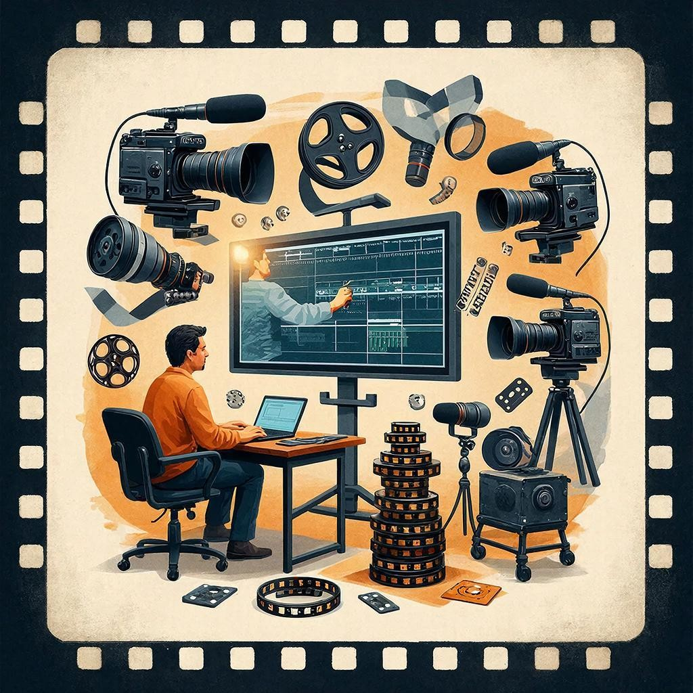

# [Монтаж](../../5.1_technology_and_digital_literacy/information and media literacy/оценка_качества_изображений_и_видео.md) — волшебство [кино](movie.md)

## Тема: [монтаж](../../../5.1_technology_and_digital_literacy/information and media literacy/оценка_качества_изображений_и_видео.md)  
**Монтаж** — это [процесс](../../../5.1_technology_and_digital_literacy/operating system/articles/process.md) соединения разных кадров, [звуков](music.md) и [сцен](script.md), чтобы получился интересный [фильм](movie.md) или видеоролик. Представь себе пазлы: монтажщик складывает кусочки картинки, пока она не станет цельной историей.

---

## Зачем нужен монтаж?  
Монтаж помогает [режиссёру](director.md) показать свою задумку зрителям. Например, монтажчик (так ласково называют монтажёров) может ускорить [действие](../../2.1_society/cause_and_effect_relationships/articles/personal_choice.md) или замедлить его, сделать кадры смешнее или драматичнее. С помощью монтажа создаётся [настроение](psychology_of_music.md) [фильма](movie.md), [зрители](../../../7.2 Media, leisure and hobbies/Computer games/articles/game_culture/esports.md) понимают [эмоции](psychology_of_music.md) героев, переживают вместе с ними радостные моменты и трагедии.

---

## Как происходит монтаж?  
Сначала снимают много-много кадров — тысячи и даже миллионы! Это называется съёмка. Затем монтажёр берёт нужные кадры и собирает их вместе, добавляя [звуковые эффекты](../../../7.2 Media, leisure and hobbies/Computer games/articles/dream_team/composer.md), [музыку](music.md) и голоса актёров. Чтобы [фильм](movie.md) был красивым и понятным, кадры должны плавно переходить друг в друга, а звуки совпадать с происходящим на экране.

Например, представь, что ты снимаешь [сюжет](script.md) про собаку, которая весело бегает по улице. Сначала тебе покажут её быстрый забег крупным планом, потом дальний [кадр](director.md) всего двора, где [собака](../../../3.2 healthy lifestyle/how to act in a dangerous situation/articles/dog-bite-first-aid.md) резвится среди друзей. А дальше монтажер соединит эти кадры так, чтобы зрители сразу поняли: вот твоя любимая собачка, весело играющая во дворе!

---

## Какие бывают [виды](../../3.1_healthy_lifestyle/pervaya_pomoshch/ushibi_porezy_ozhogi/08_porezy_sadiny_vidy.md) монтажа?  
Есть несколько способов монтажа, каждый из которых подходит для определённого сюжета:

### **Монтаж внутри кадра**
Это когда один [кадр](../../../../8.1_entertainment/articles/director.md) продолжается дольше обычного, показывая нам события подробнее. Такой монтаж используют, когда нужно детально рассказать зрителю историю героя или показать напряжённый момент сцены.

### **Наружный монтаж**
Тут всё наоборот — короткие кадры сменяют друг друга быстро, создавая ощущение движения или динамики. Такой монтаж часто встречается в экшен-сценах, когда герои стремительно двигаются, происходят погони или драки.

---

## Важность звука в монтаже  
Звуки играют огромную роль в [фильме](movie.md). Они помогают зрителю лучше понимать происходящее и чувствовать атмосферу картины. Монтажёр должен точно подбирать музыку, шумы и [диалоги](../../../7.2 Media, leisure and hobbies/Computer games/articles/dream_team/screenwriter.md) персонажей, чтобы картинка выглядела живой и реалистичной.

Представь себе фантастический [фильм](movie.md), где герои путешествуют по далёкой планете. [Звук](../../1.2_natural_sciences/why_science_help_understand_world/physics.md) ветра, [шаги](../../../7.2 Media, leisure and hobbies/Computer games/articles/dream_team/composer.md) по сыпучему песку и голос главного героя создают полное ощущение приключения, погружают зрителя прямо внутрь истории.

---

## [Виды](../../../3.1_healthy_lifestyle/pervaya_pomoshch/ushibi_porezy_ozhogi/08_porezy_sadiny_vidy.md) профессии монтажёра  
Монтажёры делятся на разные специализации, каждая из которых важна для создания качественного [фильма](movie.md):

- **Киношники** работают над полнометражными художественными [фильмами](movie.md).
- **Документалисты** занимаются документальными лентами.
- **Рекламщики** монтируют рекламные ролики и короткие клипы.
- **Фильмотехники** делают монтаж любительских [фильмов](movie.md) и семейных хроник.

---

## Итог  
Монтаж — это магия кинематографа, [искусство](../../../7.2 Media, leisure and hobbies /what_you_can_read_and_watch_to_develop_your_taste/articles/aesthetics_and_taste.md) превращения отдельных кадров и звуков в [живое](../../1.2_natural_sciences/why_science_help_understand_world/nature.md) зрелище. Каждый монтажёр вкладывает душу в своё дело, делая [фильмы](movie.md) увлекательными и запоминающимися. Если хочешь стать частью волшебства экрана, попробуй себя в роли монтажёра — это удивительное занятие!

---
[Автор](../../5.1_technology_and_digital_literacy/information and media literacy/авторское_право_и_честное_использование.md): Фролов Матвей

*[LLM](../../../7.1_art/modern_technological_art/README.md) - GigaChat*

