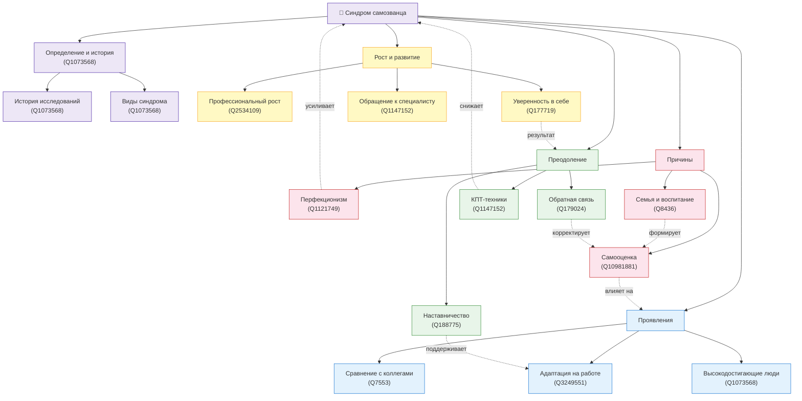

# [Синдром самозванца](../../8.1_self-understanding/HowToFindYourStrengths/articles/impostor_syndrome.md) на новой [работе](../../8.2_future/choosing_a_career_path/articles/interview.md)

## Описание направления

Раздел энциклопедии, посвящённый синдрому самозванца в контексте начала карьеры и смены места [работы](../../8.2_future/choosing_a_career_path/articles/interview.md). Основная идея — объяснить природу этого психологического явления, его причины и проявления, а также предложить конкретные [инструменты](../../1.2_natural_sciences/physics_in_everyday_life/Q36253.md) для работы с ним и [достижения](../../4.1_rules_of_study/how_to_learn_effectively/articles/gamification.md) уверенности в профессиональной деятельности.

**Раздел:** 8. [Будущее](../../1.2_natural_sciences/physics_in_everyday_life/Q11469.md), [цели](../../3.1_healthy_lifestyle/pervaya_pomoshch/ushibi_porezy_ozhogi/02_celi_pervoy_pomoshchi.md) и самореализация  
**Подраздел:** 8.1 [Понимание](../../2.1_society/cause_and_effect_relationships/articles/empathy_causality.md) себя  
**Тема:** Синдром самозванца на новой работе

---

## Онтология предметной области

### [Визуализация](../../4.1_rules_of_study/how_to_memorize/articles/vizualizaciya.md) (Mermaid)

### Описание связей

| [Тип](../../5.2_cybersecurity/cpp_fundamentals/13_struct.md) связи | [Обозначение](../../1.2_natural_sciences/physics_in_everyday_life/Q30006.md) | Примеры |
|-----------|-------------|---------|
| **Иерархическая** (включает / является частью) | Сплошная линия → | Синдром самозванца → [Виды](../../3.1_healthy_lifestyle/pervaya_pomoshch/ushibi_porezy_ozhogi/08_porezy_sadiny_vidy.md); Преодоление → КПТ-техники |
| **Горизонтальная** (влияет / усиливает) | Пунктирная линия -.-> | [Перфекционизм](../../../8.1_self_understanding/articles/perfectionism.md) → Синдром; [Обратная связь](../../8.1_self-understanding/HowToFindYourStrengths/articles/objective_view.md) → [Самооценка](../../2.1_society/how_and_where_find_friends/articles/otkaz_ne_konets.md) |
| **Результирующая** (приводит к) | Пунктирная линия -.-> | Преодоление → [Уверенность в себе](../../2.1_society/how_and_where_find_friends/articles/fandom.md) |

---

### [Список](../../5.2_cybersecurity/cpp_fundamentals/10_arrays.md) понятий

| # | Понятие | WikiData | Категория | [Файл](../../5.1_technology_and_digital_literacy/operating system/articles/file_system.md) |
|---|---------|----------|-----------|------|
| 1 | Синдром самозванца | [Q1073568](https://www.wikidata.org/wiki/Q1073568) | [Определение](../../1.2_natural_sciences/physics_in_everyday_life/Q29996.md) | `articles/impostor_syndrome.md` |
| 2 | [История](../../1.2_natural_sciences/physics_in_everyday_life/Q11469.md) и исследования феномена | [Q1073568](https://www.wikidata.org/wiki/Q1073568) | Определение | `articles/history_of_impostor_syndrome.md` |
| 3 | [Виды синдрома самозванца](../../../8.1_self_understanding/articles/types_of_impostor_syndrome.md) | [Q1073568](https://www.wikidata.org/wiki/Q1073568) | Определение | `articles/types_of_impostor_syndrome.md` |
| 4 | Причины возникновения синдрома самозванца | [Q1073568](https://www.wikidata.org/wiki/Q1073568) | Причины | `articles/causes.md` |
| 5 | Синдром самозванца и перфекционизм | [Q1121749](https://www.wikidata.org/wiki/Q1121749) | Причины | `articles/perfectionism.md` |
| 6 | Роль воспитания и семьи | [Q8436](https://www.wikidata.org/wiki/Q8436) | Причины | `articles/family_influence.md` |
| 7 | Как проявляется синдром на новой работе | [Q1073568](https://www.wikidata.org/wiki/Q1073568) | Проявления | `articles/manifestations.md` |
| 8 | Синдром самозванца и самооценка | [Q10981881](https://www.wikidata.org/wiki/Q10981881) | Проявления | `articles/self_esteem.md` |
| 9 | Синдром самозванца у высокодостигающих людей | [Q1073568](https://www.wikidata.org/wiki/Q1073568) | Проявления | `articles/high_achievers.md` |
| 10 | [Адаптация](../../2.1_society/how_and_where_find_friends/articles/druzhba_posle_shkoly.md) на новом месте работы | [Q3249551](https://www.wikidata.org/wiki/Q3249551) | Проявления | `articles/workplace_adaptation.md` |
| 11 | Обратная связь и как её воспринимать | [Q179024](https://www.wikidata.org/wiki/Q179024) | Проявления | `articles/feedback.md` |
| 12 | [Сравнение](../../5.2_cybersecurity/cpp_fundamentals/5_operators.md) себя с коллегами | [Q7553](https://www.wikidata.org/wiki/Q7553) | Проявления | `articles/social_comparison.md` |
| 13 | Способы преодоления синдрома самозванца | [Q1073568](https://www.wikidata.org/wiki/Q1073568) | Преодоление | `articles/overcoming.md` |
| 14 | Когнитивно-поведенческие [техники](../../8.2_future_and_path_choice/articles/03_stress_management.md) | [Q1147152](https://www.wikidata.org/wiki/Q1147152) | Преодоление | `articles/cbt_techniques.md` |
| 15 | Роль наставника и поддержки коллег | [Q188775](https://www.wikidata.org/wiki/Q188775) | Преодоление | `articles/mentorship.md` |
| 16 | Синдром самозванца и [профессиональный рост](../../../8.1_self_understanding/articles/professional_growth.md) | [Q2534109](https://www.wikidata.org/wiki/Q2534109) | [Рост](../../3.1. healthy lifestyle/Sleep, nutrition, and adolescent energy/articles/micronutrients_and_teenagers.md) | `articles/professional_growth.md` |
| 17 | Когда стоит обратиться к специалисту | [Q1147152](https://www.wikidata.org/wiki/Q1147152) | Рост | `articles/when_to_seek_help.md` |
| 18 | Уверенность в себе как [навык](../../5.1_technology_and_digital_literacy/information and media literacy/карта_компетенций_по_возрастам.md) | [Q177719](https://www.wikidata.org/wiki/Q177719) | Рост | `articles/self_confidence.md` |

---

## [Источники](../../4.2_thinking_and_working_information/how_to_search_information/articles/three_whales.md) знаний

### WikiData / SPARQL

Для каждого понятия из таблицы выше могут быть извлечены [данные](../../2.1_society/cause_and_effect_relationships/articles/ai_causality.md) из WikiData с помощью SPARQL-запросов:
- Метки и описания на русском/английском языках
- Иерархические связи (P279 — subclass of, P31 — instance of)
- Связанные сущности (P737 — influenced by и др.)

### Генерация текстов

Тексты энциклопедических статей генерируются с помощью языковых моделей.

Промпт-шаблон:
> **Системный**: "Ты [автор](../../4.2_thinking_and_working_information/how_to_search_information/articles/copypaste.md) энциклопедии для молодых специалистов. Пиши ясно, конкретно и с опорой на психологические исследования."
>
> **Пользователь**: "Напиши подробную статью об понятии «{понятие}». Тема раздела: «Синдром самозванца на новой работе». Описание: {description}. Содержание: введение, история/[контекст](../../5.1_technology_and_digital_literacy/information and media literacy/геолокация_и_проверка_контекста.md), суть явления, практические примеры, [польза](../../7.2 Media, leisure and hobbies /useful_and_interesting_leisure/articles/computer_games_with_benefit.md) осознания, [риски](../../7.2 Media, leisure and hobbies /useful_and_interesting_leisure/articles/safety_during_recreation.md) игнорирования, способы работы с темой, [заключение](../../1.2_natural_sciences/physics_in_everyday_life/Q2225.md). Используй WikiData: {wikidata_context}. [Ответ](../../5.1_technology_and_digital_literacy/how_internet_works/articles/http_https/http_https.md) в формате markdown."

### Перекрёстные ссылки

Ссылки между статьями расставляются на основе `concepts.json` по леммам понятий. Первое вхождение каждого понятия в тексте заменяется на markdown-ссылку.

---

## Участники группы

| # | ФИО | Понятия |
|---|-----|---------|
| 1 | Гуляев Андрей | Синдром самозванца, История феномена, Виды синдрома |
| 2 | Лапин Данил| Причины, Перфекционизм, Роль семьи |
| 3 | Болдинова Валерия | Проявления на работе, Самооценка, Высокодостигающие |
| 4 | Фоменко Артем | Адаптация, Обратная связь, Сравнение с коллегами |
| 5 | Суровегин Никита | Преодоление, КПТ-техники, [Наставничество](../../../8.1_self_understanding/articles/mentorship.md) |
| 6 | Малеев Владислав | Профессиональный рост, Обращение к специалисту, Уверенность в себе |