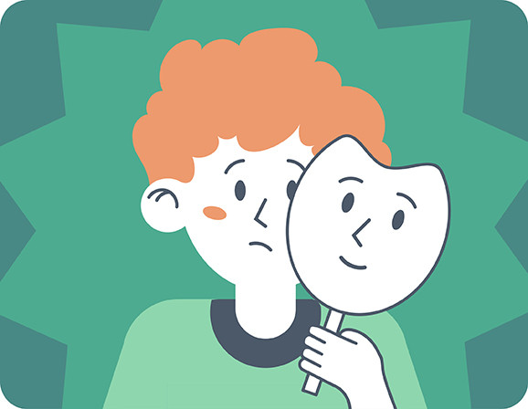

# Причины возникновения синдрома самозванца

Откуда берётся чувство, что ты оказался не на своём месте? Почему одни люди верят в себя, а другие — нет, даже при одинаковых достижениях? Причин у [синдрома самозванца](impostor_syndrome.md) несколько, и они бывают очень разными.

## Новые ситуации

Чаще всего [синдром самозванца](../../../8.1_self-understanding/HowToFindYourStrengths/articles/impostor_syndrome.md) «включается» именно тогда, когда [человек](../../../1.2_natural_sciences/physics_in_everyday_life/Q45003.md) попадает в незнакомую обстановку. [Новая работа](../../../../8.1_self_understanding/articles/manifestations.md), новый класс, новый кружок — все вокруг кажутся опытнее и увереннее. В такой момент очень легко решить, что ты здесь лишний.

На самом деле все новички чувствуют себя примерно одинаково — просто не говорят об этом вслух.

## Высокие [ожидания](../../../1.2_natural_sciences/neurobiology_for_teens/articles/27_brain_predicts.md) окружающих

Если [родители](../../../../8.1_self_understanding/articles/family_influence.md), учителя или тренеры постоянно говорят: «Ты такой способный, у тебя всё получится» — это звучит приятно. Но иногда такие слова давят. Человек начинает бояться: а вдруг я не оправдаю ожиданий? А вдруг они ошиблись?

Чем выше ожидания — тем сильнее [страх](../../../1.2_natural_sciences/neurobiology_for_teens/articles/14_amygdala_fear.md) не соответствовать им.

## [Сравнение с другими](../../../../8.1_self_understanding/articles/social_comparison.md)

Когда постоянно смотришь на тех, кто делает что-то лучше тебя, и думаешь: «Вот они — настоящие, а я — нет», — это прямая дорога к синдрому самозванца.

Особенно это усилилось с появлением социальных сетей: там люди показывают только лучшее, и кажется, что у всех вокруг всё идеально — кроме тебя.

## [Детские установки](../../../../8.1_self_understanding/articles/family_influence.md)

То, что говорили нам в детстве, очень глубоко оседает в голове. Если ребёнку часто говорили «не высовывайся», «не хвались», «другие лучше знают» — он может вырасти с ощущением, что его [мнение](../../../4.2_thinking_and_working_information/critical_thinking/articles/fact_and_opinion_differences.md) и [достижения](../../../4.1_rules_of_study/how_to_learn_effectively/articles/gamification.md) ничего не стоят.

Подробнее об этом — в статье про [роль воспитания и семьи](family_influence.md).

## [Перфекционизм](../../../../8.1_self_understanding/articles/perfectionism.md)

Стремление делать всё идеально — ещё одна частая [причина](../../../2.1_society/cause_and_effect_relationships/articles/causality_base.md). Если человек ставит себе только наивысшую планку, любой обычный [результат](../../../1.2_natural_sciences/why_science_help_understand_world/experimental_science.md) кажется ему провалом. А значит — он «недостаточно хорош».

О связи [перфекционизма](perfectionism.md) и синдрома самозванца — в отдельной статье.

## [Тревожность](../../../../8.1_self_understanding/articles/causes.md)

Некоторые люди от природы склонны беспокоиться больше других. Для них неопределённость и [риск](../../../1.2_natural_sciences/neurobiology_for_teens/articles/05_teen_brain.md) [ошибки](../../../3.1_healthy_lifestyle/pervaya_pomoshch/ushibi_porezy_ozhogi/07_ushib_chego_nelzya.md) переживаются острее. Синдром самозванца и [тревожность](when_to_seek_help.md) часто идут рядом.

## Интересные [факты](../../../1.2_natural_sciences/physics_in_everyday_life/Q17737.md)

- Синдром самозванца чаще встречается у людей, которые первыми в семье получают [высшее образование](../../../8.2_future/choosing_a_career_path/articles/university.md) или приходят в новую профессию — им не с кем себя сравнивать «изнутри».
- Он усиливается в ситуациях, где человек чувствует себя «другим» — например, единственным человеком своего возраста в коллективе.
- Парадокс: чем умнее человек, тем лучше он умеет придумывать объяснения своим успехам — и тем легче убеждает себя, что всё это случайность.

## Примеры из жизни

Лена перешла в сильный класс с углублённым английским. Все вокруг говорят свободно, а она ещё путается в временах. Лена решила, что попала сюда по ошибке — хотя на самом деле она просто новенькая, и ей просто нужно [время](../../../1.2_natural_sciences/physics_in_everyday_life/Q20702.md).

## [Баланс](../../../1.2_natural_sciences/physics_in_everyday_life/Q634.md)

[Понимание](../../../2.1_society/cause_and_effect_relationships/articles/empathy_causality.md) причин помогает не осуждать себя. Синдром самозванца возникает не потому, что человек слабый или глупый — а потому что он оказался в непростой ситуации и реагирует на неё по-человечески.

## [Заключение](../../../1.2_natural_sciences/physics_in_everyday_life/Q2225.md)

Синдром самозванца возникает из-за новизны ситуации, высоких ожиданий, сравнения с другими, детских установок и [склонности](../../../7.2 Media, leisure and hobbies /useful_and_interesting_leisure/articles/how_to_understand_your_interests.md) к тревоге. Ни одна из этих причин не означает, что с человеком что-то не так. Зная причины, легче найти [выход](../../../3.2 healthy lifestyle/how to act in a dangerous situation/articles/building-evacuation.md).

---

[Автор](../../../4.2_thinking_and_working_information/how_to_search_information/articles/copypaste.md): Лапин Данил

*[LLM](../../../7.1_art/modern_technological_art/README.md) — Claude (Anthropic)*
