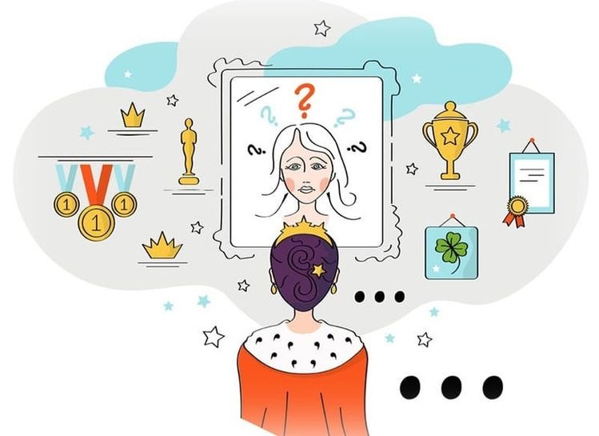

# Способы преодоления синдрома самозванца

[Синдром самозванца](impostor_syndrome.md) — неприятная штука. Но хорошая [новость](../../../5.1_technology_and_digital_literacy/information and media literacy/информационная_диета.md) в [том](../../../7.1_art/musical_instruments/articles/drums.md), что с ним можно работать. Не «вылечиться раз и навсегда» — он может возвращаться в новых ситуациях. Но научиться с ним справляться так, чтобы он не управлял твоей жизнью — вполне реально.

## [Шаг](../../../1.2_natural_sciences/physics_in_everyday_life/Q36253.md) 1: Назвать это своим именем

Первый и самый важный шаг — понять, [что происходит](../../../5.1_technology_and_digital_literacy/how_internet_works/articles/web_basics/what_happens.md). Когда ты думаешь «я здесь случайно» или «сейчас меня разоблачат», скажи себе: «Это [синдром самозванца](../../../8.1_self-understanding/HowToFindYourStrengths/articles/impostor_syndrome.md). Не [реальность](../../../1.2_natural_sciences/physics_in_everyday_life/Q140028.md), а мысль».

Называние вещей своими именами снижает их власть над нами.

## Шаг 2: Отделить мысль от факта

Мысль «я недостаточно хорош» — это не [факт](../../../1.2_natural_sciences/why_science_help_understand_world/science.md). Это просто мысль. Спроси себя:
- Какие есть **реальные [доказательства](../../../4.2_thinking_and_working_information/critical_thinking/articles/fact_and_opinion_differences.md)** того, что я справляюсь?
- Если бы лучший друг думал о себе так — что бы я ему сказал?
- Что конкретно говорит о том, что я «[самозванец](../../../../8.1_self_understanding/articles/impostor_syndrome.md)»?

Обычно оказывается, что реальных доказательств нет — только ощущения.

## Шаг 3: Вести «[банк](../../../6.2_money_and_literacy/how_to_save_for_goal/articles/bank_account.md) достижений»

Заведи тетрадь или заметку в телефоне. Записывай туда всё, что у тебя получилось: большое и маленькое. Задача решена. Коллега сказал спасибо. Разобрался в новой теме. Сделал презентацию.

В момент сомнений этот [список](../../../5.2_cybersecurity/cpp_fundamentals/10_arrays.md) — твоё противоядие. Это реальные [факты](../../../1.2_natural_sciences/physics_in_everyday_life/Q17737.md), а не ощущения.

## Шаг 4: Поговорить с кем-то

Синдром самозванца живёт в тишине. Он теряет силу, когда о нём говоришь вслух. Расскажи другу, коллеге или [наставнику](mentorship.md) о своих сомнениях — и, скорее всего, услышишь: «Я тоже так чувствовал».

Большинство людей никогда не говорят о своих сомнениях — и каждый думает, что он один такой.

## Шаг 5: Принять, что учиться — нормально

На новом месте [нельзя](../../../3.1_healthy_lifestyle/pervaya_pomoshch/ushibi_porezy_ozhogi/07_ushib_chego_nelzya.md) знать всё сразу. Это не недостаток — это [условие](../../../5.2_cybersecurity/cpp_fundamentals/6_control_flow.md) [задачи](../../../1.2_natural_sciences/why_science_help_understand_world/research_work.md). Позволь себе быть новичком. Новичок — это не самозванец, это [человек](../../../1.2_natural_sciences/physics_in_everyday_life/Q45003.md) в начале пути.

## Шаг 6: Принимать похвалу

Когда тебя хвалят — не отмахивайся. Скажи просто «спасибо» и дай этому осесть. Не нужно объяснять, почему это не заслужено. Просто: «Спасибо, это важно для меня».

## Интересные факты

- Исследования показали, что простое называние своих эмоций вслух снижает [уровень](../../../../8.1_entertainment/articles/gamification.md) стресса — это подтверждено нейронауками.
- Люди, которые ведут дневник достижений, через несколько недель заметно лучше оценивают свою [работу](../../../8.2_future/choosing_a_career_path/articles/interview.md).
- Открытый [разговор](../../../2.1_society/how_and_where_find_friends/articles/izi_temy_dlya_razgovora.md) о синдроме самозванца в команде повышает сплочённость — люди понимают, что не одиноки.

## Примеры из жизни

Никита начал вести заметку «что я сделал сегодня». Поначалу казалось, что [записывать](../../../4.1_rules_of_study/how_to_memorize/articles/konspektirovanie.md) нечего. Но через месяц он перечитал — и удивился: сколько всего он освоил за это [время](../../../1.2_natural_sciences/physics_in_everyday_life/Q20702.md). Синдром самозванца говорил «ничего не получается» — но список доказывал обратное.

## Когда нужна профессиональная [помощь](../../../3.1_healthy_lifestyle/pervaya_pomoshch/ushibi_porezy_ozhogi/10_krovotechenie_chto_delat.md)?

Если синдром самозванца очень сильный, мешает работать, вызывает постоянную тревогу — стоит обратиться к специалисту. О том, когда это нужно и как это сделать, — в статье [когда стоит обратиться к специалисту](when_to_seek_help.md). О конкретных психологических техниках — в статье про [когнитивно-поведенческие техники](cbt_techniques.md).

## [Заключение](../../../1.2_natural_sciences/physics_in_everyday_life/Q2225.md)

[Преодоление синдрома самозванца](../../../../8.1_self_understanding/articles/overcoming.md) — не разовое [действие](../../../2.1_society/cause_and_effect_relationships/articles/personal_choice.md), а [практика](../../../1.2_natural_sciences/physics_in_everyday_life/Q124003.md). Называй его, отделяй мысли от фактов, собирай доказательства своих успехов, говори о сомнениях вслух и позволяй себе быть новичком. Каждый из этих шагов немного ослабляет его власть.

---

[Автор](../../../4.2_thinking_and_working_information/how_to_search_information/articles/copypaste.md): Суровегин Никита

*[LLM](../../../7.1_art/modern_technological_art/README.md) — Claude (Anthropic)*
