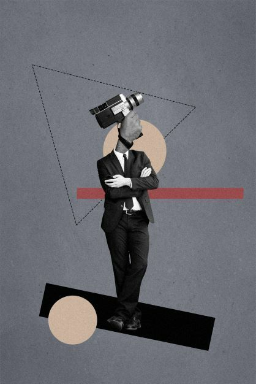

# [Синдром самозванца](../../../8.1_self-understanding/HowToFindYourStrengths/articles/impostor_syndrome.md) и [профессиональный рост](../../../../8.1_self_understanding/articles/professional_growth.md)

Странная вещь: [синдром самозванца](impostor_syndrome.md) чаще всего появляется именно тогда, когда [человек](../../../1.2_natural_sciences/physics_in_everyday_life/Q45003.md) растёт. Новая должность, сложный [проект](../../../1.2_natural_sciences/why_science_help_understand_world/research_work.md), переход на следующий [уровень](../../../../8.1_entertainment/articles/gamification.md) — и снова: «А справлюсь ли я?». Получается, что [сомнения](../../../8.2_future_and_path_choice/articles/02_insecurity_causes.md) и [рост](../../../3.1. healthy lifestyle/Sleep, nutrition, and adolescent energy/articles/micronutrients_and_teenagers.md) идут рядом.

## Почему рост и сомнения связаны?

Профессиональный рост — это всегда [выход](../../../3.2 healthy lifestyle/how to act in a dangerous situation/articles/building-evacuation.md) за зону привычного. Ты берёшься за [задачи](../../../1.2_natural_sciences/why_science_help_understand_world/research_work.md), которых раньше не делал. Оказываешься в ситуациях, где ещё нет готовых ответов. Это и есть [развитие](../../../3.1. healthy lifestyle/Sleep, nutrition, and adolescent energy/articles/micronutrients_and_teenagers.md) — но именно здесь синдром самозванца активируется особенно сильно.

Это не случайность. Это механизм: **чем сложнее задача, тем выше неопределённость, тем громче сомнения**.

## Синдром самозванца как [сигнал](../../../5.1_technology_and_digital_literacy/how_internet_works/articles/wifi/router.md) роста

Звучит парадоксально, но сомнения могут быть признаком того, что ты идёшь в правильном направлении. Если тебе совсем не страшно и не тревожно — возможно, задача слишком лёгкая и ты не растёшь.

Небольшая [тревога](../../../1.2_natural_sciences/neurobiology_for_teens/articles/07_stress.md) перед сложной задачей — нормальная [реакция](../../../1.2_natural_sciences/why_science_help_understand_world/chemistry.md). Проблема начинается, когда эта тревога становится такой сильной, что мешает действовать.

## Ловушка «я должен сначала стать готовым»

Многие люди откладывают рост из-за синдрома самозванца: «Сначала я ещё поучусь, стану экспертом — и тогда возьмусь». Но идеальной готовности не бывает. Настоящая [компетентность](../../../../8.1_self_understanding/articles/professional_growth.md) приходит через практику, а не через бесконечную подготовку.

## Как использовать рост против синдрома самозванца?

- **Смотреть назад** — периодически оглядывайся: что ты умел год назад? Два года назад? Разница — это твой рост, который сложно заметить изнутри.
- **Фиксировать вехи** — каждый новый [навык](../../../5.1_technology_and_digital_literacy/information and media literacy/карта_компетенций_по_возрастам.md), решённая сложная задача, пройденный трудный [период](../../../1.2_natural_sciences/physics_in_everyday_life/Q11652.md) — всё это реальные [доказательства](../../../4.2_thinking_and_working_information/critical_thinking/articles/fact_and_opinion_differences.md) твоего развития.
- **Принимать неудобные задачи** — именно там, где страшно, и происходит рост.

## Интересные [факты](../../../1.2_natural_sciences/physics_in_everyday_life/Q17737.md)

- [Психолог](../../../../8.1_self_understanding/articles/when_to_seek_help.md) Кэрол Двек описала «установку на рост» ([growth mindset](../../../4.1_rules_of_study/how_to_learn_effectively/articles/growth_mindset.md)): люди, которые верят, что [способности](../../../4.1_rules_of_study/how_to_learn_effectively/articles/growth_mindset.md) развиваются через усилие, достигают больших результатов и меньше страдают от синдрома самозванца.
- По данным исследований, [профессиональный рост](professional_growth.md) на протяжении карьеры напрямую связан с готовностью принимать [ошибки](../../../3.1_healthy_lifestyle/pervaya_pomoshch/ushibi_porezy_ozhogi/07_ushib_chego_nelzya.md) как [обучение](../../../3.1. healthy lifestyle/Sleep, nutrition, and adolescent energy/articles/sleep_and_memory_grades.md), а не как [провал](../../../4.2_thinking_and_working_information/critical_thinking/articles/main_cognitive_distortions.md).
- Люди, регулярно берущиеся за сложные задачи, через несколько лет значительно уверен нее в себе — даже если поначалу испытывали сильный синдром самозванца.

## Примеры из жизни

Света работала помощником редактора два года. Когда ей предложили стать главным редактором, первая реакция была: «Я не готова, я ещё многого не знаю». Она поговорила с [наставником](mentorship.md), записала, что уже умеет — и взялась за новую роль. Через полгода она думала: «Как хорошо, что согласилась».

## [Связь](../../../1.2_natural_sciences/physics_in_everyday_life/Q12969754.md) с [уверенностью в себе](self_confidence.md)

Рост и [уверенность](../../../2.1_society/how_and_where_find_friends/articles/otkaz_ne_konets.md) подпитывают друг друга: чем больше ты делаешь, тем больше накапливается [опыт](../../../1.2_natural_sciences/why_science_help_understand_world/experimental_science.md) успехов — и тем устойчивее становится [вера в себя](../../../8.1_self-understanding/HowToFindYourStrengths/articles/impostor_syndrome.md). Это медленный [процесс](../../../5.1_technology_and_digital_literacy/operating system/articles/process.md), но он работает.

## [Заключение](../../../1.2_natural_sciences/physics_in_everyday_life/Q2225.md)

Синдром самозванца и профессиональный рост часто идут рядом. Сомнения в новых ситуациях — это нормально и даже полезно как сигнал, что ты движешься вперёд. Главное — не давать им останавливать тебя. Оглядывайся назад, фиксируй рост и позволяй себе браться за сложное — именно там и происходит настоящее развитие.

---

[Автор](../../../4.2_thinking_and_working_information/how_to_search_information/articles/copypaste.md): Малеев Владислав

*[LLM](../../../7.1_art/modern_technological_art/README.md) — Claude (Anthropic)*
