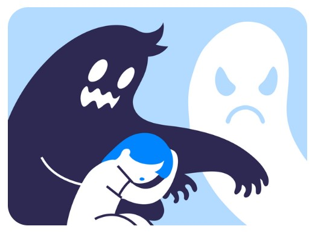

# [Синдром самозванца](../../../8.1_self-understanding/HowToFindYourStrengths/articles/impostor_syndrome.md) и [самооценка](../../../2.1_society/how_and_where_find_friends/articles/otkaz_ne_konets.md)

Ты когда-нибудь замечал, что одни люди после [ошибки](../../../3.1_healthy_lifestyle/pervaya_pomoshch/ushibi_porezy_ozhogi/07_ushib_chego_nelzya.md) говорят «ну и ладно, в следующий раз получится» — а другие долго переживают и думают, что они вообще ни на что не способны? Во многом это зависит от **самооценки** — того, как [человек](../../../1.2_natural_sciences/physics_in_everyday_life/Q45003.md) оценивает самого себя.

## Что такое самооценка?

Самооценка — это то, насколько человек считает себя ценным, достойным уважения и способным справляться с жизнью. Это не то же самое, что гордость или хвастовство. Это просто внутреннее ощущение: «я в порядке».

Самооценка бывает:
- **Высокая** — человек в целом доволен собой, умеет принять ошибку и двигаться дальше
- **Низкая** — человек постоянно сомневается в себе, тяжело переносит критику
- **Нестабильная** — скачет в зависимости от внешних оценок: похвалили — хорошо, покритиковали — катастрофа

## Как самооценка связана с синдромом самозванца?

[Синдром самозванца](impostor_syndrome.md) и низкая или нестабильная самооценка — очень [близкие](../../../7.2 Media, leisure and hobbies /useful_and_interesting_leisure/articles/leisure_with_friends_and_family.md) вещи. Человек с низкой самооценкой привык думать о себе плохо. Поэтому когда происходит что-то хорошее — [успех](../../../4.2_thinking_and_working_information/critical_thinking/articles/main_cognitive_distortions.md), [похвала](../../../8.1_self-understanding/HowToFindYourStrengths/articles/objective_view.md), новая возможность — его [мозг](../../../3.1. healthy lifestyle/Sleep, nutrition, and adolescent energy/articles/breakfast_for_the_brain.md) воспринимает это как ошибку. «Это не я заслужил. Это случайность».

При нестабильной самооценке человек всё [время](../../../1.2_natural_sciences/physics_in_everyday_life/Q20702.md) ищет подтверждения своей [ценности](../../../2.1_society/how_and_where_find_friends/articles/druzhba_posle_shkoly.md) извне. Его хвалят — он на минуту верит в себя. Критикуют — и снова рушится всё.

## Откуда берётся низкая самооценка?

- Из детства — частая [критика](../../../8.1_self-understanding/HowToFindYourStrengths/articles/impostor_syndrome.md), [сравнение с другими](../../../../8.1_self_understanding/articles/social_comparison.md), отсутствие поддержки (подробнее — в статье про [роль семьи](family_influence.md))
- Из неудачного опыта — если человека долго не ценили, он начинает соглашаться с этим
- Из постоянного [сравнения с другими](social_comparison.md) — особенно когда видишь только чужие успехи

## Как самооценка влияет на [поведение](../../../1.2_natural_sciences/neurobiology_for_teens/articles/06_phineas_gage.md) на [работе](../../../8.2_future/choosing_a_career_path/articles/interview.md)?

Человек с низкой самооценкой на новом месте:
- Не решается высказывать своё [мнение](../../../4.2_thinking_and_working_information/critical_thinking/articles/fact_and_opinion_differences.md)
- Соглашается со всем, даже когда не согласен
- Боится просить о повышении [зарплаты](../../../8.2_future/choosing_a_career_path/articles/salary.md) или новых задачах
- Болезненно воспринимает любую критику — даже конструктивную
- Приписывает свои успехи удаче, а [неудачи](../../../4.1_rules_of_study/how_to_learn_effectively/articles/learning_from_mistakes.md) — своей некомпетентности

## Интересные [факты](../../../1.2_natural_sciences/physics_in_everyday_life/Q17737.md)

- [Психолог](../../../../8.1_self_understanding/articles/when_to_seek_help.md) Моррис Розенберг в 1965 году создал «Шкалу самооценки» — простой тест из 10 вопросов, который до сих пор используется во всём мире.
- Исследования показывают, что самооценка влияет не только на [настроение](../../../1.2_natural_sciences/neurobiology_for_teens/articles/10_sweet_tooth.md), но и на [здоровье](../../../3.1. healthy lifestyle/Sleep, nutrition, and adolescent energy/articles/chronic_sleep_deprivation.md), [отношения](../../../2.1_society/how_and_where_find_friends/articles/guide_dlya_introvertov.md) с людьми и даже на продолжительность жизни.
- Самооценка — не постоянная величина. Её можно изменить — и это подтверждено научно.

## Примеры из жизни

Вера — отличная художница. Её рисунки всегда отмечают на выставках. Но когда кто-то хвалит её [работу](../../../8.2_future/choosing_a_career_path/articles/interview.md), она говорит: «Да это просто так получилось, ничего особенного». Вера не скромничает — она по-настоящему не верит в [качество](../../../6.1_Independent_living_and_daily_living_skills/reasonable_spending/articles/quality.md) своих работ. Это низкая самооценка в действии.

## Что помогает укрепить самооценку?

- [Замечать](../../../4.1_rules_of_study/how_to_memorize/articles/vnimanie.md) и [записывать](../../../4.1_rules_of_study/how_to_memorize/articles/konspektirovanie.md) свои [достижения](../../../4.1_rules_of_study/how_to_learn_effectively/articles/gamification.md), даже маленькие
- Относиться к себе так же добро, как к хорошему другу
- Перестать измерять свою ценность только результатами
- Обратиться за помощью, если самостоятельно трудно (об этом — в статье [когда стоит обратиться к специалисту](when_to_seek_help.md))

## [Заключение](../../../1.2_natural_sciences/physics_in_everyday_life/Q2225.md)

Самооценка — это фундамент, на котором строится отношение человека к себе. Синдром самозванца часто вырастает именно из нестабильного или низкого фундамента. Хорошая [новость](../../../5.1_technology_and_digital_literacy/information and media literacy/информационная_диета.md) — самооценку можно укрепить, и это меняет всё.

---

[Автор](../../../4.2_thinking_and_working_information/how_to_search_information/articles/copypaste.md): Болдинова Валерия

*[LLM](../../../7.1_art/modern_technological_art/README.md) — Claude (Anthropic)*
