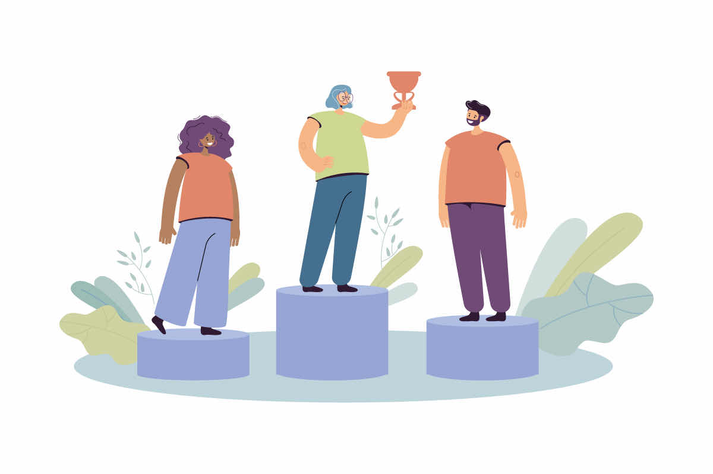

# [Сравнение](../../../5.2_cybersecurity/cpp_fundamentals/5_operators.md) себя с коллегами

«Петя решил задачу быстрее меня», «Катя уже знает весь [материал](../../../1.2_natural_sciences/physics_in_everyday_life/Q25358.md), а я ещё нет», «Все справляются, а я — нет». Если такие мысли тебе знакомы — ты занимаешься **социальным сравнением**. И делаешь это абсолютно по-человечески — все так делают.

## Что такое [социальное сравнение](../../../../8.1_self_understanding/articles/social_comparison.md)?

В 1954 году [психолог](../../../../8.1_self_understanding/articles/when_to_seek_help.md) Леон [Фестингер](../../../8.2_future_and_path_choice/articles/social_comparison.md) описал простую идею: люди оценивают себя, сравнивая с другими. Это нормальная часть того, как работает наш [мозг](../../../3.1. healthy lifestyle/Sleep, nutrition, and adolescent energy/articles/breakfast_for_the_brain.md). Мы хотим понимать, «где мы находимся» — и ориентиры берём из окружающей среды.

Проблема не в самом сравнении, а в [том](../../../7.1_art/musical_instruments/articles/drums.md), **с кем** и **как** мы сравниваем.

## Два вида сравнения

### [Восходящее сравнение](../../../8.2_future_and_path_choice/articles/social_comparison.md)
Ты сравниваешь себя с тем, кто лучше, опытнее, успешнее. Это может [мотивировать](../../../4.1_rules_of_study/how_to_memorize/articles/motivaciya.md) — «[хочу](../../../6.1_Independent_living_and_daily_living_skills/reasonable_spending/articles/want.md) достичь того же». Но при [синдроме самозванца](impostor_syndrome.md) оно превращается в самобичевание: «Я никогда не буду таким хорошим».

### [Нисходящее сравнение](../../../8.2_future_and_path_choice/articles/social_comparison.md)
Ты сравниваешь себя с тем, кто справляется хуже. Это иногда помогает почувствовать себя лучше — но ненадолго и не очень честно.

## Почему сравнение с коллегами особенно опасно?

На новом месте ты видишь коллег, которые уже всё знают и умеют. Но ты не видишь:
- сколько лет они здесь работают
- через какие [ошибки](../../../3.1_healthy_lifestyle/pervaya_pomoshch/ushibi_porezy_ozhogi/07_ushib_chego_nelzya.md) прошли
- что они тоже в чём-то сомневаются

Ты сравниваешь **свой старт** с **их результатом**. Это заведомо несправедливое сравнение.

## [Социальные сети](../../../3.1_healthy lifestyle/vrednye_privychki/articles/Social_media.md) делают всё хуже

В соцсетях люди публикуют лучшее: красивые фотографии, [достижения](../../../4.1_rules_of_study/how_to_learn_effectively/articles/gamification.md), успехи. Никто не пишет пост «сегодня я облажался на совещании». Поэтому кажется, что у всех вокруг [жизнь](../../../1.2_natural_sciences/physics_in_everyday_life/Q1751973.md) идеальная — кроме тебя.

## Интересные [факты](../../../1.2_natural_sciences/physics_in_everyday_life/Q17737.md)

- Фестингер заметил, что люди чаще сравнивают себя с теми, кто похож на них — одного возраста, профессии, уровня. Сравнение с великим учёным кажется бессмысленным, а вот с одноклассником — нет.
- Исследования показывают: чем больше времени [человек](../../../1.2_natural_sciences/physics_in_everyday_life/Q45003.md) проводит в социальных сетях, тем ниже его [самооценка](self_esteem.md) и сильнее [тревога](../../../1.2_natural_sciences/neurobiology_for_teens/articles/07_stress.md).
- При синдроме самозванца человек замечает только тех, кто лучше — и игнорирует случаи, когда он сам справляется не хуже других.

## Примеры из жизни

Лиза пришла на новую [работу](../../../8.2_future/choosing_a_career_path/articles/interview.md) дизайнером. Коллега Маша делает макеты быстро и уверенно. Лиза думает: «Маша намного лучше меня, я здесь не на своём месте». Но Лиза не знает, что Маша работает в этой компании три года и знает все шаблоны наизусть. Лиза на этом месте — первый месяц.

## Как сравнивать себя здоровее?

- **Сравнивай себя с собой вчерашним** — что ты умел месяц назад и что умеешь сейчас?
- **Учитывай [контекст](../../../5.1_technology_and_digital_literacy/information and media literacy/геолокация_и_проверка_контекста.md)** — сколько времени у другого человека было на [развитие](../../../3.1. healthy lifestyle/Sleep, nutrition, and adolescent energy/articles/micronutrients_and_teenagers.md) этого навыка?
- **Замечай, что у тебя получается** — у каждого есть [сильные стороны](../../../8.1_self-understanding/HowToFindYourStrengths/articles/career-rise-natural-strengths.md), которых нет у других
- **Используй сравнение как [ориентир](../../../../8.1_self_understanding/articles/social_comparison.md), а не как оценку** — «хочу научиться так же» вместо «я хуже»

## [Связь](../../../1.2_natural_sciences/physics_in_everyday_life/Q12969754.md) с [адаптацией](workplace_adaptation.md)

На этапе адаптации сравнение с опытными коллегами особенно коварно. Именно тогда важно [помнить](../../../4.1_rules_of_study/how_to_memorize/articles/pamyat.md): у них был такой же первый день, как у тебя сейчас.

## [Заключение](../../../1.2_natural_sciences/physics_in_everyday_life/Q2225.md)

Сравнивать себя с другими — это нормально и неизбежно. Важно делать это честно: учитывать разницу в опыте, видеть и свои сильные стороны, и сравнивать себя с собой прошлым. [Синдром самозванца](../../../8.1_self-understanding/HowToFindYourStrengths/articles/impostor_syndrome.md) использует несправедливые сравнения как «[доказательство](../../../1.2_natural_sciences/why_science_help_understand_world/scientific_method.md)» некомпетентности — и это можно научиться [замечать](../../../4.1_rules_of_study/how_to_memorize/articles/vnimanie.md).

---

[Автор](../../../4.2_thinking_and_working_information/how_to_search_information/articles/copypaste.md): Фоменко Артем

*[LLM](../../../7.1_art/modern_technological_art/README.md) — Claude (Anthropic)*
