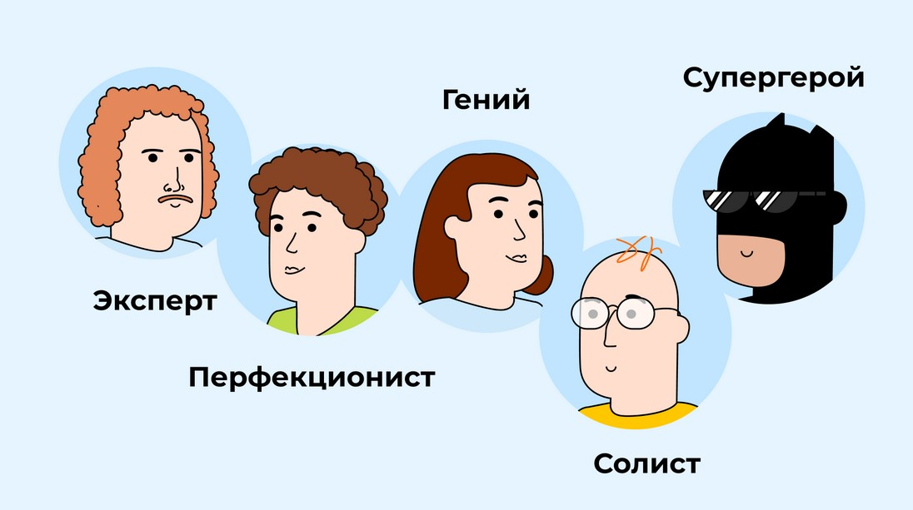

# [Виды синдрома самозванца](../../../../8.1_self_understanding/articles/types_of_impostor_syndrome.md)

[Синдром самозванца](../../../8.1_self-understanding/HowToFindYourStrengths/articles/impostor_syndrome.md) у всех выглядит немного по-разному. Один [человек](../../../1.2_natural_sciences/physics_in_everyday_life/Q45003.md) боится попросить о помощи. Другой работает до изнеможения, чтобы «доказать» свою ценность. Третий уверен, что у него всё должно получаться само собой. [Психолог](../../../../8.1_self_understanding/articles/when_to_seek_help.md) Валери Янг изучила эти различия и описала **пять основных типов** синдрома самозванца.

## [Тип](../../../5.2_cybersecurity/cpp_fundamentals/13_struct.md) 1: [Перфекционист](../../../../8.1_self_understanding/articles/types_of_impostor_syndrome.md)

**Девиз:** «Или идеально, или никак»

Перфекционист устанавливает для себя очень высокую планку. Если он сделал что-то на 95% хорошо — он всё равно думает, что провалился, потому что не добился 100%.

Такой человек замечает только свои [ошибки](../../../3.1_healthy_lifestyle/pervaya_pomoshch/ushibi_porezy_ozhogi/07_ushib_chego_nelzya.md), даже если их почти нет. Любая [похвала](../../../8.1_self-understanding/HowToFindYourStrengths/articles/objective_view.md) кажется ему незаслуженной.

> Пример: Катя получила четвёрку за сочинение. Вместо радости она думает: «Могла бы написать лучше. Значит, я плохо стараюсь».

## Тип 2: [Природный гений](../../../../8.1_self_understanding/articles/types_of_impostor_syndrome.md)

**Девиз:** «Если надо стараться — значит, я не способный»

Природный гений убеждён, что у по-настоящему умных людей всё получается легко и сразу. Если ему что-то даётся с трудом — он воспринимает это как [доказательство](../../../1.2_natural_sciences/why_science_help_understand_world/scientific_method.md) своей некомпетентности.

Он хорошо справляется с тем, что ему легко даётся, но избегает новых и сложных задач, где придётся учиться.

> Пример: Дима легко решает [задачи](../../../1.2_natural_sciences/why_science_help_understand_world/research_work.md) по математике. Но на первом уроке по программированию у него что-то не вышло — и он решил, что «не создан для этого».

## Тип 3: Солист

**Девиз:** «Настоящий специалист справляется сам»

Солист считает, что просить [помощь](../../../3.1_healthy_lifestyle/pervaya_pomoshch/ushibi_porezy_ozhogi/10_krovotechenie_chto_delat.md) — это признак слабости и некомпетентности. Настоящий профессионал, по его мнению, должен всё делать самостоятельно.

Он отказывается от помощи, даже когда она необходима, — и потом чувствует себя виноватым, если всё-таки не справился в одиночку.

> Пример: Антон не понял [объяснение](../../../4.1_rules_of_study/how_to_learn_effectively/articles/teaching_others.md) учителя, но не поднял руку и не спросил — потому что боялся выглядеть глупым.

## Тип 4: [Супергерой](../../../../8.1_self_understanding/articles/types_of_impostor_syndrome.md)

**Девиз:** «Я должен работать больше всех»

Супергерой компенсирует [неуверенность в себе](../../../../8.1_self_understanding/articles/causes.md) через сверхусилия. Он берёт на себя как можно больше задач и работает дольше остальных — чтобы доказать (прежде всего себе), что он достаточно хорош.

Такой человек редко отдыхает и может быстро «сгореть» от усталости.

> Пример: Оля взялась делать и доклад, и презентацию, и стенгазету — одна, хотя в группе было пятеро. Она боялась, что иначе подумают, будто она не тянет.

## Тип 5: [Эксперт](../../../../8.1_self_understanding/articles/types_of_impostor_syndrome.md)

**Девиз:** «Я должен знать всё»

Эксперт убеждён, что компетентный человек обязан знать [ответ](../../../5.1_technology_and_digital_literacy/how_internet_works/articles/http_https/http_https.md) на любой вопрос. Если он чего-то не знает — значит, он ненастоящий специалист.

Перед тем как взяться за дело, он изучает всё, что только можно, — но никогда не чувствует себя достаточно подготовленным.

> Пример: Саша хочет записаться в кружок робототехники, но сначала решила прочитать три [книги](../../../7.2 Media, leisure and hobbies /useful_and_interesting_leisure/articles/reading_and_self_education.md) по электронике «чтобы не выглядеть глупо». В итоге так и не записалась.

## Интересные [факты](../../../1.2_natural_sciences/physics_in_everyday_life/Q17737.md)

- У одного человека могут сочетаться несколько типов сразу.
- Чаще всего синдром самозванца активируется в новых ситуациях — первый день в школе, новый кружок, незнакомый [коллектив](../../../8.2_future/choosing_a_career_path/articles/team.md).
- [Знание](../../../1.2_natural_sciences/why_science_help_understand_world/science.md) своего типа помогает лучше понять, какие именно мысли мешают двигаться вперёд.

## Как определить свой тип?

Задай себе вопрос: что именно тебя пугает — [ошибка](../../../5.1_technology_and_digital_literacy/how_internet_works/articles/http_https/http_https.md), [необходимость](../../../6.1_Independent_living_and_daily_living_skills/reasonable_spending/articles/need.md) учиться, просьба о помощи, недостаточные старания или незнание чего-то? Ответ подскажет, какой тип тебе ближе.

## [Заключение](../../../1.2_natural_sciences/physics_in_everyday_life/Q2225.md)

Пять типов синдрома самозванца — это пять разных способов не доверять себе. Перфекционист, природный гений, солист, супергерой и эксперт — у каждого своя [история](../../../1.2_natural_sciences/physics_in_everyday_life/Q11469.md), но финал одинаковый: человек не верит, что он достаточно хорош. Понять свой тип — [первый шаг](../../../1.2_natural_sciences/physics_in_everyday_life/Q26540.md) к тому, чтобы с этим справиться.

---

[Автор](../../../4.2_thinking_and_working_information/how_to_search_information/articles/copypaste.md): Гуляев Андрей

*[LLM](../../../7.1_art/modern_technological_art/README.md) — Claude (Anthropic)*
