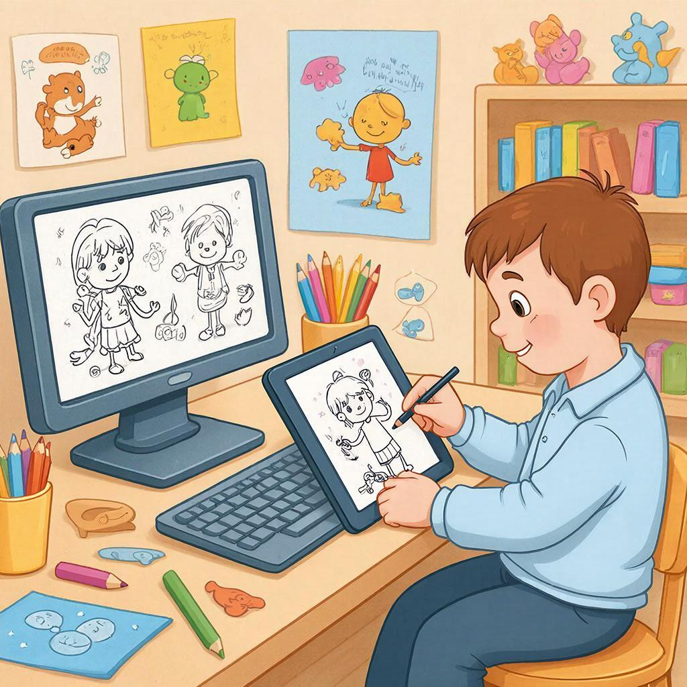
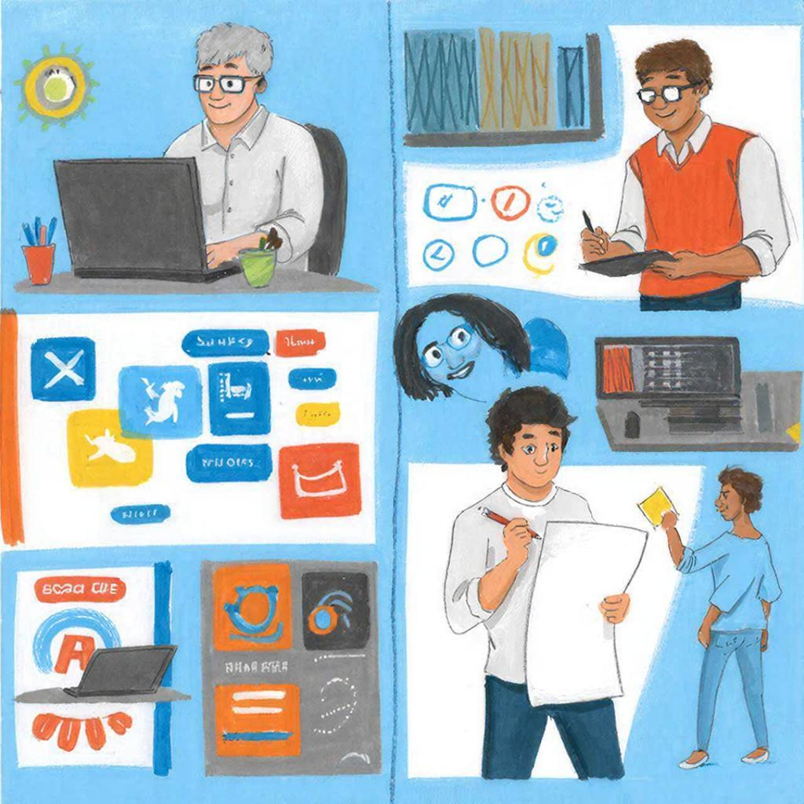
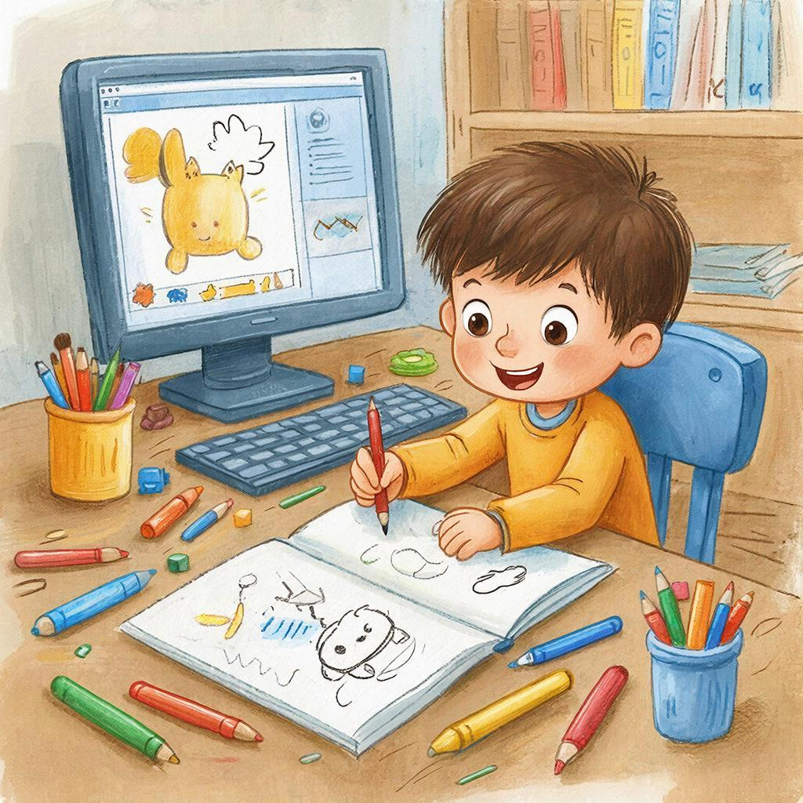

#  Дизайнер ([профессия](../../../7.2 Media, leisure and hobbies /useful_and_interesting_leisure/articles/leisure_influence_on_future.md))

## Кто такой дизайнер?

**Дизайнер** — это [человек](../../../1.2_natural_sciences/physics_in_everyday_life/Q45003.md), который делает вещи красивыми, удобными и понятными для людей. Это творческая и важная **[профессия](profession.md)**.

Дизайнеры придумывают внешний вид сайтов, приложений, одежды, игрушек и даже комнат. Они помогают сделать мир вокруг нас более удобным и приятным.

> [Дизайн](../../../7.2 Media, leisure and hobbies/Computer games/articles/dream_team/artist.md) — это не только про красоту, но и про [удобство](../../../6.1_Independent_living_and_daily_living_skills/reasonable_spending/articles/quality.md).

---

## Что делает дизайнер?

Дизайнер решает разные [задачи](../../../1.2_natural_sciences/why_science_help_understand_world/research_work.md):

* придумывает внешний вид вещей
* рисует макеты и схемы
* подбирает [цвета](../../../1.2_natural_sciences/physics_in_everyday_life/Q11652.md) и формы
* делает объекты удобными для людей

Для этого ему нужны разные **[навыки](skills.md)**:

* творческое [мышление](../../../1.2_natural_sciences/neurobiology_for_teens/articles/01_brain_complexity.md)
* внимательность к деталям
* чувство стиля
* умение понимать людей

> [!IMPORTANT]
> Хороший дизайнер думает не только о [том](../../../7.1_art/musical_instruments/articles/drums.md), как выглядит вещь, но и о том, как ей пользоваться.

---

## Какие бывают дизайнеры?

Существует много направлений:

* графический дизайнер — создаёт картинки и постеры
* веб-дизайнер — оформляет сайты
* дизайнер интерфейсов — делает [приложения](../../../4.1_rules_of_study/how_to_learn_effectively/articles/digital_tools.md) удобными
* дизайнер одежды — придумывает [стиль](../../../7.1_art/modern_technological_art/articles/5.5_yandex_neural.md) вещей

Каждое [направление](../../../1.2_natural_sciences/physics_in_everyday_life/Q11402.md) — это часть большой **[карьеры](career-path.md)** дизайнера.

---

## Где работают дизайнеры?

Дизайнеры могут работать:

* в студиях
* в компаниях
* дома

Это их **[рабочее место](office.md)**.

Часто дизайнеры работают в **[команде](team.md)** с программистами и другими специалистами.

---

## Как становятся дизайнерами?

Многие дизайнеры начинают с **[увлечений](hobbies.md)** — например, рисования.

Дальше можно:

1. учиться самостоятельно
2. пойти в художественную школу
3. поступить в **[университет](university.md)**
4. пройти **[стажировку](internship.md)**

---

## Как найти [работу](interview.md) дизайнеру?

Чтобы устроиться на работу, нужно:

* подготовить **[резюме](resume.md)**
* собрать [портфолио](resume.md) (примеры работ)
* пройти **[собеседование](interview.md)**

---

## Сколько зарабатывает дизайнер?

[Доход](../../../6.1_Independent_living_and_daily_living_skills/reasonable_spending/articles/income.md) дизайнера — это его **[зарплата](salary.md)**.

Она зависит от:

* опыта
* уровня навыков
* сложности проектов

> [!NOTE]
> Чем лучше дизайнер умеет решать задачи, тем выше его ценят.

---

## Почему эта профессия важна?

Дизайнеры делают мир удобнее и красивее. Без них:

* сайты были бы непонятными
* вещи — неудобными
* города — менее уютными

Часто [путь](../../../1.2_natural_sciences/physics_in_everyday_life/Q11476.md) дизайнера начинается с **[мечты](dream.md)** создавать что-то своё.

---

## Итог

**Дизайнер** — это творческая **[профессия](profession.md)**, которая помогает делать мир лучше.

Она подходит тем, кто:

* любит рисовать и придумывать
* замечает детали
* хочет создавать удобные и красивые вещи

Если тебе нравится [творчество](../../../2.1_society/how_and_where_find_friends/articles/sam_sebe_interesnyi.md) и [идеи](../../../7.2 Media, leisure and hobbies /useful_and_interesting_leisure/articles/free_leisure_activities.md) — возможно, это твой путь.

---

**[Автор](../../../4.2_thinking_and_working_information/how_to_search_information/articles/copypaste.md):** Иванов [Владимир](../../../2.2_society/history/articles/Kievan_Rus.md)

*Использованные [нейросети](../../../2.1_society/cause_and_effect_relationships/articles/ai_causality.md): [ChatGPT](../../../7.1_art/modern_technological_art/articles/6.1_prompt_art.md) (генерация текста), GigaChat ([генерация изображений](../../../7.1_art/modern_technological_art/articles/6.1_prompt_art.md))*
