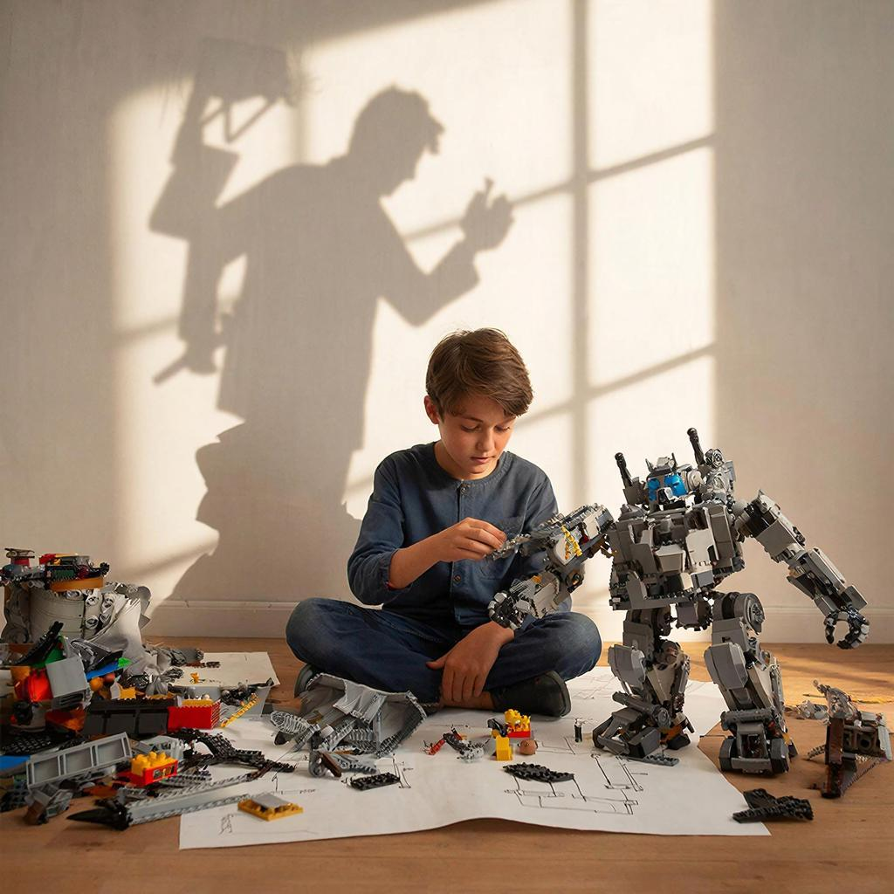

# От игры к делу: как хобби превращается в [работу](interview.md)?

Ты когда-нибудь задумывался, почему тебе так нравится собирать конструкторы, рисовать комиксы или устраивать футбольные матчи во дворе? Всё это — твои **хобби**. На первый взгляд это просто весёлое времяпрепровождение, но на самом деле это твои первые шаги в будущую [профессию](profession.md).

**Хобби** — это занятие для души, которое помогает тебе развивать свои скрытые таланты и природные [[навыки](skills.md)](skills.md).

---

### Твои интересы — это подсказки

Представь, что твои увлечения — это карта сокровищ. Если внимательно на неё посмотреть, можно увидеть, кем ты станешь, когда вырастешь:

| Если твоё хобби... | То тебе может понравиться быть... | Какие знания пригодятся? |
| :--- | :--- | :--- |
| **Компьютерные игры** | [Программистом](programmer.md) | Логика и математика |
| **Рисование и лепка** | [Дизайнером](designer.md) | Чувство стиля и цвета |
| **Забота о животных** | [Врачом-ветеринаром](doctor.md) | Биология и химия |
| **Походы и кружки юннатов** | Учёным или экологом | География и природа |

---

### Как хобби помогает в будущем?

Многие великие мастера начинали с простых увлечений. Например, создатели компьютерных игр в детстве просто любили играть в приставки, а знаменитые повара начинали с того, что помогали маме печь печенье.

Когда ты занимаешься тем, что тебе нравится:
1.  Ты учишься доводить дело до конца.
2.  Ты узнаёшь, как работают разные вещи.
3.  Твоя [[мечта](dream.md)](dream.md) становится ближе, потому что ты уже пробуешь её на вкус!

### Можно ли работать и играть одновременно?

Самые счастливые взрослые — это те, кто смог превратить своё любимое занятие в [работу](interview.md). Они не просто ходят в [[офис](office.md)](office.md), чтобы получать [[зарплату](salary.md)](salary.md), а продолжают заниматься любимым делом, только теперь им за это ещё и платят!

Поэтому не бросай свои **кружки** и **интересы**. Даже если сейчас это кажется просто игрой, завтра это может стать делом всей твоей жизни.

---
**Автор:** Ильинский Никита

*Использованные нейросети: Gemini (генерация текста), GigaChat (генерация изображений)*