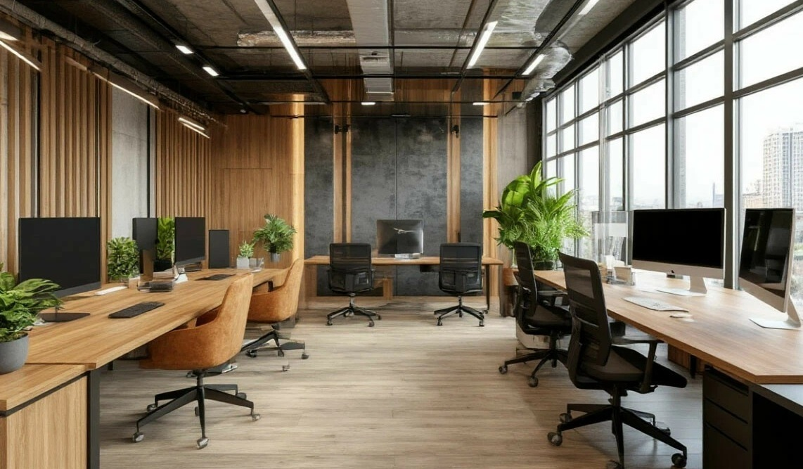

# Офис и удалёнка

## Где можно работать?

Раньше почти все ходили в **офис** — специальное здание или помещение, где стояли столы, компьютеры и [работали](interview.md) сотрудники. Но сейчас мир изменился! Всё больше людей [работают](interview.md) из дома. Это называется **удалёнка**.

А некоторые выбирают **гибридный [формат](../../../7.2 Media, leisure and hobbies/Computer games/articles/how_it_all_started/cartridge_versus_disc.md)**: пару дней в офисе, пару дней дома. Или даже [работают](interview.md) из кафе, коворкингов и других городов!

---

## Офис: за и против

### Плюсы офиса ✅

| Что нравится | Почему |
| :--- | :--- |
| **[Живое](../../../1.2_natural_sciences/why_science_help_understand_world/nature.md) [общение](../../../2.1_society/how_and_where_find_friends/articles/guide_dlya_introvertov.md)** | Можно перекинуться парой слов, обсудить задачу лично, спросить совета у [коллег](team.md). |
| **Чёткие границы** | Пришёл в 9, ушёл в 18. [Работа](interview.md) не смешивается с домом. |
| **Оборудование** | В офисе есть всё: мощные компьютеры, принтеры, удобные кресла. |
| **[Атмосфера](../../../1.2_natural_sciences/physics_in_everyday_life/Q1290.md)** | Когда вокруг [работают](interview.md) — легче настроиться самому. |

### Минусы офиса ❌

| Что не нравится | Почему |
| :--- | :--- |
| **Дорога** | Тратишь [время](../../../1.2_natural_sciences/physics_in_everyday_life/Q20702.md) и [силы](../../../1.2_natural_sciences/physics_in_everyday_life/Q11423.md), чтобы добраться. В больших городах это [часы](../../../1.2_natural_sciences/physics_in_everyday_life/Q20702.md) жизни! |
| **Меньше свободы** | [Нельзя](../../../3.1_healthy_lifestyle/pervaya_pomoshch/ushibi_porezy_ozhogi/07_ushib_chego_nelzya.md) уйти пораньше к врачу или [работать](interview.md) в пижаме. |
| **Шум и отвлечения** | [Коллеги](team.md) разговаривают, кто-то смеётся — [сосредоточиться](../../../4.1_rules_of_study/how_to_memorize/articles/koncentraciya.md) сложнее. |

---

## Удалёнка: за и против

### Плюсы удалёнки ✅

| Что нравится | Почему |
| :--- | :--- |
| **Нет дороги** | [Экономия](../../../6.2_money_and_literacy/how_to_save_for_goal/articles/expenses.md) времени и [денег](salary.md). Можно поспать подольше! |
| **Гибкий график** | Можно начать раньше или позже, сделать [перерыв](../../../7.2 Media, leisure and hobbies/Computer games/articles/useful_tips/eyes_and_back.md) на [спорт](../../../3.1. healthy lifestyle/Sleep, nutrition, and adolescent energy/articles/sport_and_energy.md). |
| **Сам себе хозяин** | Сам организуешь своё [рабочее место](office.md) и расписание. |
| **[Работа](../../../1.2_natural_sciences/physics_in_everyday_life/Q11382.md) откуда угодно** | Хоть из другого города, хоть из кафе на берегу моря. |

### Минусы удалёнки ❌

| Что не нравится | Почему |
| :--- | :--- |
| **[Одиночество](../../../2.1_society/how_and_where_find_friends/articles/sam_sebe_interesnyi.md)** | Нет живого общения, можно чувствовать себя изолированным от [команды](team.md). |
| **Сложно отключиться** | [Работа](interview.md) затягивается на вечер, [выходные](../../../3.1. healthy lifestyle/Sleep, nutrition, and adolescent energy/articles/social_jetlag_and_monday_morning.md). Нет чёткой границы. |
| **Дисциплина** | Нужно самому себя заставлять [работать](interview.md), а не отвлекаться на сериалы. Развивай свои [навыки](skills.md) самоконтроля! |
| **Домашние отвлекают** | Сложно сосредоточиться, если рядом кто-то есть. |

---

## Как устроить идеальное рабочее место дома?

Если ты [работаешь](interview.md) из дома, важно создать **рабочее место**, которое поможет тебе быть продуктивным.

Вот чек-лист хорошего домашнего офиса:

- [ ] **Отдельное место** (не кровать и не диван)
- [ ] **Удобный стул** — [спина](../../../7.2 Media, leisure and hobbies/Computer games/articles/useful_tips/eyes_and_back.md) скажет спасибо
- [ ] **Хороший [свет](../../../1.2_natural_sciences/physics_in_everyday_life/Q1.md)** (желательно естественный)
- [ ] **Тишина или наушники**
- [ ] **Всё под рукой** — ручки, блокнот, [зарядка](../../../7.2 Media, leisure and hobbies/Computer games/articles/useful_tips/eyes_and_back.md), [вода](../../../3.1. healthy lifestyle/Sleep, nutrition, and adolescent energy/articles/drinking_regime.md)

> [!NOTE]
> Твоя спина и [глаза](../../../7.2 Media, leisure and hobbies/Computer games/articles/useful_tips/eyes_and_back.md) будут благодарны, если ты правильно организуешь [рабочее пространство](../../../1.2_natural_sciences/physics_in_everyday_life/Q628858.md). Не экономь на стуле и мониторе!

---

## Гибридный формат: лучшее из двух миров?

Многие компании выбирают **гибридный формат**: сотрудники сами решают, когда приезжать в офис, а когда оставаться дома.

**Как это работает:**
- Общие встречи и важные созвоны — в офисе (чтобы все собрались)
- Глубокую [работу](interview.md) (когда нужно сосредоточиться) делаешь дома
- Можно выбрать дни: например, вторник и четверг — в офисе, остальное — дома

Такой формат даёт и живое общение, и свободу. Многие считают его самым удобным!

---

## Что выбрать?

Нет правильного ответа для всех. Всё зависит от тебя:

| Ты такой... | Тебе подойдёт... |
| :--- | :--- |
| Любишь общаться, легко заводишь друзей, тебя заряжает атмосфера | **Офис** |
| Ценишь тишину, умеешь себя организовывать, хочешь больше свободы | **Удалёнка** |
| Любишь и то, и другое, хочешь гибкости | **Гибрид** |

> [!TIP]
> Даже если ты [работаешь](interview.md) из дома, не забывай общаться с [коллегами](team.md)! Зови их на кофе ([онлайн](../../../3.2 healthy lifestyle/how to act in a dangerous situation/articles/internet-safety.md) или офлайн), участвуй в общих чатах. Так ты не будешь чувствовать себя одиноко.

---

## Итог

**Офис** и **удалёнка** — это не просто место [работы](interview.md). Это [образ](../../../7.2 Media, leisure and hobbies/Computer games/articles/game_culture/cosplay.md) жизни.

- **Офис** даёт общение и структуру.
- **Удалёнка** даёт свободу и [комфорт](../../../4.1_rules_of_study/how_to_learn_effectively/articles/learning_environment.md).
- А **гибрид** позволяет взять лучшее от обоих миров.

Главное — найти формат, в котором ты будешь и эффективным, и счастливым. И помни: даже если ты [работаешь](interview.md) один дома, ты всё равно часть [команды](team.md)! 🤝

---

**[Автор](../../../4.2_thinking_and_working_information/how_to_search_information/articles/copypaste.md):** Кирюхин Георгий

**GitHub:** [sisyphean0labor](https://github.com/sisyphean0labor-web)

*Использованные [нейросети](../../../2.1_society/cause_and_effect_relationships/articles/ai_causality.md): DeepSeek (генерация текста), [Midjourney](../../../7.1_art/modern_technological_art/articles/6.1_prompt_art.md) ([генерация изображений](../../../7.1_art/modern_technological_art/articles/6.1_prompt_art.md))*
