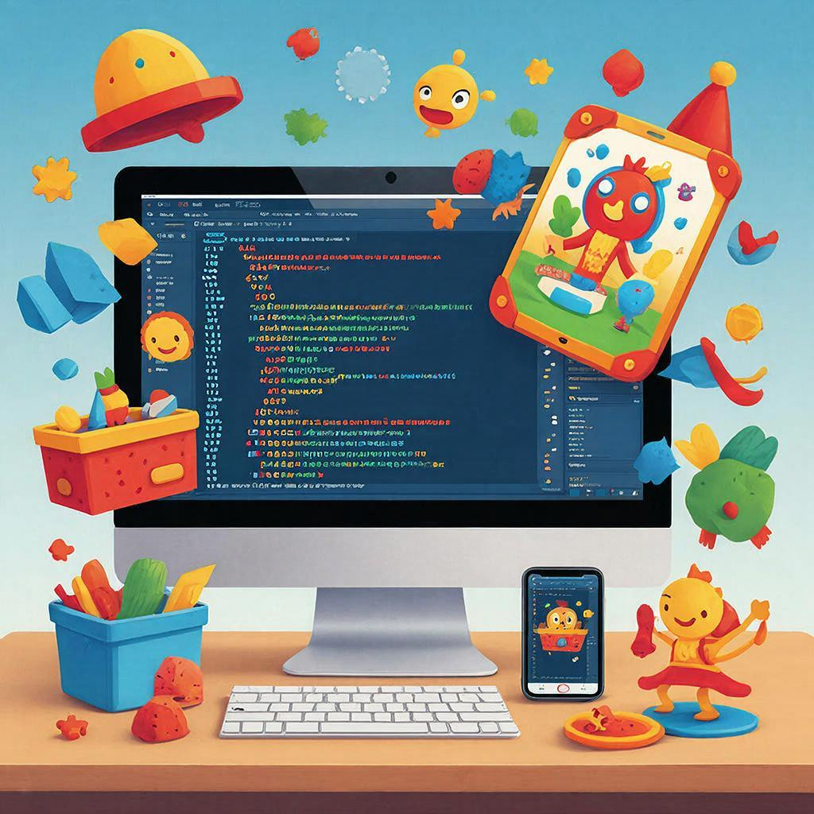
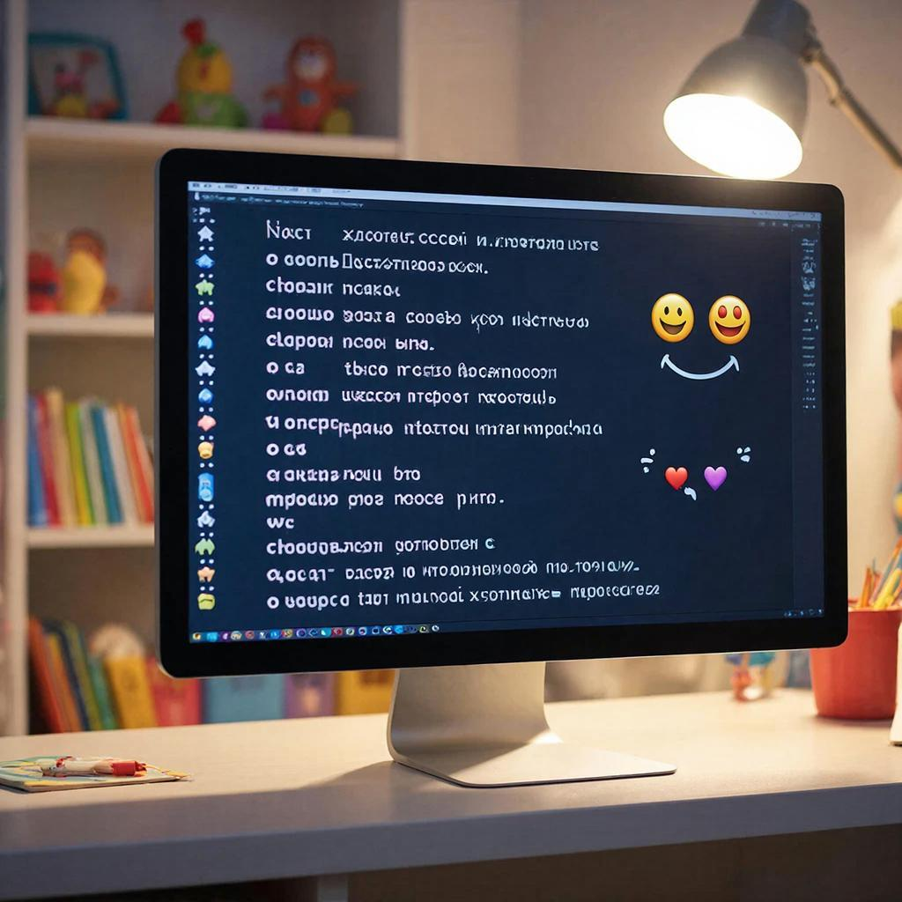
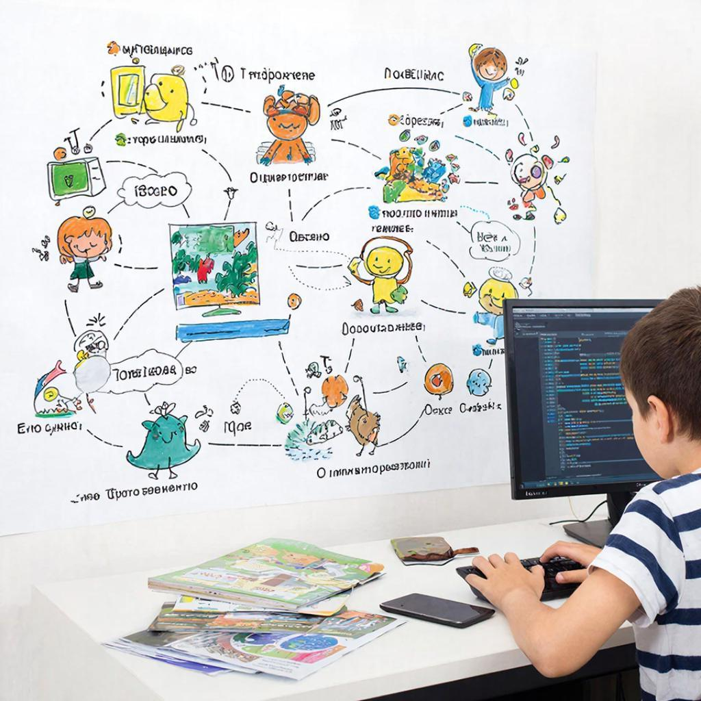

# Программист

## Кто такой программист?


**Программист** — это [человек](../../../1.2_natural_sciences/physics_in_everyday_life/Q45003.md), который пишет [код](../../../5.2_cybersecurity/cpp_fundamentals/1_introduction.md) и создаёт программы для компьютеров. Это одна из современных и очень интересных **[профессий](profession.md)**.

Проще говоря, программист «объясняет» компьютеру, что нужно делать: запускать игры, показывать сайты или помогать людям учиться.

> Компьютер сам ничего не умеет — ему нужны точные команды!

---

## Что делает программист?



Программист каждый день решает разные [задачи](../../../1.2_natural_sciences/why_science_help_understand_world/research_work.md):

* придумывает решения
* пишет код
* ищет [ошибки](../../../3.1_healthy_lifestyle/pervaya_pomoshch/ushibi_porezy_ozhogi/07_ushib_chego_nelzya.md)
* улучшает программы

Для этого ему нужны разные **[навыки](skills.md)**:

* логическое [мышление](../../../1.2_natural_sciences/neurobiology_for_teens/articles/01_brain_complexity.md)
* внимательность
* умение работать в команде

---

## Как выглядит код?



Код — это специальный [язык](../../../5.2_cybersecurity/cpp_fundamentals/1_introduction.md) для общения с компьютером:

```python
print("Привет, мир!")
```

Этот код говорит: **Привет, Мир!**.


---

## Как становятся программистами?



Часто всё начинается с **[увлечения](hobbies.md)** — например, любви к играм или технике.

Дальше можно:

1. Учиться самостоятельно
2. Поступить в **[университет](university.md)**
3. Пройти **[стажировку](internship.md)**
4. Начать свою **[карьеру](career-path.md)**

---

## Где работают программисты?


Программисты могут работать:

* в офисе (**[офис](office.md)**)
* дома
* в разных компаниях

Часто они работают в **[команде](team.md)** вместе с другими специалистами.

---

## Сколько зарабатывает программист?


[Доход](../../../6.1_Independent_living_and_daily_living_skills/reasonable_spending/articles/income.md) программиста зависит от опыта и умений. Это называется **[зарплата](salary.md)** 💰.

> [!NOTE]
> Чем больше ты умеешь — тем больше можешь зарабатывать!

---

## Как найти первую [работу](interview.md)?

Чтобы устроиться на работу, нужно:

* составить **[резюме](resume.md)**
* пройти **[собеседование](interview.md)**

---

## Почему это интересная [профессия](../../../7.2 Media, leisure and hobbies /useful_and_interesting_leisure/articles/leisure_influence_on_future.md)?

Программист может:

* создавать игры
* разрабатывать [приложения](../../../4.1_rules_of_study/how_to_learn_effectively/articles/digital_tools.md)
* помогать людям

Это профессия для тех, у кого есть **[мечта](dream.md)** создавать что-то новое 🚀

---

## Итог

**Программист** — это современная и важная **[профессия](profession.md)**, которая помогает создавать [технологии](../../../2.2_history/world_economy_on_fingers/articles/globalizatsiya.md) будущего.

Если тебе нравится решать задачи, придумывать новое и работать с компьютерами — возможно, это твой [путь](../../../1.2_natural_sciences/physics_in_everyday_life/Q11476.md)! 😊

---

**[Автор](../../../4.2_thinking_and_working_information/how_to_search_information/articles/copypaste.md):** Иванов [Владимир](../../../2.2_society/history/articles/Kievan_Rus.md)


*Использованные [нейросети](../../../2.1_society/cause_and_effect_relationships/articles/ai_causality.md): [ChatGPT](../../../7.1_art/modern_technological_art/articles/6.1_prompt_art.md) (генерация текста), GigaChat ([генерация изображений](../../../7.1_art/modern_technological_art/articles/6.1_prompt_art.md))*
