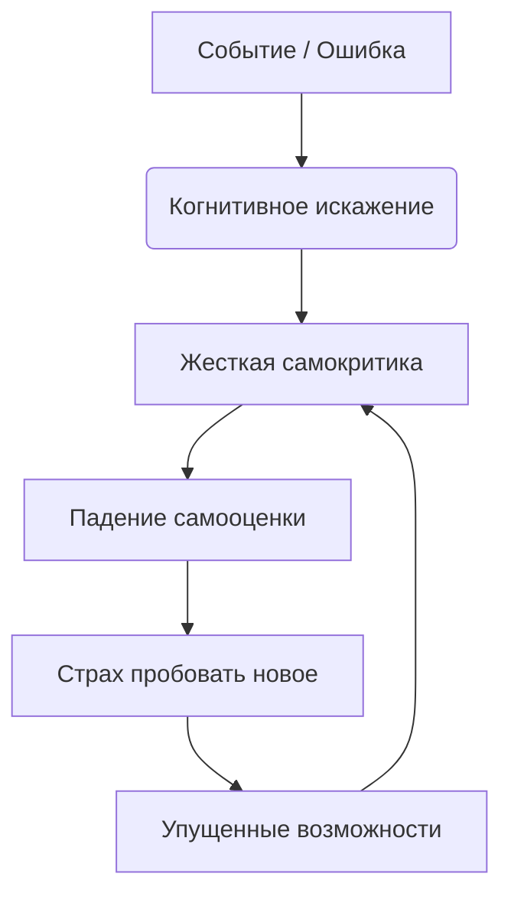
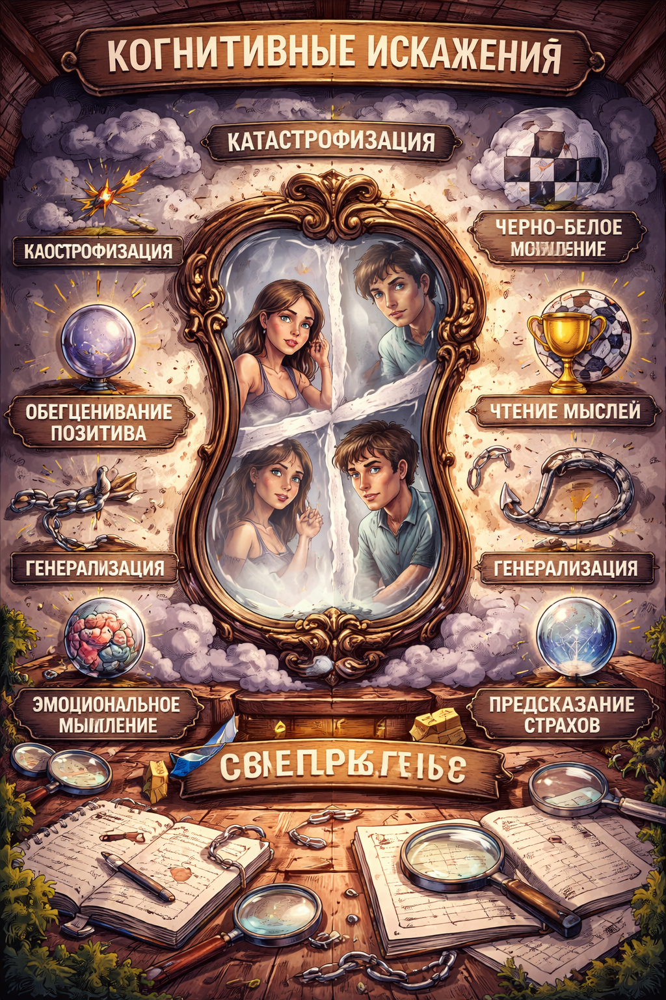

# [Когнитивные искажения](../../../1.2_natural_sciences/neurobiology_for_teens/articles/25_cognitive_biases.md) и [самокритика](../../../../8.1_self_understanding/articles/perfectionism.md) 🪞🌩️

Наш [мозг](../../../3.1. healthy lifestyle/Sleep, nutrition, and adolescent energy/articles/breakfast_for_the_brain.md) иногда нас обманывает. Когнитивные искажения — это систематические [ошибки](../../../3.1_healthy_lifestyle/pervaya_pomoshch/ushibi_porezy_ozhogi/07_ushib_chego_nelzya.md) в мышлении, фильтры, через которые мы видим мир в негативном свете 🌑. Именно они питают нашего сурового внутреннего [критика](../../../8.1_self-understanding/HowToFindYourStrengths/articles/impostor_syndrome.md), заставляя нас сомневаться в себе, преувеличивать ошибки и обесценивать [достижения](../../../4.1_rules_of_study/how_to_learn_effectively/articles/gamification.md) ❗

> ### 🛑 [Мифы и реальность](../../../1.2_natural_sciences/physics_in_everyday_life/Q748254.md) о самокритике
>
> **1. Самокритика мотивирует?** > 🔴 *Миф:* «Если я не буду себя ругать, я расслаблюсь и ничего не добьюсь».  
> 🟢 *[Реальность](../../../1.2_natural_sciences/physics_in_everyday_life/Q140028.md):* Жесткая самокритика уничтожает самооценку и приводит к апатии. Реально мотивирует самоподдержка и бережное отношение к себе.
>
> **2. Мои мысли — это [факты](../../../1.2_natural_sciences/physics_in_everyday_life/Q17737.md)?** > 🔴 *Миф:* «Если я чувствую себя неудачником, значит, так оно и есть».  
> 🟢 *Реальность:* Мысли — это просто гипотезы мозга, часто искаженные усталостью, стрессом или плохим настроением.

---

## Как искажения проявляются 😓

Основные проявления:  

- **[Черно-белое мышление](../../articles/cognitive_distortions_and_self_criticism.md):** «Если я не сдал на отлично, значит, я полный [провал](../../../4.2_thinking_and_working_information/critical_thinking/articles/main_cognitive_distortions.md)» ⚪⚫  
- **[Катастрофизация](../../articles/cognitive_distortions_and_self_criticism.md):** «Я запнулся на презентации, теперь меня все засмеют и уволят» 🌋  
- **[Чтение](../../../4.1_rules_of_study/how_to_learn_effectively/articles/reading_skills.md) мыслей:** «Она посмотрела на меня и точно подумала, что я глупый» 👁️  
- **[Обесценивание](../../../2.2_history/world_economy_on_fingers/articles/devalvatsiya.md) плюсов:** «Да, я сдал [проект](../../../1.2_natural_sciences/why_science_help_understand_world/research_work.md), но это просто повезло» 📉  

Эти [ловушки мышления](../../articles/cognitive_distortions_and_self_criticism.md) заставляют нас жить в постоянном напряжении и страхе ошибки.

---

## [Влияние](../../../5.1_technology_and_digital_literacy/information and media literacy/манипуляции_и_пропаганда.md) самокритики на [восприятие](../../../1.2_natural_sciences/neurobiology_for_teens/articles/26_optical_illusions.md) себя 🧩

Представь, что твой разум — это комната смеха с кривыми зеркалами. Когнитивные искажения искажают твое [отражение](../../../1.2_natural_sciences/physics_in_everyday_life/Q11388.md): маленькая [ошибка](../../../5.1_technology_and_digital_literacy/how_internet_works/articles/http_https/http_https.md) кажется гигантской, а большие успехи — невидимыми.

---

## Практические [советы](../../../7.2 Media, leisure and hobbies /useful_and_interesting_leisure/articles/mistakes_in_choosing_hobby.md) 🌱💪

1. **Лови мысль за хвост 🕵️‍♀️**
   Когда чувствуешь тревогу или стыд, спроси себя: «О чем я сейчас подумал? Какое это искажение?».

2. **Ищи [доказательства](../../../4.2_thinking_and_working_information/critical_thinking/articles/fact_and_opinion_differences.md) против ⚖️**
   Сыграй в адвоката. Если мозг говорит: «Ты ничего не умеешь», вспомни [минимум](../../../1.2_natural_sciences/physics_in_everyday_life/Q136980.md) три ситуации в прошлом, где ты успешно справился со сложной задачей.

3. **Разговаривай с собой как с другом 🤝**
   Если бы твой лучший друг совершил такую же ошибку, стал бы ты его оскорблять? Скорее всего, ты бы его поддержал. Примени это к себе.

4. **Замени «Я должен» на «Было бы здорово» 🔄**
   Слово «должен» создает колоссальное [давление](../../../1.1_structure_of_the_world/matter/articles/07_gases.md). Смягчение формулировок снижает [стресс](../../../3.1. healthy lifestyle/Sleep, nutrition, and adolescent energy/articles/chronic_sleep_deprivation.md).

---

## Мини-чеклист ✅

* Отслеживай моменты, когда начинаешь ругать себя
* Называй искажение по имени (например: «О, это опять моя катастрофизация»)
* Практикуй дневник благодарности себе (3 вещи перед сном) ✨
* Перефразируй негативную мысль в нейтральную
* Относись к своим мыслям как к проплывающим облакам ☁️

---

## 😂 Анекдот от Gemini по теме

Мой внутренний критик настолько суров, что если я когда-нибудь получу Нобелевскую премию, он вздохнет и скажет: «Ну, вообще-то мог бы постараться и две получить, лентяй» 🏆🤦‍♂️

---

---
**Авторы:** Ногаев.T.T

*[Ресурсы](../../../2.1_society/cause_and_effect_relationships/articles/ecological_footprint.md): [LLM](../../../7.1_art/modern_technological_art/README.md) - Gemini* 🤖
