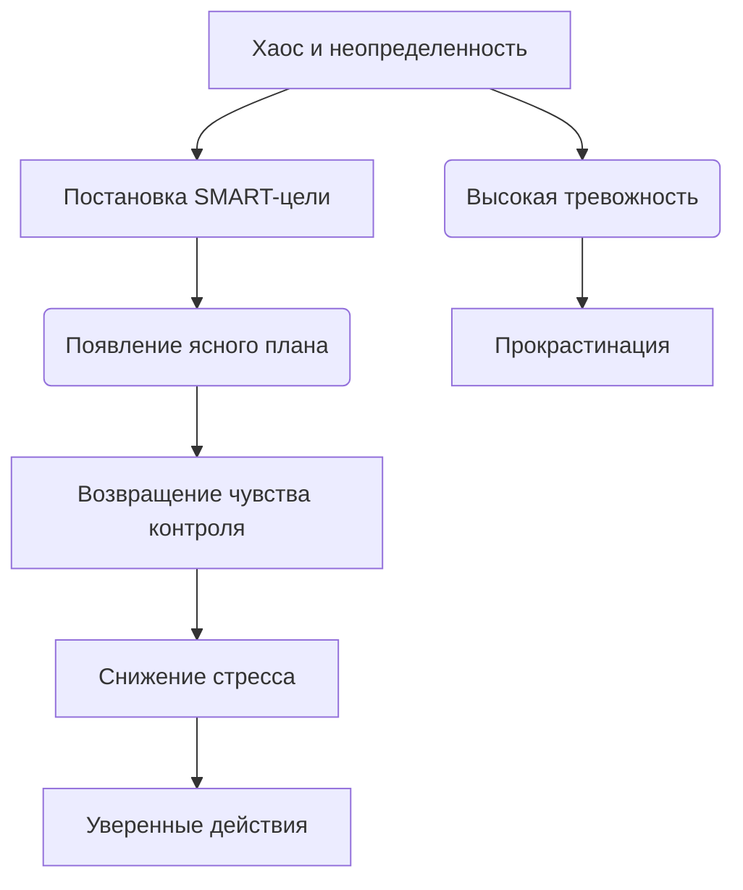

# [Постановка целей](../../../4.1_rules_of_study/how_to_learn_effectively/articles/learning_goals.md) и снижение тревожности 🎯😌

Неопределенность — один из главных источников тревоги. Когда мы не знаем, куда идем, каждый [шаг](../../../1.2_natural_sciences/physics_in_everyday_life/Q36253.md) кажется опасным. [Постановка](../../../../8.1_entertainment/articles/director.md) ясных и достижимых целей работает как [компас](../../../1.2_natural_sciences/physics_in_everyday_life/Q11408.md) 🧭. Она помогает структурировать [хаос](../../../1.2_natural_sciences/physics_in_everyday_life/Q45003.md), возвращает чувство контроля и значительно снижает [уровень](../../../../8.1_entertainment/articles/gamification.md) фонового стресса ❗

> ### 🛑 [Мифы и реальность](../../../1.2_natural_sciences/physics_in_everyday_life/Q748254.md) о целях
>
> **1. [Цели](../../../3.1_healthy_lifestyle/pervaya_pomoshch/ushibi_porezy_ozhogi/02_celi_pervoy_pomoshchi.md) должны быть глобальными?** > 🔴 *Миф:* «Целься в Луну, даже если промахнешься — окажешься среди звезд».  
> 🟢 *[Реальность](../../../1.2_natural_sciences/physics_in_everyday_life/Q140028.md):* Слишком масштабные и нереалистичные цели без плана действий вызывают паралич и тревогу.
>
> **2. [План](../../../7.2 Media, leisure and hobbies/Computer games/articles/genres_and_worlds/strategy.md) [нельзя](../../../3.1_healthy_lifestyle/pervaya_pomoshch/ushibi_porezy_ozhogi/07_ushib_chego_nelzya.md) менять?** > 🔴 *Миф:* «Если я изменил [цель](../../../1.2_natural_sciences/why_science_help_understand_world/research_work.md), значит, я сдался».  
> 🟢 *Реальность:* Гибкость — [ключ](../../../5.1_technology_and_digital_literacy/how_internet_works/articles/http_https/tls.md) к психологическому здоровью. Нормально корректировать курс, если изменились обстоятельства.

---

## Как отсутствие целей проявляется 😓

Основные проявления:  

- Чувство, что [жизнь](../../../1.2_natural_sciences/physics_in_everyday_life/Q1751973.md) проходит мимо, а ты стоишь на месте 🚶‍♂️  
- Растерянность при необходимости сделать [выбор](../../../2.1_society/cause_and_effect_relationships/articles/personal_choice.md) 🤷‍♀️  
- [Страх](../../../1.2_natural_sciences/neurobiology_for_teens/articles/14_amygdala_fear.md) перед будущим и неизвестностью 🌫️  
- Распыление энергии на множество мелких, не связанных между собой дел ⚡  

Отсутствие четкого вектора заставляет [мозг](../../../3.1. healthy lifestyle/Sleep, nutrition, and adolescent energy/articles/breakfast_for_the_brain.md) постоянно просчитывать все возможные негативные сценарии, что ведет к выгоранию.

---

## [Влияние](../../../5.1_technology_and_digital_literacy/information and media literacy/манипуляции_и_пропаганда.md) планирования на уровень тревоги 🧩

Представь, что твоя цель — это вершина [горы](../../../1.2_natural_sciences/physics_in_everyday_life/Q81809.md) в тумане. Без карты ты будешь бояться каждого шороха. [Планирование](../../../3.1. healthy lifestyle/Sleep, nutrition, and adolescent energy/articles/ideal_schedule_energy_management.md) рассеивает туман и показывает безопасную тропу.

---

## Практические [советы](../../../7.2 Media, leisure and hobbies /useful_and_interesting_leisure/articles/mistakes_in_choosing_hobby.md) 🌱💪

1. **Используй систему [SMART](../../../6.2_money_and_literacy/how_to_save_for_goal/articles/smart_goal.md) 🔍**
   Цель должна быть конкретной, измеримой, достижимой, значимой и ограниченной по времени.

2. **[Фокус](../../../1.2_natural_sciences/physics_in_everyday_life/Q35197.md) на процессе, а не только на результате 🏃‍♂️**
   Вместо цели «Похудеть на 10 кг» ([результат](../../../1.2_natural_sciences/why_science_help_understand_world/experimental_science.md)), поставь цель «Гулять по 30 минут каждый вечер» ([процесс](../../../5.1_technology_and_digital_literacy/operating system/articles/process.md)). Это снимает [давление](../../../1.1_structure_of_the_world/matter/articles/07_gases.md).

3. **Практикуй фрирайтинг (свободное письмо) 📝**
   Если [тревога](../../../1.2_natural_sciences/neurobiology_for_teens/articles/07_stress.md) зашкаливает, выпиши все свои мысли и страхи на бумагу. Это разгрузит «оперативную [память](../../../3.1. healthy lifestyle/Sleep, nutrition, and adolescent energy/articles/sleep_and_memory_grades.md)» мозга.

4. **Празднуй маленькие победы 🏆**
   Отмечай каждый пройденный этап. Выработка дофамина закрепит привычку двигаться вперед без стресса.

---

## Мини-чеклист ✅

* Сформулируй одну главную цель на ближайший месяц
* Разбей эту цель на 4 еженедельные микро-задачи
* Заведи трекер привычек или дневник успеха 📓
* Пересматривай свои планы раз в неделю в спокойной обстановке
* Оставь в расписании [время](../../../1.2_natural_sciences/physics_in_everyday_life/Q20702.md) для отдыха и «ничегонеделания» 🛋️

---

## 😂 Анекдот от Gemini по теме

— Моя цель на этот год — стать максимально продуктивным и перестать тревожиться!
— И как успехи?
— Я уже составил 15 детальных планов того, как я буду это делать. Завтра начну нервничать из-за того, что отстаю от графика! 📝😅

---

---

**Авторы:** Ногаев.T.T

*[Ресурсы](../../../2.1_society/cause_and_effect_relationships/articles/ecological_footprint.md): [LLM](../../../7.1_art/modern_technological_art/README.md) - Gemini* 🤖
