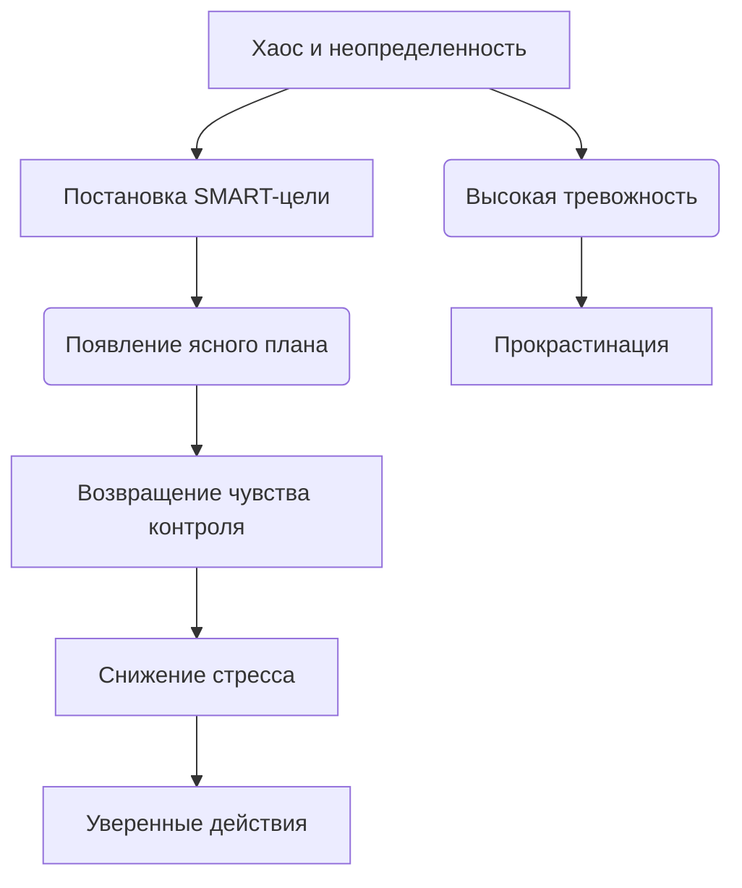

# Постановка целей и снижение тревожности 🎯😌

Неопределенность — один из главных источников тревоги. Когда мы не знаем, куда идем, каждый шаг кажется опасным. Постановка ясных и достижимых целей работает как компас 🧭. Она помогает структурировать хаос, возвращает чувство контроля и значительно снижает уровень фонового стресса ❗

> ### 🛑 Мифы и реальность о целях
>
> **1. Цели должны быть глобальными?** > 🔴 *Миф:* «Целься в Луну, даже если промахнешься — окажешься среди звезд».  
> 🟢 *Реальность:* Слишком масштабные и нереалистичные цели без плана действий вызывают паралич и тревогу.
>
> **2. План нельзя менять?** > 🔴 *Миф:* «Если я изменил цель, значит, я сдался».  
> 🟢 *Реальность:* Гибкость — ключ к психологическому здоровью. Нормально корректировать курс, если изменились обстоятельства.

---

## Как отсутствие целей проявляется 😓

Основные проявления:  

- Чувство, что жизнь проходит мимо, а ты стоишь на месте 🚶‍♂️  
- Растерянность при необходимости сделать выбор 🤷‍♀️  
- Страх перед будущим и неизвестностью 🌫️  
- Распыление энергии на множество мелких, не связанных между собой дел ⚡  

Отсутствие четкого вектора заставляет мозг постоянно просчитывать все возможные негативные сценарии, что ведет к выгоранию.

---

## Влияние планирования на уровень тревоги 🧩

Представь, что твоя цель — это вершина горы в тумане. Без карты ты будешь бояться каждого шороха. Планирование рассеивает туман и показывает безопасную тропу.

---

## Практические советы 🌱💪

1. **Используй систему SMART 🔍**
   Цель должна быть конкретной, измеримой, достижимой, значимой и ограниченной по времени.

2. **Фокус на процессе, а не только на результате 🏃‍♂️**
   Вместо цели «Похудеть на 10 кг» (результат), поставь цель «Гулять по 30 минут каждый вечер» (процесс). Это снимает давление.

3. **Практикуй фрирайтинг (свободное письмо) 📝**
   Если тревога зашкаливает, выпиши все свои мысли и страхи на бумагу. Это разгрузит «оперативную память» мозга.

4. **Празднуй маленькие победы 🏆**
   Отмечай каждый пройденный этап. Выработка дофамина закрепит привычку двигаться вперед без стресса.

---

## Мини-чеклист ✅

* Сформулируй одну главную цель на ближайший месяц
* Разбей эту цель на 4 еженедельные микро-задачи
* Заведи трекер привычек или дневник успеха 📓
* Пересматривай свои планы раз в неделю в спокойной обстановке
* Оставь в расписании время для отдыха и «ничегонеделания» 🛋️

---

## 😂 Анекдот от Gemini по теме

— Моя цель на этот год — стать максимально продуктивным и перестать тревожиться!
— И как успехи?
— Я уже составил 15 детальных планов того, как я буду это делать. Завтра начну нервничать из-за того, что отстаю от графика! 📝😅

---

---

**Авторы:** Ногаев.T.T

*Ресурсы: LLM - Gemini* 🤖
