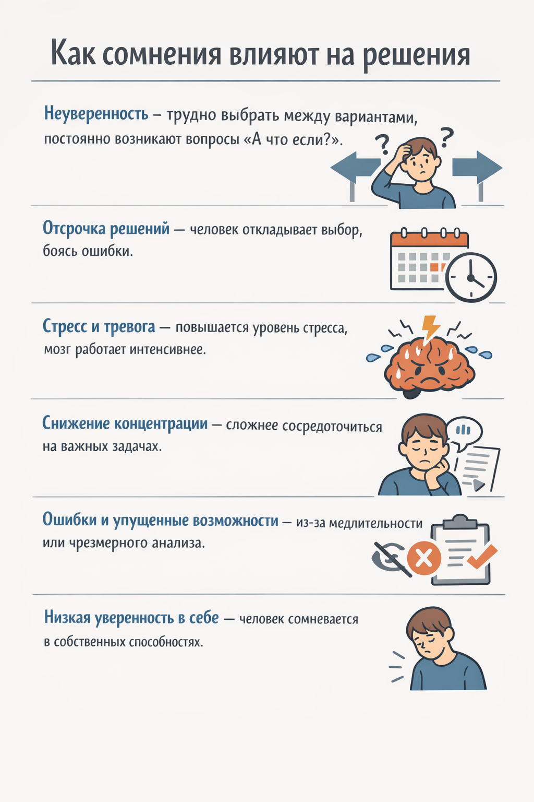

# Причины неуверенности и сомнений 🤔💭

Неуверенность и сомнения в себе — частые спутники подростков и даже взрослых, особенно при планировании будущего или выборе пути. Они мешают действовать, создают стресс и заставляют откладывать решения.

> ### 🛑 Мифы и реальность о неуверенности
>
> **1. Неуверенность — это слабость**
> 
> 🔴 *Миф:* «Если я сомневаюсь, значит, я слабый».
> 
> 🟢 *Реальность:* Сомнения — нормальная часть процесса принятия решений. Они помогают оценить риски и варианты.
>
> **2. Сомневаться — плохо**
> 
> 🔴 *Миф:* «Сомнения мешают действовать, их нужно полностью убрать».
> 
> 🟢 *Реальность:* Правильные сомнения помогают принимать более взвешенные решения и избегать ошибок.

---

## Основные причины неуверенности 😟

1. **Страх ошибки** ❌
   Боишься, что решение окажется неправильным, и это приведет к негативным последствиям.

2. **Сравнение с другими** 👀
   Постоянное сравнение с друзьями или сверстниками снижает самооценку.

3. **Отсутствие опыта** 🛤️
   Чем меньше практика в принятии решений, тем труднее доверять себе.

4. **Критика или давление окружающих** 🗣️
   Частые замечания или негативные оценки со стороны родителей, учителей или друзей формируют чувство «я недостаточно хорош».

5. **Хронический стресс** ⚡
   Постоянное напряжение ослабляет уверенность и повышает тревожность.

---

## Влияние неуверенности на жизнь 🧩

Неуверенность влияет на повседневные решения, учебу, выбор кружков, друзей и будущую профессию. Она снижает мотивацию, провоцирует прокрастинацию и мешает проявлять инициативу.

---

## Советы для борьбы с неуверенностью 🌟💪

1. **Фокус на маленьких успехах** ✅
   Каждый выполненный шаг повышает уверенность.

2. **Позитивное саморазговор** 🗣️
   Заменяй негативные мысли на конструктивные: «Я могу попробовать и научусь».

3. **Опыт и практика** 🎯
   Чем больше действий и решений, тем увереннее человек становится.

4. **Поддержка друзей и наставников** 🤝
   Разговор с тем, кому доверяешь, помогает снизить тревогу и найти правильные решения.

---

## Мини-чеклист ✅

* Пиши маленькие цели и отмечай успехи
* Анализируй свои сомнения: реально ли они опасны?
* Разделяй задачи на шаги
* Ищи поддержку у друзей, наставников или семьи

---

## 😂 Анекдот от GPT

— Я боюсь сделать неправильный выбор…
— Не переживай, главное — выбрать что-то хотя бы случайно! Даже случайно иногда срабатывает лучше, чем планирование! 🎯

---

---

**Авторы:** Анна, @Henrygrimm

**Нейросети, использованные при создании статьи:** ChatGPT 🤖
