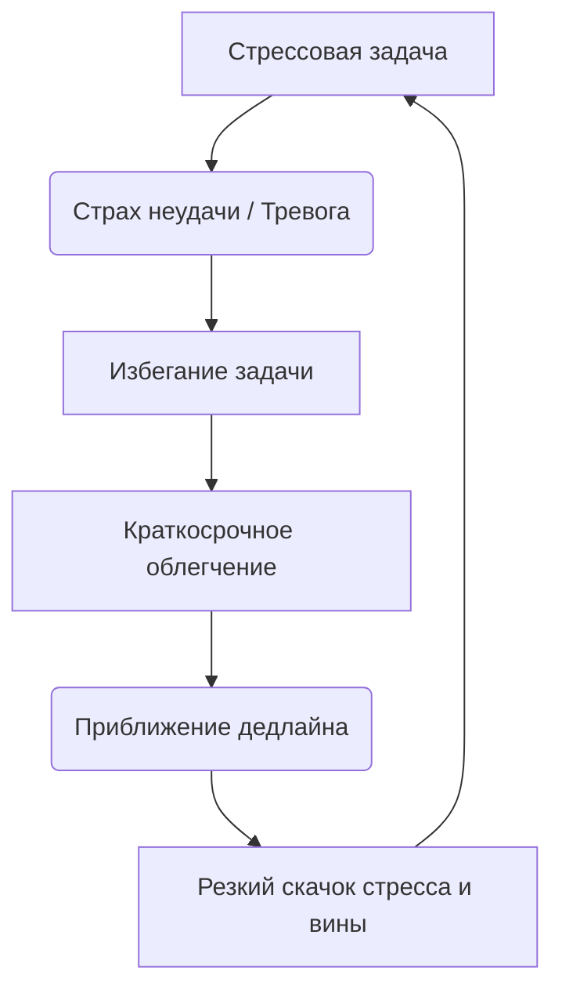

# [Прокрастинация](../../../1.2_natural_sciences/neurobiology_for_teens/articles/12_lazy_brain.md) и её [связь](../../../1.2_natural_sciences/physics_in_everyday_life/Q12969754.md) со стрессом ⏳😰

Прокрастинация — это не просто [лень](../../../1.2_natural_sciences/neurobiology_for_teens/articles/12_lazy_brain.md) или неумение управлять временем, это проблема регуляции эмоций. Мы часто откладываем [задачи](../../../1.2_natural_sciences/why_science_help_understand_world/research_work.md), потому что они вызывают у нас [стресс](../../../3.1. healthy lifestyle/Sleep, nutrition, and adolescent energy/articles/chronic_sleep_deprivation.md), [страх](../../../1.2_natural_sciences/neurobiology_for_teens/articles/14_amygdala_fear.md) [неудачи](../../../4.1_rules_of_study/how_to_learn_effectively/articles/learning_from_mistakes.md) или чувство подавленности 📉. Прокрастинация дает временное облегчение, но в долгосрочной перспективе лишь усиливает тревогу и чувство вины ❗

> ### 🛑 [Мифы и реальность](../../../1.2_natural_sciences/physics_in_everyday_life/Q748254.md) о прокрастинации
>
> **1. Прокрастинация — это просто лень?** > 🔴 *Миф:* «Ты просто не хочешь работать, возьми себя в руки».  
> 🟢 *[Реальность](../../../1.2_natural_sciences/physics_in_everyday_life/Q140028.md):* Это защитный механизм мозга. Откладывая дела, [мозг](../../../3.1. healthy lifestyle/Sleep, nutrition, and adolescent energy/articles/breakfast_for_the_brain.md) пытается избежать стресса и негативных эмоций, связанных с задачей.
>
> **2. Дедлайны всегда помогают?** > 🔴 *Миф:* «Я лучше всего работаю в последнюю ночь перед сдачей».  
> 🟢 *Реальность:* [Работа](../../../1.2_natural_sciences/physics_in_everyday_life/Q11382.md) в условиях паники истощает нервную систему, повышает [риск](../../../1.2_natural_sciences/neurobiology_for_teens/articles/05_teen_brain.md) ошибок и приводит к хроническому стрессу.

---

## Как прокрастинация проявляется 😓

Основные проявления:  

- Бесконечный [скроллинг](../../../3.1_healthy lifestyle/vrednye_privychki/articles/Doomscrolling.md) соцсетей вместо [работы](../../../8.2_future/choosing_a_career_path/articles/interview.md) 📱  
- Выполнение мелких и неважных дел («иллюзия занятости») 🧹  
- Постоянное чувство вины и тревоги на фоне отдыха 😔  
- Паника и спешка в последние [часы](../../../1.2_natural_sciences/physics_in_everyday_life/Q20702.md) перед дедлайном ⏰  

Хроническое [откладывание](../../../1.2_natural_sciences/neurobiology_for_teens/articles/12_lazy_brain.md) дел создает [замкнутый круг](../../articles/procrastination_and_stress.md): стресс вызывает прокрастинацию, а прокрастинация рождает еще больший стресс.

---

## [Влияние](../../../5.1_technology_and_digital_literacy/information and media literacy/манипуляции_и_пропаганда.md) прокрастинации на [работу](../../../8.2_future/choosing_a_career_path/articles/interview.md) мозга 🧩

Представь, что твой мозг — это [смартфон](../../../1.2_natural_sciences/physics_in_everyday_life/Q3198.md). Нерешенные задачи — это фоновые [приложения](../../../4.1_rules_of_study/how_to_learn_effectively/articles/digital_tools.md), которые постоянно едят батарею. Чем дольше ты их не закрываешь (откладываешь), тем сильнее тормозит система и быстрее садится [заряд](../../../1.2_natural_sciences/physics_in_everyday_life/Q2225.md).

---

## Практические [советы](../../../7.2 Media, leisure and hobbies /useful_and_interesting_leisure/articles/mistakes_in_choosing_hobby.md) 🌱💪

1. **[Правило](../../../1.2_natural_sciences/why_science_help_understand_world/patterns.md) двух минут ⏱️**
   Если задачу можно начать и сделать за 2 минуты — сделай её прямо сейчас. Это снимает психологический барьер первого шага.

2. **Прости себя за [прошлое](../../../2.1_society/cause_and_effect_relationships/articles/lessons_of_history.md) 🕊️**
   Исследования показывают: те, кто прощает себя за вчерашнюю прокрастинацию, реже откладывают дела сегодня.

3. **Дроби слона на кусочки 🐘**
   «Написать диплом» — звучит страшно. «Написать один абзац введения» — звучит выполнимо и не вызывает паники.

4. **[Метод](../../../5.1_technology_and_digital_literacy/how_internet_works/articles/http_https/http_https.md) Помодоро 🍅**
   Работайте 25 минут, затем 5 минут отдыхайте. Это снижает страх перед бесконечной рутиной.

---

## Мини-чеклист ✅

* Убери телефон в другую комнату перед началом работы
* Напиши одну самую важную задачу на стикере
* Договорись с собой поработать хотя бы 5 минут (дальше втянешься)
* Награждай себя за завершенные этапы ☕
* Не ругай себя, если что-то пошло не по плану

---

## 😂 Анекдот от Gemini по теме

— Как называется [человек](../../../1.2_natural_sciences/physics_in_everyday_life/Q45003.md), который откладывает всё на завтра?
— Завтрамен! Его суперсила — делать месячный [объем](../../../1.2_natural_sciences/physics_in_everyday_life/Q11435.md) работы в последнюю ночь со слезами на глазах 🦸‍♂️😭

---

---

**Авторы:** Ногаев.T.T

*[Ресурсы](../../../2.1_society/cause_and_effect_relationships/articles/ecological_footprint.md): [LLM](../../../7.1_art/modern_technological_art/README.md) - Gemini* 🤖
