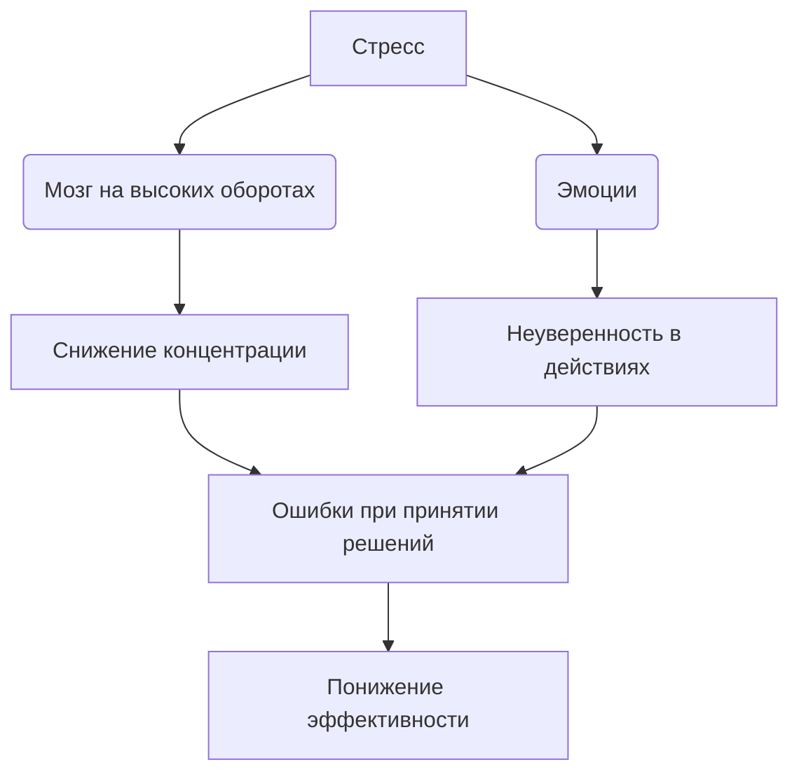
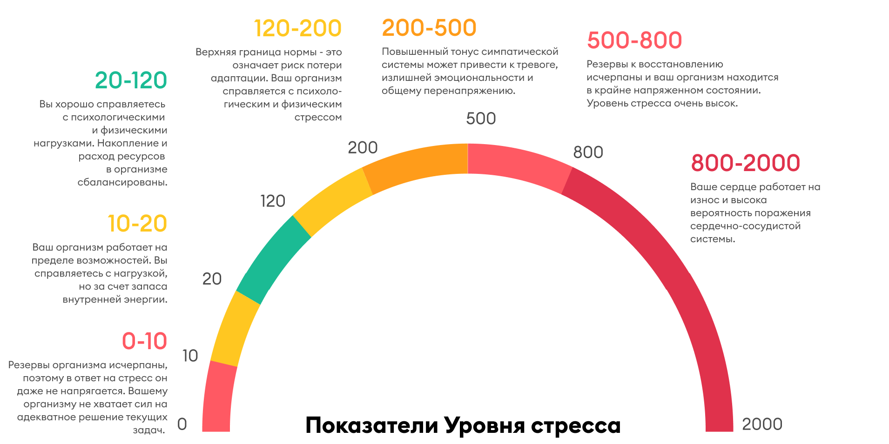

# [Понимание](../../../2.1_society/cause_and_effect_relationships/articles/empathy_causality.md) стресса и его [влияние](../../../5.1_technology_and_digital_literacy/information and media literacy/манипуляции_и_пропаганда.md) 😰💡

[Стресс](../../../3.1. healthy lifestyle/Sleep, nutrition, and adolescent energy/articles/chronic_sleep_deprivation.md) — естественная [реакция организма](../../articles/01_stress_effect.md) на [трудности](../../../4.1_rules_of_study/how_to_learn_effectively/articles/growth_mindset.md), изменения и новые вызовы. Он появляется при подготовке к контрольным, при выборе пути в жизни, во [время](../../../1.2_natural_sciences/physics_in_everyday_life/Q20702.md) экзаменов или при общении с новыми людьми 🗣️. Стресс может как мобилизовать [силы](../../../1.2_natural_sciences/physics_in_everyday_life/Q11423.md), так и мешать принимать правильные решения, снижать концентрацию и [уверенность в себе](../../../2.1_society/how_and_where_find_friends/articles/fandom.md) ❗  

> ### 🛑 [Мифы и реальность](../../../1.2_natural_sciences/physics_in_everyday_life/Q748254.md) о стрессе  
>
> **1. Стресс — всегда плохо?**  
> 🔴 *Миф:* «Стресс — это признак слабости».  
> 🟢 *[Реальность](../../../1.2_natural_sciences/physics_in_everyday_life/Q140028.md):* Умеренный стресс помогает сконцентрироваться, быстрее реагировать и мобилизует [ресурсы](../../../2.1_society/cause_and_effect_relationships/articles/ecological_footprint.md) организма.  
>
> **2. Можно игнорировать стресс?**  
> 🔴 *Миф:* «Если закрыть [глаза](../../../7.2 Media, leisure and hobbies/Computer games/articles/useful_tips/eyes_and_back.md), он уйдёт сам».  
> 🟢 *Реальность:* Игнорирование стрессовых факторов только усугубляет тревогу, [усталость](../../../3.1. healthy lifestyle/Sleep, nutrition, and adolescent energy/articles/sugar_rollercoaster.md) и [сомнения](../../articles/02_insecurity_causes.md) в своих способностях.

---

## Как стресс проявляется 😓

Основные проявления стресса:  

- [Тревожность](../../../../8.1_self_understanding/articles/causes.md) и раздражительность 😣  
- Сложности с концентрацией и [памятью](../../../4.1_rules_of_study/how_to_memorize/articles/pamyat.md) 🧠  
- [Утомляемость](../../../1.2_natural_sciences/physics_in_everyday_life/Q628858.md) и снижение энергии ⚡  
- Нарушения сна и аппетита 😴🍽️  

[Хронический стресс](../../../1.2_natural_sciences/neurobiology_for_teens/articles/07_stress.md) может привести к эмоциональному выгоранию, постоянной неуверенности и снижению мотивации при выборе жизненного пути.

---

## Влияние стресса на [принятие решений](../../../1.2_natural_sciences/neurobiology_for_teens/articles/05_teen_brain.md) 🧩

Представь, что [мозг](../../../3.1. healthy lifestyle/Sleep, nutrition, and adolescent energy/articles/breakfast_for_the_brain.md) — это суперкар. Он может ездить быстро, но только если правильно заправлен. Стресс — это [сигнал](../../../5.1_technology_and_digital_literacy/how_internet_works/articles/wifi/router.md), что топлива мало или автомобиль в опасной зоне.  

---

## Практические [советы](../../../7.2 Media, leisure and hobbies /useful_and_interesting_leisure/articles/mistakes_in_choosing_hobby.md) 🌱💪

1. **Определи [источники](../../../4.2_thinking_and_working_information/how_to_search_information/articles/three_whales.md) стресса 🔍**
   Запиши, что вызывает наибольшую тревогу — [первый шаг](../../../1.2_natural_sciences/physics_in_everyday_life/Q26540.md) к контролю ситуации.

2. **[Техники](../../articles/03_stress_management.md) релаксации 🧘‍♂️**
   [Дыхательные упражнения](../../articles/03_stress_management.md), [прогулки](../../../7.2 Media, leisure and hobbies /useful_and_interesting_leisure/articles/active_recreation_and_sport.md) 🚶, [музыка](../../../1.2_natural_sciences/neurobiology_for_teens/articles/18_music_chills.md) или [медитация](../../articles/relaxation_and_recovery.md) помогают снизить [уровень](../../../../8.1_entertainment/articles/gamification.md) тревоги.

3. **Разделяй [задачи](../../../1.2_natural_sciences/why_science_help_understand_world/research_work.md) на [шаги](../../../7.2 Media, leisure and hobbies/Computer games/articles/dream_team/composer.md) 📝**
   Большие [цели](../../../3.1_healthy_lifestyle/pervaya_pomoshch/ushibi_porezy_ozhogi/02_celi_pervoy_pomoshchi.md) кажутся пугающими. Разбей их на [маленькие шаги](../../articles/goal_setting_and_anxiety.md) — и появится контроль и [уверенность](../../../2.1_society/how_and_where_find_friends/articles/otkaz_ne_konets.md).

4. **[Физическая активность](../../../3.1. healthy lifestyle/Sleep, nutrition, and adolescent energy/articles/sport_and_energy.md) и [сон](../../../3.1. healthy lifestyle/Sleep, nutrition, and adolescent energy/articles/evening_rituals_sleep_fast.md) 🏃‍♀️😴**
   [Спорт](../../../3.1. healthy lifestyle/Sleep, nutrition, and adolescent energy/articles/sport_and_energy.md) помогает выбросу «гормонов радости», регулярный сон восстанавливает силы.

---

## Мини-чеклист ✅

* Составь [список](../../../5.2_cybersecurity/cpp_fundamentals/10_arrays.md) задач и расставь приоритеты
* Выделяй 5–10 минут на дыхательные упражнения
* Делай короткие [перерывы](../../../4.1_rules_of_study/how_to_learn_effectively/articles/breaks_and_rest.md) каждые 50–60 минут [работы](../../../8.2_future/choosing_a_career_path/articles/interview.md)
* Поддерживай активность: прогулки, спорт, растяжка
* Следи за сном и питанием 🥗

---

## 😂 Анекдот от GPT по теме

Учительница:
— Дети, кто готов к контрольной?

Голос с последней парты:
— Мой мозг ещё на «синем экране». Он только что загрузился после стресса от вчерашней домашки 😅

---

---
## [Навигация](../../../1.2_natural_sciences/physics_in_everyday_life/Q11408.md) по серии статей
# Понимание стресса и его влияние 😰💡

## Навигация по серии статей

* Понимание стресса и его влияние 😰💡
* [Причины неуверенности и сомнений 🤔💭](./insecurity_causes.md)
* [Методы управления стрессом 🧘‍♂️💪](./stress_management.md)
* [Когнитивные искажения и самокритика](./cognitive_distortions_and_self_criticism.md)
* [Постановка целей и снижение тревожности](./goal_setting_and_anxiety.md)
* [Прокрастинация и её связь со стрессом](./procrastination_and_stress.md)
* [Социальное сравнение и его последствия](./social_comparison.md)
* [Поддержка и помощь со стороны окружающих](./support_and_help.md)
* [Формирование устойчивости к стрессу](./building_resilience.md)
* [Влияние стресса на здоровье](./stress_health.md)
* [Роль эмоций в принятии решений](./emotions_decisions.md)
* [Психология страха и тревожности](./fear_anxiety_psychology.md)
* [Развитие уверенности](./confidence_development.md) 
* [Влияние окружения на самооценку](./environment_influence_on_self_esteem.md)
* [Релаксация и восстановление](./relaxation_and_recovery.md)

---

**Авторы:** Бакач Анна, @Henrygrimm

**[Нейросети](../../../2.1_society/cause_and_effect_relationships/articles/ai_causality.md), использованные при создании статьи:** GPT-4 🤖

