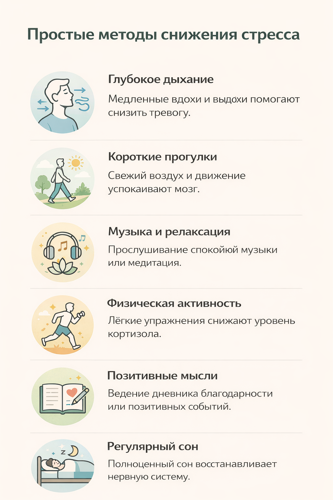

# [Методы](../../../4.1_rules_of_study/how_to_learn_effectively/articles/note_taking.md) управления стрессом 🧘‍♂️💪

[Стресс](../../../3.1. healthy lifestyle/Sleep, nutrition, and adolescent energy/articles/chronic_sleep_deprivation.md) — это нормальная часть жизни, но если он становится хроническим или сильным, он мешает учёбе, [хобби](../../../2.1_society/how_and_where_find_friends/articles/neochevidnye_mesta_dlya_znakomstva.md) и общению с друзьями. [Управление стрессом](../../articles/03_stress_management.md) помогает сохранять ясность мысли, [уверенность](../../../2.1_society/how_and_where_find_friends/articles/otkaz_ne_konets.md) и [здоровье](../../../3.1. healthy lifestyle/Sleep, nutrition, and adolescent energy/articles/chronic_sleep_deprivation.md).

> ### 🛑 [Мифы](../../../1.2_natural_sciences/physics_in_everyday_life/Q140028.md) о способах борьбы со стрессом
>
> **1. Стресс нужно «выгонять» полностью**
> 
> 🔴 *Миф:* «Если перестану испытывать стресс, [жизнь](../../../1.2_natural_sciences/physics_in_everyday_life/Q1751973.md) станет идеальной».
> 
> 🟢 *[Реальность](../../../1.2_natural_sciences/physics_in_everyday_life/Q140028.md):* Стресс [нельзя](../../../3.1_healthy_lifestyle/pervaya_pomoshch/ushibi_porezy_ozhogi/07_ushib_chego_nelzya.md) убрать полностью, его нужно **научиться контролировать**.

> **2. Все [техники](../../articles/03_stress_management.md) одинаково работают для всех**
> 
> 🔴 *Миф:* «Есть универсальный способ, который подходит каждому».
> 
> 🟢 *Реальность:* Методы управления стрессом индивидуальны. Нужно пробовать разные и выбрать подходящие для себя.

---

## Основные техники управления стрессом 😌

1. **[Дыхательные упражнения](../../articles/03_stress_management.md)** 🌬️
   Медленные вдохи и выдохи помогают снизить [уровень](../../../../8.1_entertainment/articles/gamification.md) тревоги и успокоить нервную систему.

2. **[Прогулки](../../../7.2 Media, leisure and hobbies /useful_and_interesting_leisure/articles/active_recreation_and_sport.md) и [физическая активность](../../../3.1. healthy lifestyle/Sleep, nutrition, and adolescent energy/articles/sport_and_energy.md)** 🚶🏃‍♀️
   Лёгкая физическая нагрузка помогает выбросу гормонов радости и снижает [напряжение](../../../1.2_natural_sciences/physics_in_everyday_life/Q11023.md).

3. **[Медитация](../../articles/relaxation_and_recovery.md) и осознанность** 🕯️
   Практики mindfulness помогают контролировать мысли и [эмоции](../../../3.1. healthy lifestyle/Sleep, nutrition, and adolescent energy/articles/stress_and_food.md), снижая тревогу.

4. **[Планирование](../../../3.1. healthy lifestyle/Sleep, nutrition, and adolescent energy/articles/ideal_schedule_energy_management.md) и разделение задач** 📝
   Большие [цели](../../../3.1_healthy_lifestyle/pervaya_pomoshch/ushibi_porezy_ozhogi/02_celi_pervoy_pomoshchi.md) разбиваются на [маленькие шаги](../../articles/goal_setting_and_anxiety.md), что снижает чувство [перегрузки](../../../1.2_natural_sciences/physics_in_everyday_life/Q11376.md) и повышает уверенность.

5. **Ведение дневника** 📓
   Записывание мыслей и эмоций помогает «разгрузить» голову и оценить ситуацию объективно.

---

## [Влияние](../../../5.1_technology_and_digital_literacy/information and media literacy/манипуляции_и_пропаганда.md) стресс-менеджмента на учебу и жизнь 🎯

Правильные методы управления стрессом помогают:

* Улучшить концентрацию и [память](../../../3.1. healthy lifestyle/Sleep, nutrition, and adolescent energy/articles/sleep_and_memory_grades.md) 🧠
* Сохранять мотивацию и [продуктивность](../../../3.1. healthy lifestyle/Sleep, nutrition, and adolescent energy/articles/ideal_schedule_energy_management.md) ⚡
* Снизить [тревожность](../../../../8.1_self_understanding/articles/causes.md) и раздражительность 😌
* Принимать более уверенные решения при выборе пути в жизни 🌱

---

## Мини-чеклист: 5 минут в день для контроля стресса ✅

* Сделай 5 глубоких вдохов и выдохов
* Прогуляйся на свежем воздухе 🚶‍♂️
* Попробуй 2–3 минуты медитации 🕯️
* Разбей задачу на маленькие шаги 📝
* Запиши одну мысль или тревогу в дневник 📓

---

## 😂 Анекдот от GPT

— Я пробовал бороться со стрессом, но ничего не помогало…
— А ты пробовал делать паузу и просто съесть шоколадку? 😆
— Серьёзно?
— Иногда простые методы работают лучше всех сложных техник! 🍫

---

---

## [Навигация](../../../1.2_natural_sciences/physics_in_everyday_life/Q11408.md) по серии статей

# Методы управления стрессом 🧘‍♂️💪

## Навигация по серии статей
[Понимание стресса и его влияние 😰💡](./stress_effect.md)
[Причины неуверенности и сомнений 🤔💭](./insecurity_causes.md)
Методы управления стрессом 🧘‍♂️💪
[Когнитивные искажения и самокритика](./cognitive_distortions_and_self_criticism.md)
[Постановка целей и снижение тревожности](./goal_setting_and_anxiety.md)
[Прокрастинация и её связь со стрессом](./procrastination_and_stress.md)
[Социальное сравнение и его последствия](./social_comparison.md)
[Поддержка и помощь со стороны окружающих](./support_and_help.md)
[Формирование устойчивости к стрессу](./building_resilience.md)
[Влияние стресса на здоровье](./stress_health.md)
[Роль эмоций в принятии решений](./emotions_decisions.md)
[Психология страха и тревожности](./fear_anxiety_psychology.md)
[Развитие уверенности](./confidence_development.md)
[Влияние окружения на самооценку](./environment_influence_on_self_esteem.md)
[Релаксация и восстановление](./relaxation_and_recovery.md)
---

**Авторы:** Анна, @Henrygrimm

*[Ресурсы](../../../2.1_society/cause_and_effect_relationships/articles/ecological_footprint.md): [LLM](../../../7.1_art/modern_technological_art/README.md) - GPT-4* 🤖

---
