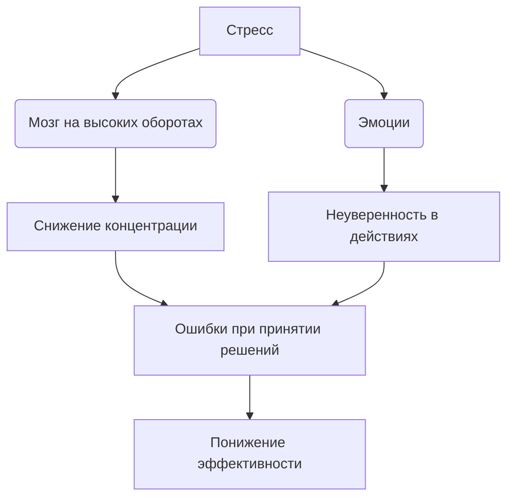
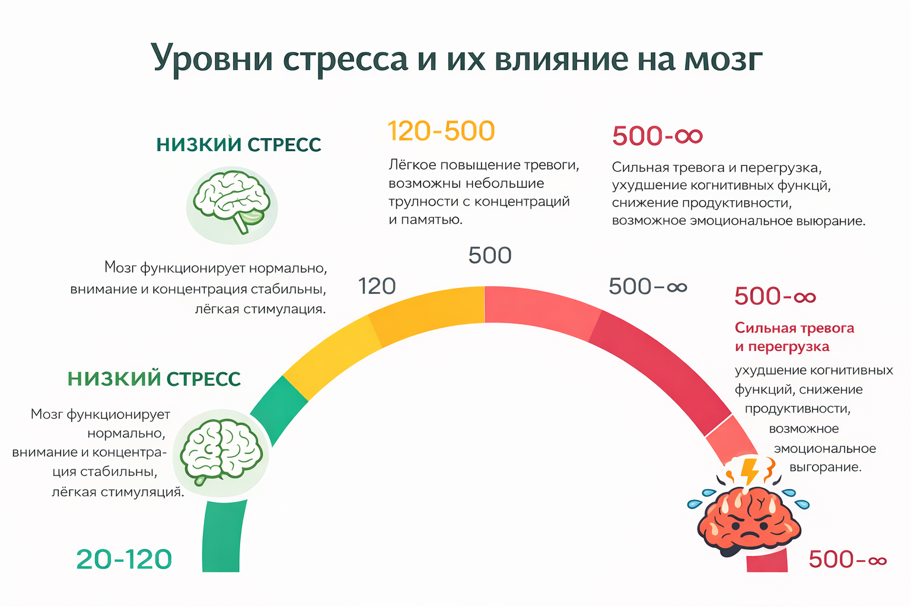

# Понимание стресса и его влияние 😰💡

Стресс — естественная реакция организма на трудности, изменения и новые вызовы. Он появляется при подготовке к контрольным, при выборе пути в жизни, во время экзаменов или при общении с новыми людьми 🗣️. Стресс может как мобилизовать силы, так и мешать принимать правильные решения, снижать концентрацию и уверенность в себе ❗  

> ### 🛑 Мифы и реальность о стрессе  
>
> **1. Стресс — всегда плохо?**  
> 🔴 *Миф:* «Стресс — это признак слабости».  
> 🟢 *Реальность:* Умеренный стресс помогает сконцентрироваться, быстрее реагировать и мобилизует ресурсы организма.  
>
> **2. Можно игнорировать стресс?**  
> 🔴 *Миф:* «Если закрыть глаза, он уйдёт сам».  
> 🟢 *Реальность:* Игнорирование стрессовых факторов только усугубляет тревогу, усталость и сомнения в своих способностях.

---

## Как стресс проявляется 😓

Основные проявления стресса:  

- Тревожность и раздражительность 😣  
- Сложности с концентрацией и памятью 🧠  
- Утомляемость и снижение энергии ⚡  
- Нарушения сна и аппетита 😴🍽️  

Хронический стресс может привести к эмоциональному выгоранию, постоянной неуверенности и снижению мотивации при выборе жизненного пути.

---

## Влияние стресса на принятие решений 🧩

Представь, что мозг — это суперкар. Он может ездить быстро, но только если правильно заправлен. Стресс — это сигнал, что топлива мало или автомобиль в опасной зоне.  

---

## Практические советы 🌱💪

1. **Определи источники стресса 🔍**
   Запиши, что вызывает наибольшую тревогу — первый шаг к контролю ситуации.

2. **Техники релаксации 🧘‍♂️**
   Дыхательные упражнения, прогулки 🚶, музыка или медитация помогают снизить уровень тревоги.

3. **Разделяй задачи на шаги 📝**
   Большие цели кажутся пугающими. Разбей их на маленькие шаги — и появится контроль и уверенность.

4. **Физическая активность и сон 🏃‍♀️😴**
   Спорт помогает выбросу «гормонов радости», регулярный сон восстанавливает силы.

---

## Мини-чеклист ✅

* Составь список задач и расставь приоритеты
* Выделяй 5–10 минут на дыхательные упражнения
* Делай короткие перерывы каждые 50–60 минут работы
* Поддерживай активность: прогулки, спорт, растяжка
* Следи за сном и питанием 🥗

---

## 😂 Анекдот от GPT по теме

Учительница:
— Дети, кто готов к контрольной?

Голос с последней парты:
— Мой мозг ещё на «синем экране». Он только что загрузился после стресса от вчерашней домашки 😅

---

---

**Авторы:** Бакач Анна, @Henrygrimm

**Нейросети, использованные при создании статьи:** GPT-4 🤖

