# 📘 KidBook — детская энциклопедия

Добро пожаловать в **KidBook** — детскую энциклопедию для школьников, созданную в рамках лабораторной работы по курсу **«Искусственный интеллект»**.

Проект объединяет статьи о мире вокруг нас, обществе, здоровье, критическом мышлении, технологиях, искусстве, досуге, развлечениях и эффективной учёбе.

---

## 🌳 График структуры проекта

```mermaid
graph TD
    A["KidBook"]

    A --> B["1. Мир и наука"]
    B --> B1["1.1 Устройство мира"]
    B1 --> B11["Материя"]
    B --> B2["1.2 Естественные науки в жизни"]
    B2 --> B21["Нейробиология для подростков"]
    B2 --> B22["Физика в повседневной жизни"]
    B2 --> B23["Почему наука помогает понимать мир"]

    A --> C["2. Человек и общество"]
    C --> C1["2.1 Общество и взаимодействие людей"]
    C1 --> C11["Причинно-следственные связи"]
    C --> C2["2.2 История, страны и мир вокруг"]

    A --> D["3. Здоровье и безопасность"]
    D --> D1["3.1 Здоровый образ жизни"]
    D1 --> D11["Сон, питание и энергия подростка"]
    D --> D2["3.2 Безопасность и первая помощь"]
    D2 --> D21["Первая помощь"]

    A --> E["4. Учёба и мышление"]
    E --> E1["4.1 Навыки учёбы"]
    E1 --> E11["Как запоминать материал"]
    E --> E2["4.2 Мышление и работа с информацией"]
    E2 --> E21["Критическое мышление"]

    A --> F["5. Цифровой мир и технологии"]
    F --> F1["5.1 Технологии и цифровая грамотность"]
    F1 --> F11["Информация и медиаграмотность"]
    F --> F2["5.2 Кибербезопасность"]

    A --> G["6. Быт, деньги и самостоятельность"]
    G --> G1["6.1 Самостоятельная жизнь и бытовые навыки"]
    G --> G2["6.2 Деньги и финансовая грамотность"]

    A --> H["7. Культура и искусство"]
    H --> H1["7.1 Искусство"]
    H1 --> H11["Музыкальные инструменты"]
    H --> H2["7.2 Медиа, досуг и хобби"]
    H2 --> H21["Компьютерные игры"]

    A --> I["8. Будущее, цели и самореализация"]
    I --> I1["8.1 Понимание себя"]
    I --> I2["8.2 Будущее и выбор пути"]
```

## 📁 Содержание энциклопедии

- **1. Мир и наука**
  - **1.1 Устройство мира**
    - [Материя](1.1_structure_of_the_world/matter/)
  - **1.2 Естественные науки в жизни**
    - [Нейробиология для подростков](1.2_natural_sciences/neurobiology_for_teens/)
    - [Физика в повседневной жизни](1.2_natural_sciences/physics_in_everyday_life/)
    - [Почему наука помогает понимать мир](1.2_natural_sciences/why_science_help_understand_world/)

- **2. Человек и общество**
  - **2.1 Общество и взаимодействие людей**
    - [Почему важно понимать причинно-следственные связи](2.1_society/)
  - **2.2 История, страны и мир вокруг**
    - [История, страны и мир вокруг](2.2_history/)

- **3. Здоровье и безопасность**
  - **3.1 Здоровый образ жизни**
    - [Сон, питание и энергия подростка](3.1_healthy lifestyle/)
  - **3.2 Безопасность и первая помощь**
    - [Первая помощь](3.2_safety_and_first_aid/)

- **4. Учёба и мышление**
  - **4.1 Навыки учёбы**
    - [Как запоминать материал](4.1_rules_of_study/)
  - **4.2 Мышление и работа с информацией**
    - [Критическое мышление](4.2_thinking_and_working_information/)

- **5. Цифровой мир и технологии**
  - **5.1 Технологии и цифровая грамотность**
    - [Информация и медиаграмотность](5.1_technology_and_digital_literacy/)
  - **5.2 Кибербезопасность и поведение в сети**
    - [Кибербезопасность](5.2_cybersecurity/)
    - [Безопасное использование интернета](5.2_cybersecurity_and_online_behavior/safety_usage_of_internet/)

- **6. Быт, деньги и самостоятельность**
  - **6.1 Самостоятельная жизнь и бытовые навыки**
    - [Самостоятельная жизнь и бытовые навыки](6.1_Independent_living_and_daily_living_skills/)
  - **6.2 Деньги и финансовая грамотность**
    - [Личный бюджет](6.2_money_and_finance/personal_budget/)
    - [Как копить на цель](6.2_money_and_literacy/how_to_save_for_goal/)

- **7. Культура и искусство**
  - **7.1 Искусство**
    - [Искусство](7.1_art/)
  - **7.2 Медиа, досуг и хобби**
    - [Компьютерные игры](7.2%20Media,%20leisure%20and%20hobbies/Computer%20games/)

- **8. Будущее, цели и самореализация**
  - **8.1 Понимание себя**
    - [Понимание себя](8.1_self_understanding/)
    - [Как найти свои сильные стороны](8.1_self-understanding/how_to_find_your_strengths/)
  - **8.2 Будущее и выбор пути**
    - [Будущее и выбор пути](8.2_future_and_path_choice/)
    - [Выбор карьерного пути](8.2_future/choosing_a_career_path/)
