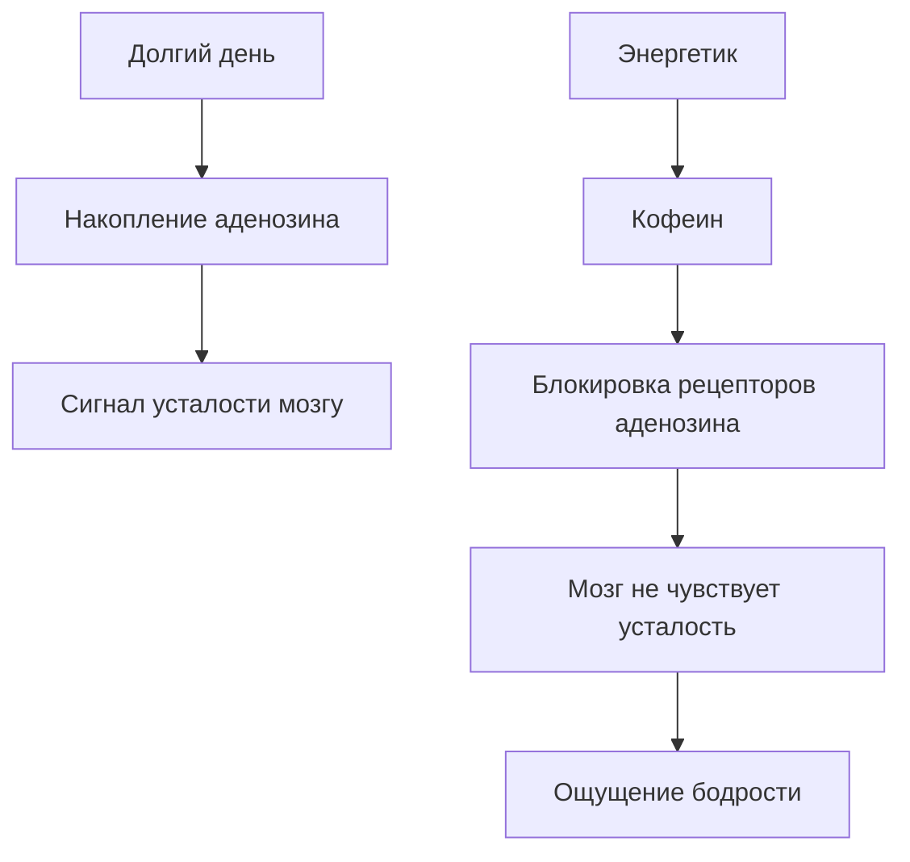
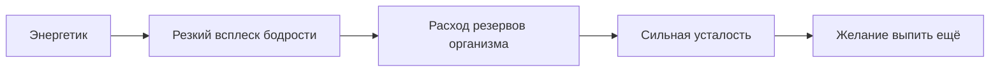

# Ловушка энергетиков: почему кофеин и таурин опасны для растущего организма

Ты стоишь перед холодильником в магазине. Яркие банки с молниями, тиграми и словами **Energy**, **Power**, **Boost** обещают одно: выпьешь — и сразу появятся силы. Можно не [спать](../../../../WEB/how_to_memorize/articles/son.md) всю ночь, готовиться к экзамену или играть до утра.

Но есть один нюанс. Энергетики не создают энергию. Они **заставляют организм тратить резервы быстрее**, чем он успевает восстановиться.

Разберёмся, что происходит внутри организма после банки энергетика и почему для подростков это особенно опасно.

>### 🛑 Рубрика «Миф vs Реальность»
>
>**1. Про энергию**  
>🔴 *Миф:* «Энергетик даёт настоящую энергию».  
>🟢 *Реальность:* Он не создаёт энергию, а **блокирует сигнал усталости**, из-за чего мозг думает, что всё в порядке.
>
>**2. Про [безопасность](../../../../WEB/7.2_leisure/useful_and_interesting_leisure/articles/safety_during_recreation.md)**  
>🔴 *Миф:* «Если напиток продаётся в магазине — значит он безопасен».  
>🟢 *Реальность:* Во многих странах энергетики **ограничивают для подростков**, потому что их нервная система ещё развивается.

## Что происходит в мозге после энергетика?

В течение дня в мозге накапливается [вещество](../../../../WEB/1.1_structure_of_the_world/matter/articles/01_matter.md) **аденозин**. Оно работает как биологический индикатор усталости.

Когда аденозина становится много, мозг получает сигнал:

> «Ты устал. Пора отдыхать».

Но кофеин действует как **блокировщик этих сигналов**. Он занимает те же рецепторы, что и аденозин, и мозг перестаёт чувствовать [усталость](../../../../WEB/how_to_memorize/articles/ustalost.md).

Проблема в том, что **усталость никуда не исчезает**. Организм всё ещё истощён, но мозг временно перестаёт это замечать.

## Таурин: загадочный сосед кофеина

Помимо кофеина, в энергетиках часто содержится **таурин** — аминокислота, участвующая в работе:

- мозга  
- сердца  
- нервной системы  

В небольших количествах таурин естественно присутствует в организме. Но в энергетиках его [концентрация](../../../../WEB/how_to_memorize/articles/koncentraciya.md) значительно выше, особенно в сочетании с кофеином.

Когда кофеин стимулирует нервную систему, таурин может усиливать воздействие на:

- сердечный ритм  
- передачу нервных импульсов  
- уровень возбуждения мозга  

В результате организм получает **двойную стимуляцию**.

## Почему подростки особенно уязвимы?

Тело подростка — это организм, который активно развивается. Формируются:

- мозг  
- гормональная система  
- сердечно-сосудистая система  

Сильные стимуляторы могут вмешиваться в эти процессы.

### 1. Нарушение сна

Кофеин может оставаться в организме **до 6–8 часов**.

Если выпить энергетик вечером, мозг получает сигнал:

> «Сейчас ещё день».

Это мешает выработке гормона сна **мелатонина**, который отвечает за засыпание.

### 2. Перегрузка нервной системы

Подростковая нервная система более чувствительна к стимуляторам.

Поэтому возможны:

- тревожность  
- раздражительность  
- дрожь  
- трудности с концентрацией  

Парадоксально, но энергетик, выпитый «для учёбы», иногда **ухудшает [внимание](../../../../WEB/how_to_memorize/articles/vnimanie.md)**.

### 3. Нагрузка на сердце

Кофеин увеличивает:

- частоту сердцебиения  
- артериальное [[давление](../../../../WEB/1.1_structure_of_the_world/matter/articles/11_physical_properties.md)](../../../../WEB/1.1_structure_of_the_world/matter/articles/07_gases.md)  

Если пить энергетики регулярно, сердце начинает работать **в режиме постоянного стресса**.

Это явление называют **«энергетическим откатом»** — после краткого подъёма энергии наступает сильная усталость.

## Что делать вместо энергетиков? (Короткий чек-лист)

Мы не можем полностью отменить усталость, но можем перестать вредить организму.

* **Сон — главный источник энергии.** Большинству подростков нужно 8–10 часов сна.
* **Пей воду.** Даже лёгкое обезвоживание снижает концентрацию.
* **Делай перерывы.** Мозгу нужен [[отдых](../../../../WEB/7.2_leisure/useful_and_interesting_leisure/articles/balance_study_rest_hobby.md)](../../../../WEB/7.2_leisure/useful_and_interesting_leisure/articles/leisure_and_why_need.md) каждые 40–60 минут.
* **Двигайся.** Короткая прогулка или лёгкая [физическая активность](../../../../WEB/7.2_leisure/useful_and_interesting_leisure/articles/active_recreation_and_sport.md) может бодрить лучше кофеина.

### 😂 Анекдот от GPT по теме

Разговаривают два студента:

— Я выпил энергетик, чтобы не спать всю ночь.

— И помогло?

— Да… теперь не сплю я, мой мозг и моё сердце.

---

**Автор:** Титова Дарья

**Нейронные сети, использованные при создании статьи:** OpenAI GPT-4o