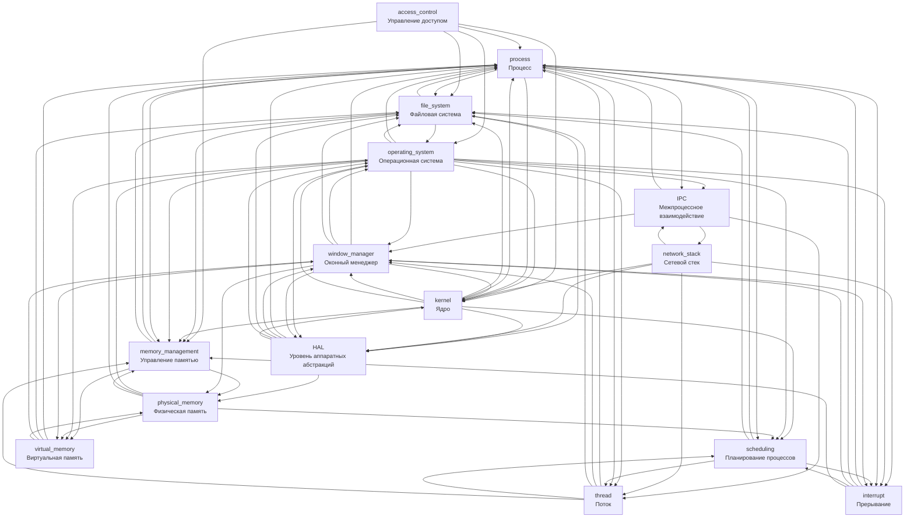

# KidBook: как устроена операционная система

## Цель работы
В рамках лабораторной работы по курсу «Искусственный интеллект» создать раздел детской энциклопедии, посвящённый операционным системам, с использованием методов и инструментов явного представления знаний (WikiData) и генеративных ИИ-моделей (DeepSeek, Qwen, ChatGPT).

## Участники команды 1408
| # | ФИО |
|---|-----|
| 1 | Воронухин Никита |
| 2 | Жаворонков Никита |

## Граф онтологии раздела

Из графа видно, что статья про операционную систему имеет связи со всеми другими статьми. 




## SPARQL-запрос
Для поиска связанных понятий использовались SPARQL-запросы в [**Wikidata Query Service**](https://query.wikidata.org/)
Данный запрос находит все составляющие части ОС на трёх уровнях вложенности.
```sparql
SELECT DISTINCT ?os ?osLabel ?level1 ?level1Label ?level2 ?level2Label ?level3 ?level3Label
WHERE {
  BIND(wd:Q9135 AS ?os)
  
  VALUES ?partProp { wdt:P361 wdt:P527 }
  
  OPTIONAL {
    { ?level1 ?partProp ?os . }  # part of wdt:P361
    UNION
    { ?os ?partProp ?level1 . }  # has parts wdt:P527
  }
  
  OPTIONAL {
    { ?level1 ?partProp ?os . }
    ?level2 ?partProp ?level1 .
  }
  
  OPTIONAL {
    { ?level1 ?partProp ?os . }
    ?level2 ?partProp ?level1 .
    ?level3 ?partProp ?level2 .
  }
  
  SERVICE wikibase:label { 
    bd:serviceParam wikibase:language "en,ru" . 
  }
}
```

## Генерация статей
Все статьи были написаны с помощью LLM **ChatGPT-5.2**, **DeepSeek-V3.2**, **Qwen3.5-Plus**.
Сначала все запросы писались вручную подробно описывая желаемую структуру статьи, сложность текста, размер статей, иногда связанные понятия, которые необходимо использовать.
Затем каждая статья дополнялась необходимыми изображениями.
Наконец каждая статья проверялась вручную на корректность содержания.

**Шаблон промпта**
```
Ты - автор статьи для десятилетних детей с аномально большой усидчивостью. Твоя задача - написать статью по следующей теме: {тема} в контексте работы Операционной Системы (ОС).

Статья должна быть написана на языке Markdown и ссылаться на другие темы в области работы Операционной Системы. Так как тема сама по себе сложная - вводи основные понятия, необходимые для понимания. Без углубления в программную реализацию, с примерами и сравнениями, опиши понятия {понятия/разные классы описываемого}, краткую справку о различии между {разные классы описываемого}. Опусти вопросы безопасности и производительности при объяснении. Объясняй не только как - объясняй почему эти механизмы в первую очередь существуют. Избегай прямых обращений к читателю. Используй упрощенную лексику (без, например, слова "аппаратный") и ограниченную выборку терминов - сначала введи эти термины, потом используй.

Обязательно должны присутствовать следующие разделы:
Определение
Подробное описание
См. также

Текст пиши в блоке кода, чтобы я мог его скопировать. Каждому пункту свой раздел. Не используй жаргон (напр. "железо" вместо компьютер). Добавь в конце (Но перед см. также) таблицу сравнения объектов описания и краткое резюме для закрепления материала.
Используй ```mermaid ``` для создания необходимых схем.
Раздел См. также должен содержать лишь тесно связанные понятия.
```

## Перекрестные ссылки
Все перекрестные ссылки создаются с помощью python скрипта. Вопрос различных форм и падежей решен с помощью pymorphy3. Данный скрипт ищет все вхождения слов из массива lemmas (находится в concepts.json для каждой статьи) в файлах, игнорируя слова в форматированном тексте (таблицы, уже существующие ссылки), слова в lemmas отсортированы по семантической близости к основной теме статьи (это сделано на основе личных мнений команды), и все корректные вхождения слов в тексте меняются на ссылку на соответствующий md документ. Скрипт обрабатывает только папку со статьями нашей команды, поскольку некоторые термины (поток, процесс) многозначны, а потому нужен более глубокий семантический анализ, чем просто поиск совпадений через regexp. Некоторые ошибки в расстановке ссылок потребовали ручного исправления.

## Вывод
В результате работы создан полноценный раздел энциклопедии «KidBook» по теме «Операционные системы». Раздел содержит 15 связанных между собой статей, написанных доступным для школьников языком с помощью LLM-моделей.  В статьях используются ссылки на внешние ресурсы и картинки. Онтология предметной области включает и иерархические, и горизонтальные связи, что обеспечивает глубину и системность изложения, что явно выражено на её визуализации. Использование данных из Wikidata подтверждает научную достоверность выбранных понятий, а SPARQL-запросы демонстрируют умение работать с открытыми базами знаний. Перекрёстные ссылки между статьями проставлены автоматически с помощью python-скрипта.

