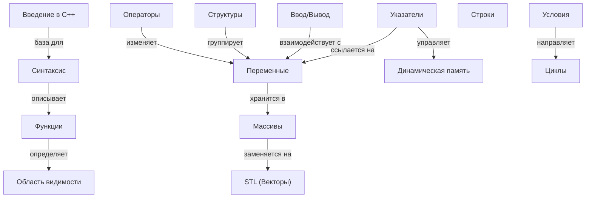

# Основы программирования на C++ для начинающих

## Описание раздела

Этот раздел энциклопедии KidBook посвящён изучению C++ — одного из самых мощных и популярных языков программирования в мире. Материалы подготовлены специально для детей и подростков, объясняя сложные концепции (указатели, память, алгоритмы) через простые аналогии с роботами, конструкторами и повседневной жизнью. Раздел охватывает путь от настройки среды разработки до использования стандартной библиотеки шаблонов (STL).

## Цель работы

В рамках лабораторной работы по курсу «Искусственный интеллект» нашей группой было сделано:

- выделено **15 ключевых понятий** (концептов) основ программирования на C++;
- построена онтология предметной области, связывающая базовый синтаксис, структуры данных и управление памятью;
- сгенерировано 15 энциклопедических статей с помощью LLM (Gemini/DeepSeek);
- реализована система перекрёстных ссылок для удобной навигации;
- интегрированы данные из внешних баз знаний (**Wikidata**);
- подготовлены SPARQL-запросы для автоматизированного извлечения данных.

## Состав группы (Team 52)

| Участник | Роль / Темы |
|----------|-------------|
| **Руслан Юнусов** | Введение, Синтаксис, Переменные |
| **Иван Леу** | Операторы, Функции, Область видимости |
| **Кривошапкин Егор** | Условные переходы, Циклы, Указатели, Массивы |
| **Тарасов Егор** | Строки, Структуры, Динамическая память |
| **Велиев Рауф** | Ввод/вывод, Массивы (соавтор), STL |

## Список понятий

1. Введение в C++
2. Структура программы (Синтаксис)
3. Переменные и типы данных
4. Ввод и вывод данных (I/O)
5. Операторы
6. Условные конструкции
7. Циклы
8. Функции
9. Область видимости
10. Массивы
11. Указатели и ссылки
12. Строки (std::string)
13. Структуры (struct)
14. Динамическая память
15. Векторы и STL

## Концептуализация предметной области

Понятия разделены на логические блоки:

- **Базис**: Введение, синтаксис, переменные, ввод/вывод;
- **Логика управления**: Операторы, условия, циклы;
- **Модульность**: Функции, области видимости;
- **Хранение данных**: Массивы, строки, структуры;
- **Продвинутое управление**: Указатели, динамическая память, STL.

### Типы связей в онтологии

| Тип связи | Пример |
|-----------|--------|
| **включает** | Структура программы → включает → Функции |
| **использует** | Операторы → используют → Переменные |
| **управляет** | Указатели → управляют → Динамическая память |
| **содержит** | Массивы → содержат → Типы данных |
| **является базой** | Введение → является базой → Все темы |
| **реализует** | Циклы → реализуют → Повторение кода |

## Онтология раздела (Mermaid)



## Использование Wikidata

Для каждого понятия в `concepts.json` указан уникальный идентификатор **Wikidata ID** (например, `Q2407` для C++), что позволяет верифицировать данные и получать актуальные определения на разных языках.

### Пример SPARQL-запроса
Для получения краткого описания всех технологий C++, используемых в проекте:

```sparql
SELECT ?item ?itemLabel ?itemDescription WHERE {
  VALUES ?item {
    wd:Q2407  wd:Q7248435 wd:Q190087 wd:Q170452 
    wd:Q2984985 wd:Q15810910 wd:Q118155 wd:Q741235
  }
  SERVICE wikibase:label { bd:serviceParam wikibase:language "ru,en". }
}
```

## Использование LLM (ИИ)

Статьи были созданы с использованием моделей **Gemini** и **DeepSeek** с применением техники «Chain of Thought» (цепочка рассуждений):
1. **Роль**: Технический писатель, объясняющий код детям.
2. **Контекст**: Статья должна содержать аналогию (например, переменная — это коробка).
3. **Связи**: В каждую статью встроены ссылки на связанные темы согласно онтологии.
4. **Формат**: Строгий Markdown с использованием блоков `[!NOTE]`, `[!WARNING]` и подсветкой синтаксиса `cpp`.

## Структура файлов

Все материалы организованы согласно иерархии проекта:

```text
WORK/5.2_cybersecurity/
  README.md         <-- Текущий файл
  concepts.json     <-- Метаданные понятий

WEB/5.2_cybersecurity/cpp_fundamentals/
  1_introduction.md
  2_syntax.md
  ...
  15_stl.md
  covers/           <-- Обложки, созданные ИИ (DALL-E 3)
```

## Итоги

Созданный раздел является полноценным интерактивным учебником. Благодаря использованию ИИ и онтологического подхода, нам удалось создать связную базу знаний, где изучение одной темы (например, массивов) логически ведет к пониманию более сложных концепций (указателей и векторов).

---
*Авторы: Team 52 (Юнусов, Леу, Кривошапкин, Тарасов, Велиев)*  
*Ресурсы: Wikidata, Gemini, DeepSeek*