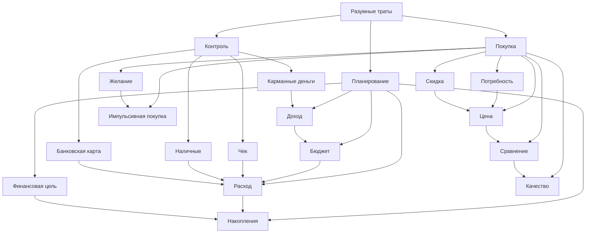

# 6.1 Самостоятельная жизнь и бытовые навыки
## Тема: Как разумно тратить деньги

### Командная цель
Создать детский раздел энциклопедии (для возраста около 10 лет), который объясняет основы разумных трат через понятные примеры, связи между понятиями и перекрестные ссылки.

### Что сделано
1. Определена концептуализация темы с 16 понятиями (больше минимального требования 15).
2. Подготовлена онтология с иерархическими и горизонтальными связями.
3. Составлены SPARQL-запросы для извлечения знаний из WikiData и DBpedia.
4. Подготовлены артефакты для автоматической обработки и последующей ручной доработки:
   - список понятий в `concepts.json`;
    - скрипт простановки перекрестных ссылок в markdown;
    - скрипт генерации черновиков страниц через LLM API;
    - скрипт сборки страницы словаря терминов.
   - таблицы узлов и связей онтологии.
5. Подготовлены и вручную отредактированы markdown-страницы в каталоге `WEB/6.1_reasonable_spending/articles`.

## Концептуализация и онтология

### Ключевые классы
- Финансовая деятельность ребенка
- Источники средств
- Планирование
- Покупка
- Контроль

### Список понятий
1. Бюджет
2. Доход
3. Расход
4. Потребность
5. Желание
6. Накопления
7. Финансовая цель
8. Цена
9. Скидка
10. Сравнение
11. Качество
12. Чек
13. Карманные деньги
14. Наличные
15. Банковская карта
16. Импульсивная покупка

### Mermaid-диаграмма онтологии


### Горизонтальные связи (примеры)
- `Потребность` помогает отличать важное от необязательного и уменьшает `Импульсивная покупка`.
- `Сравнение` влияет на выбор между товарами одинакового назначения.
- `Чек` связывает факт покупки с контролем `Расход`.
- `Скидка` полезна только вместе с проверкой `Качество` и исходной `Цена`.

## Использованные источники знаний
- WikiData (через SPARQL endpoint)
- DBpedia (через SPARQL endpoint)

SPARQL-запросы сохранены в папке `sparql`.


## Автоматизация

### Генерация черновиков через LLM API
Файл: `src/generate_pages_template.py`

Назначение:
- создает черновые markdown-страницы по понятиям из `concepts.json`;
- использует промпт с требованием: "объясни для десятилетнего ребенка";
- работает с chat-completions-совместимым endpoint.

Промпты сохранены в файле `llm_prompts.md`.

Пример запуска:
```bash
set LLM_API_URL=https://your-endpoint
set LLM_API_KEY=your_key
set LLM_MODEL=your_model
python WORK/6.1_reasonable_spending/src/generate_pages_template.py
```

### Скрипт перекрестных ссылок
Файл: `src/insert_links.py`

Назначение:
- читает `concepts.json`;
- проходит по markdown-страницам в `WEB/6.1_reasonable_spending/articles`;
- заменяет найденные термины на markdown-ссылки;
- не меняет заголовки и уже существующие ссылки.

Запуск из корня репозитория:
```bash
python WORK/6.1_reasonable_spending/src/insert_links.py
```

### Генерация словаря терминов
Файл: `src/build_glossary.py`

Запуск:
```bash
python WORK/6.1_reasonable_spending/src/build_glossary.py
```

## Структура артефактов этой группы
- `WORK/6.1_reasonable_spending/README.md` - отчет группы
- `WORK/6.1_reasonable_spending/concepts.json` - словарь понятий
- `WORK/6.1_reasonable_spending/sparql/` - SPARQL-запросы к WikiData и DBpedia
- `WORK/6.1_reasonable_spending/raw_data/` - узлы и связи онтологии
- `WORK/6.1_reasonable_spending/src/` - автоматизация
- `WORK/6.1_reasonable_spending/llm_prompts.md` - шаблоны промптов
- `WEB/6.1_reasonable_spending/articles/` - детские markdown-страницы

## Проверка и ручная редактура
1. Все статьи прошли проверку участниками команды на понятность для детей и соответствие теме раздела.
2. Перекрестные ссылки проверены вручную, чтобы не было само-ссылок и битых переходов.
3. Формулировки в `concepts.json` дополнены и выровнены после автоматической генерации.

## Ограничения и что можно улучшить
1. В перекрестных ссылках используются словоформы из списка aliases, поэтому редкие падежные формы могут иногда пропускаться.
2. В статьях есть единый образовательный стиль, но его можно сделать еще более разнообразным, если часть страниц дописать вручную разными участниками команды.

## Идеи для улучшения
1. Добавить иллюстрации и простые инфографики к каждой странице.
2. Подключить морфологический анализ (например, `pymorphy3`) для более точной расстановки ссылок по падежам.
3. Сгенерировать общую страницу-словарь по всем разделам автоматически.
