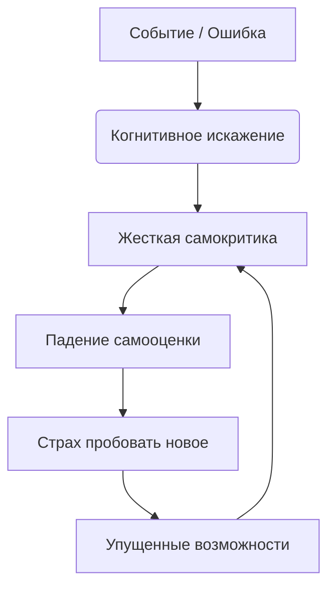

### Файл 3: Когнитивные искажения и самокритика

# Когнитивные искажения и самокритика 🪞🌩️

Наш мозг иногда нас обманывает. Когнитивные искажения — это систематические ошибки в мышлении, фильтры, через которые мы видим мир в негативном свете 🌑. Именно они питают нашего сурового внутреннего критика, заставляя нас сомневаться в себе, преувеличивать ошибки и обесценивать достижения ❗

> ### 🛑 Мифы и реальность о самокритике
>
> **1. Самокритика мотивирует?** > 🔴 *Миф:* «Если я не буду себя ругать, я расслаблюсь и ничего не добьюсь».  
> 🟢 *Реальность:* Жесткая самокритика уничтожает самооценку и приводит к апатии. Реально мотивирует самоподдержка и бережное отношение к себе.
>
> **2. Мои мысли — это факты?** > 🔴 *Миф:* «Если я чувствую себя неудачником, значит, так оно и есть».  
> 🟢 *Реальность:* Мысли — это просто гипотезы мозга, часто искаженные усталостью, стрессом или плохим настроением.

---

## Как искажения проявляются 😓

Основные проявления:  

- **Черно-белое мышление:** «Если я не сдал на отлично, значит, я полный провал» ⚪⚫  
- **Катастрофизация:** «Я запнулся на презентации, теперь меня все засмеют и уволят» 🌋  
- **Чтение мыслей:** «Она посмотрела на меня и точно подумала, что я глупый» 👁️  
- **Обесценивание плюсов:** «Да, я сдал проект, но это просто повезло» 📉  

Эти ловушки мышления заставляют нас жить в постоянном напряжении и страхе ошибки.

---

## Влияние самокритики на восприятие себя 🧩

Представь, что твой разум — это комната смеха с кривыми зеркалами. Когнитивные искажения искажают твое отражение: маленькая ошибка кажется гигантской, а большие успехи — невидимыми.

---

## Практические советы 🌱💪

1. **Лови мысль за хвост 🕵️‍♀️**
   Когда чувствуешь тревогу или стыд, спроси себя: «О чем я сейчас подумал? Какое это искажение?».

2. **Ищи доказательства против ⚖️**
   Сыграй в адвоката. Если мозг говорит: «Ты ничего не умеешь», вспомни минимум три ситуации в прошлом, где ты успешно справился со сложной задачей.

3. **Разговаривай с собой как с другом 🤝**
   Если бы твой лучший друг совершил такую же ошибку, стал бы ты его оскорблять? Скорее всего, ты бы его поддержал. Примени это к себе.

4. **Замени «Я должен» на «Было бы здорово» 🔄**
   Слово «должен» создает колоссальное давление. Смягчение формулировок снижает стресс.

---

## Мини-чеклист ✅

* Отслеживай моменты, когда начинаешь ругать себя
* Называй искажение по имени (например: «О, это опять моя катастрофизация»)
* Практикуй дневник благодарности себе (3 вещи перед сном) ✨
* Перефразируй негативную мысль в нейтральную
* Относись к своим мыслям как к проплывающим облакам ☁️

---

## 😂 Анекдот от Gemini по теме

Мой внутренний критик настолько суров, что если я когда-нибудь получу Нобелевскую премию, он вздохнет и скажет: «Ну, вообще-то мог бы постараться и две получить, лентяй» 🏆🤦‍♂️

---

---

## Навигация по серии статей

* [Понимание стресса и его влияние 😰💡](./01_stress_understanding.md)
* [Причины неуверенности и сомнений 🤔💭](./02_insecurity_causes.md)
* [Методы управления стрессом 🧘‍♂️💪](./03_stress_management.md)
* [Влияние стресса на здоровье](./04_stress_health.md)
* [Роль эмоций в принятии решений](./05_emotions_decisions.md)
* [Психология страха и тревожности](./06_fear_anxiety_psychology.md)
* [Прокрастинация и её связь со стрессом](./07_procrastination_stress.md)
* [Постановка целей и снижение тревожности](./08_goal_setting_anxiety.md)
* **Когнитивные искажения и самокритика 🪞🌩️**

---

**Авторы:** Ногаев.T.T

*Ресурсы: LLM - Gemini* 🤖