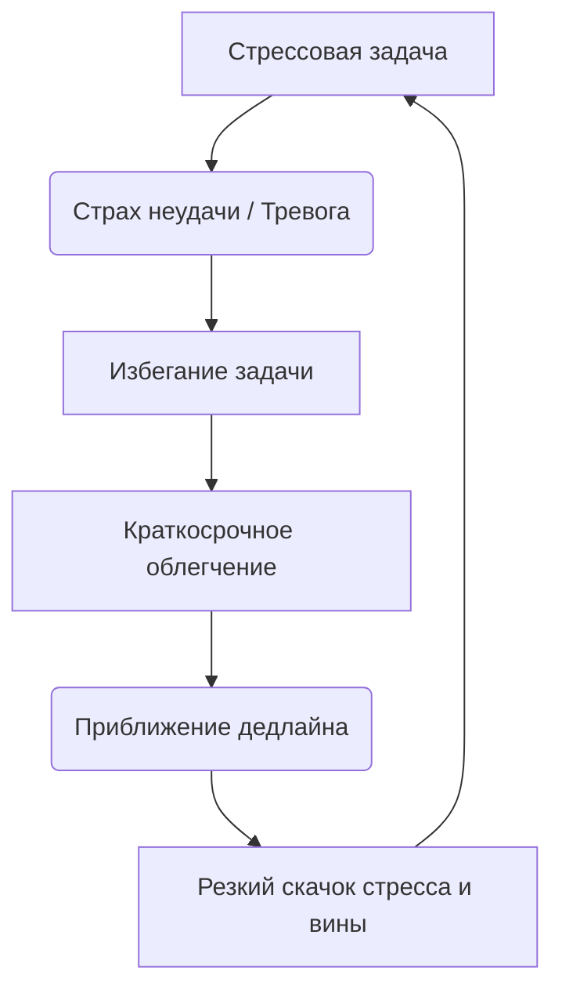
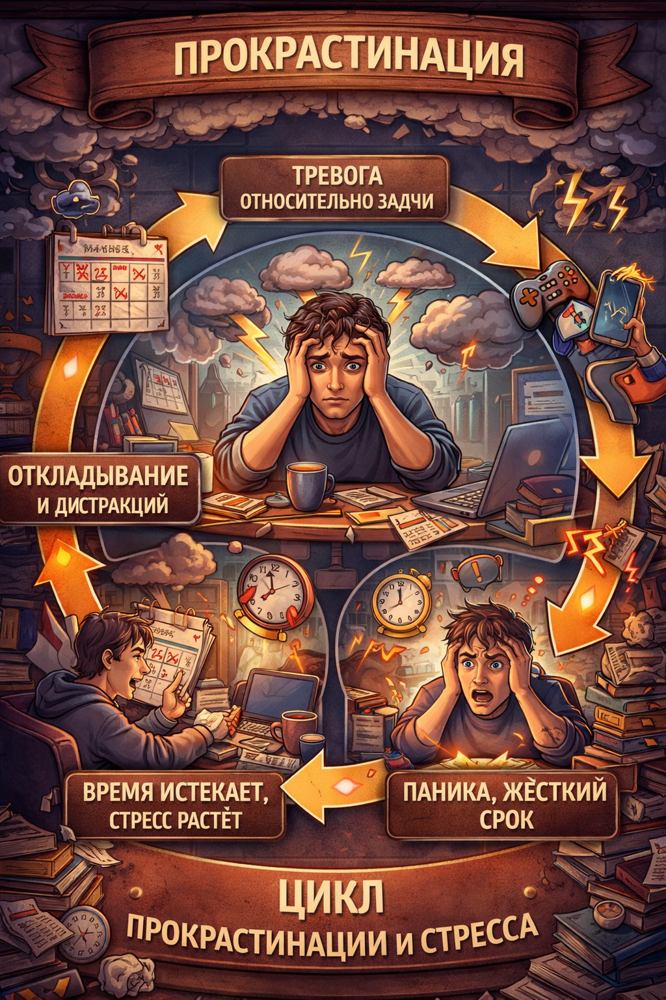

### Файл 1: Прокрастинация и её связь со стрессом

# Прокрастинация и её связь со стрессом ⏳😰

Прокрастинация — это не просто лень или неумение управлять временем, это проблема регуляции эмоций. Мы часто откладываем задачи, потому что они вызывают у нас стресс, страх неудачи или чувство подавленности 📉. Прокрастинация дает временное облегчение, но в долгосрочной перспективе лишь усиливает тревогу и чувство вины ❗

> ### 🛑 Мифы и реальность о прокрастинации
>
> **1. Прокрастинация — это просто лень?** > 🔴 *Миф:* «Ты просто не хочешь работать, возьми себя в руки».  
> 🟢 *Реальность:* Это защитный механизм мозга. Откладывая дела, мозг пытается избежать стресса и негативных эмоций, связанных с задачей.
>
> **2. Дедлайны всегда помогают?** > 🔴 *Миф:* «Я лучше всего работаю в последнюю ночь перед сдачей».  
> 🟢 *Реальность:* Работа в условиях паники истощает нервную систему, повышает риск ошибок и приводит к хроническому стрессу.

---

## Как прокрастинация проявляется 😓

Основные проявления:  

- Бесконечный скроллинг соцсетей вместо работы 📱  
- Выполнение мелких и неважных дел («иллюзия занятости») 🧹  
- Постоянное чувство вины и тревоги на фоне отдыха 😔  
- Паника и спешка в последние часы перед дедлайном ⏰  

Хроническое откладывание дел создает замкнутый круг: стресс вызывает прокрастинацию, а прокрастинация рождает еще больший стресс.

---

## Влияние прокрастинации на работу мозга 🧩

Представь, что твой мозг — это смартфон. Нерешенные задачи — это фоновые приложения, которые постоянно едят батарею. Чем дольше ты их не закрываешь (откладываешь), тем сильнее тормозит система и быстрее садится заряд.

---

## Практические советы 🌱💪

1. **Правило двух минут ⏱️**
   Если задачу можно начать и сделать за 2 минуты — сделай её прямо сейчас. Это снимает психологический барьер первого шага.

2. **Прости себя за прошлое 🕊️**
   Исследования показывают: те, кто прощает себя за вчерашнюю прокрастинацию, реже откладывают дела сегодня.

3. **Дроби слона на кусочки 🐘**
   «Написать диплом» — звучит страшно. «Написать один абзац введения» — звучит выполнимо и не вызывает паники.

4. **Метод Помодоро 🍅**
   Работайте 25 минут, затем 5 минут отдыхайте. Это снижает страх перед бесконечной рутиной.

---

## Мини-чеклист ✅

* Убери телефон в другую комнату перед началом работы
* Напиши одну самую важную задачу на стикере
* Договорись с собой поработать хотя бы 5 минут (дальше втянешься)
* Награждай себя за завершенные этапы ☕
* Не ругай себя, если что-то пошло не по плану

---

## 😂 Анекдот от Gemini по теме

— Как называется человек, который откладывает всё на завтра?
— Завтрамен! Его суперсила — делать месячный объем работы в последнюю ночь со слезами на глазах 🦸‍♂️😭

---

---

## Навигация по серии статей

* [Понимание стресса и его влияние 😰💡](./01_stress_understanding.md)
* [Причины неуверенности и сомнений 🤔💭](./02_insecurity_causes.md)
* [Методы управления стрессом 🧘‍♂️💪](./03_stress_management.md)
* [Влияние стресса на здоровье](./04_stress_health.md)
* [Роль эмоций в принятии решений](./05_emotions_decisions.md)
* [Психология страха и тревожности](./06_fear_anxiety_psychology.md)
* **Прокрастинация и её связь со стрессом ⏳😰**
* [Постановка целей и снижение тревожности](./08_goal_setting_anxiety.md)
* [Когнитивные искажения и самокритика](./09_cognitive_distortions.md)

---

**Авторы:** Ногаев.T.T

*Ресурсы: LLM - Gemini* 🤖